# 1. Введение
Основные типы массивов хранения данных:
- Storage Area Network (SAN)
- Network Attached Storage (NAS)

# 2. Массивы хранения данных — подготовка сцены
Традиционно массивы хранения представляли собой большие, гудящие рамы вращающихся дисков, которые занимали огромное количество площади в центре обработки данных и потребляли достаточно электроэнергии, чтобы обеспечить электроэнергией небольшую страну. Самый большой мог быть длиной более 10 шкафов, вмещая тысячи дисководов, сотни интерфейсных портов и терабайты кэша. Они, как правило, поставлялись в специализированных ¬шкафах, которые были худшим кошмаром для менеджера центра обработки данных. Вдобавок ко всему, они были дорогими в покупке, сложными в управлении и примерно такими же негибкими, как гранит. Это было прекрасно, если вы хотели заработать много денег в качестве консультанта, но не так хорошо, если вы хотели управлять бережливым и эффективным ИТ-магазином, который мог бы быстро реагировать на требования бизнеса.

На рисунке показан массив EMC VMAX из 11 рам.К счастью, все это меняется, в немалой степени из-за влияния твердотельных накопителей и облака. Обе технологии являются чрезвычайно разрушительными и заставляют поставщиков хранилищ -повышать свою игру. Массивы хранения становятся более энергоэффективными, более простыми в управлении ¬, более осведомленными о приложениях и гипервизорах, более компактными, более стандартизированными и в некоторых случаях более дешевыми!

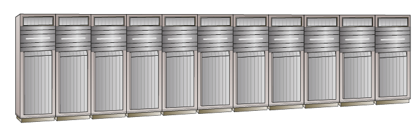

Вот краткий обзор терминологии, прежде чем вы углубитесь в детали: термины storage array , storage subsystem , storage frame и SAN array часто используются для обозначения одного и того же. Хотя это может быть не самым точным с технической точки зрения, в этой книге в основном используется термин storage array или просто array , поскольку это, вероятно, наиболее широко используемые термины в отрасли

# 3. Что такое массив хранения данных?
Массив хранения данных — это компьютерная система, разработанная и предназначенная для предоставления хранилища внешним ¬компьютерам, обычно через сеть хранения данных. Традиционно таким хранилищем был вращающийся диск, но мы видим все большее количество твердотельных носителей в массивах хранения данных. Нередко большой массив хранения данных имеет более петабайта (ПБ) памяти.

Массивы хранения данных подключаются к хост-компьютерам через общую сеть и обычно обеспечивают повышенную надежность и расширенную функциональность. 

Массивы хранения данных бывают трех основных видов:
- SAN
- NAS
- Унифицированный (SAN и NAS)

Массивы хранения SAN , иногда называемые массивами блочного хранения , обеспечивают подключение через блочные протоколы, такие как Fibre Channel (FC), Fibre Channel over Ethernet (FCoE), Internet Small Computer System Interface (iSCSI) или Serial Attached SCSI (SAS). Массивы блочного хранения отправляют низкоуровневые команды доступа к диску, называемые блоками дескрипторов команд SCSI (CDB), такие как READ block , WRITE block и READ CAPACITY через SAN.

Массивы хранения NAS , иногда называемые файлерами , обеспечивают подключение по файловым ¬протоколам, таким как сетевая файловая система (NFS) и SMB/CIFS. Файловые протоколы работают на более высоком уровне, чем низкоуровневые блочные команды. Они манипулируют файлами и каталогами с помощью команд, которые выполняют такие действия, как создание файлов, переименование файлов, блокировка диапазона байтов в файле, закрытие файла и т. д

```
Хотя на самом деле протокол называется Server Message Block (SMB), чаще всего его называют по его старому названию Common Internet File System (CIFS). Произносится как сифс.
```

Унифицированные массивы хранения , иногда называемые многопротокольными массивами , обеспечивают общее хранилище как по блочным, так и по файловым протоколам. Лучшее из обоих миров, не так ли? Иногда, а иногда нет.
Целью всех массивов хранения, SAN и NAS, является объединение ресурсов хранения и предоставление этих ресурсов хостам, подключенным через сеть хранения. Помимо этого, большинство массивов хранения предоставляют следующие расширенные функции и возможности:
- Репликация (Replication)
- Снимки (Snapshots)
- Разгрузки (Offloads)
- Высокая доступность и отказоустойчивость (High availability and resiliency)
- Высокая производительность (High performance)
- Эффективность использования пространства (Space efficiency)

Хотя существуют всевозможные массивы хранения, нефункциональной целью каждого массива хранения является обеспечение идеальной среды и экосистемы для выживания и процветания дисковых накопителей и твердотельных накопителей. Эти массивы спроектированы и точно настроены для обеспечения оптимального -охлаждающего воздушного потока, гашения вибраций и чистого защищенного источника питания, а также для выполнения таких задач, как регулярная очистка дисков и другие проверки работоспособности. По сути, если бы вы были дисковым накопителем, вы бы хотели жить в массиве хранения!

```
SCSI Enclosure Services (SES) — один из примеров видов услуг, которые ¬массивы хранения предоставляют для дисковых накопителей. SES — это фоновая технология, о которой вам, возможно, никогда не придется знать, но она предоставляет жизненно важную услугу. SES контролирует питание и напряжение, вентиляторы и охлаждение, промежуточные платы и другие ¬факторы, связанные с окружающей средой в вашем массиве хранения. В центрах обработки данных с отключенным светом ¬SES может предупредить вас о том, что у вас может быть семья голубей, гнездящихся в теплом бэкэнде вашего производственного массива хранения уровня 1.
```

# 4. SAN-хранилище
Как отмечалось ранее, массивы хранения SAN обеспечивают подключение к ресурсам хранения через блочные протоколы, такие как FC, FCoE и iSCSI. Ресурсы хранения представляются хостам как логические номера устройств SCSI (***LUN***) . Представьте себе LUN как необработанное дисковое устройство, которое с точки зрения операционной системы или гипервизора выглядит и ведет себя точно так же, как локально установленный дисковый накопитель — по сути, кусок необработанной емкости. Таким образом, ОС/гипервизор знает, что ему нужно отформатировать LUN и записать на него файловую систему.

Хотя это и спорно, по сравнению с хранилищем NAS, массивы хранения SAN исторически воспринимались как более производительные и более дорогие. Они предоставляют все службы моментальных снимков и репликации, которые вы также получили бы на массиве NAS, но поскольку массивы хранения SAN не владеют файловой системой на томе и не имеют никаких знаний о ней, в некоторых отношениях они немного глуповаты по сравнению со своими собратьями NAS.
Одной из основных причин, по которой массивы SAN считаются более производительными, чем массивы NAS, является выделенная сеть Fibre Channel, которая часто требуется для массива SAN. Сети Fibre Channel обычно предназначены для трафика хранения, часто используют методы коммутации cut-through и работают на высоких уровнях пропускной способности. Поэтому они обычно работают со значительно меньшей задержкой, чем совместное использование сети Ethernet 1 Gigabit или даже 10 Gigabit, которые являются обычными при использовании массива NAS.

Одной из основных причин, по которой массивы SAN считаются более производительными, чем массивы NAS, является выделенная сеть Fibre Channel, которая часто требуется для массива SAN. Сети Fibre Channel обычно предназначены для трафика хранения, часто используют методы коммутации cut-through и работают на высоких уровнях пропускной способности. Поэтому они обычно работают со значительно меньшей задержкой, чем совместное использование сети Ethernet 1 Gigabit или даже 10 Gigabit, которые являются обычными при использовании массива NAS.

# 5. NAS-хранилище
Массивы хранения NAS работают с файлами, а не с блоками. Эти массивы обеспечивают подключение через протоколы обмена файлами на основе TCP/IP, такие как NFS и SMB/CIFS. Они часто используются для консолидации файловых серверов Windows и Linux, где хосты монтируют экспорты и общие ресурсы из NAS точно так же, как они монтируют общий ресурс NFS или CIFS из файлового сервера Linux или Windows. Благодаря этому хосты знают, что эти экспорты и общие ресурсы не являются локальными томами, то есть нет необходимости записывать файловую систему на смонтированный том, поскольку это работа массива NAS.
Хост Windows, желающий сопоставить общий ресурс SMB/CIFS с массива NAS, сделает это точно так же, как он сопоставляет общий ресурс с файлового сервера Windows, используя путь в формате UNC, например \\legendary-file-server\shares\tech .
Поскольку протоколы NAS работают через общие сети Ethernet, они обычно страдают от более высокой сетевой задержки, чем хранилище SAN, и более подвержены проблемам, связанным с сетью. Кроме того, поскольку массивы хранения NAS работают с файлами и каталогами, им приходится иметь дело с разрешениями файлов, учетными записями пользователей, Active Directory, Network Information Service (NIS), блокировкой файлов и другими технологиями, связанными с файлами. Одной из распространенных проблем является интеграция проверки на вирусы с хранилищем NAS. В этом нет никаких сомнений: хранилище NAS — это совершенно другой зверь, чем хранилище SAN.

Массивы NAS часто упоминаются с использованием термина NetApp filers, поэтому не редкость ¬услышать, как кто-то говорит: «Мы обновляем код на производственных filers в эти выходные ¬». Контроллеры NAS часто называют головками или головками NAS. Поэтому такое утверждение, как «Поставщик находится на месте, заменяя неисправную головку на NAS в Нью-Йорке», относится к замене неисправного контроллера NAS.

Массивы NAS исторически считались более дешевыми и менее производительными, чем массивы SAN. Это не обязательно так. Фактически, поскольку массивы NAS владеют и понимают базовую файловую систему, используемую на экспортируемом томе, и, следовательно, понимают файлы и метаданные, они часто могут иметь преимущество перед массивами SAN. Как и в большинстве случаев, вы можете купить дешевые, низкопроизводительные устройства NAS или вы можете копнуть немного глубже и купить дорогие ¬, высокопроизводительные NAS. Конечно, большинство поставщиков скажут вам, что их устройства NAS недорогие и высокопроизводительные. Просто убедитесь, что вы знаете, что покупаете, прежде чем расстаться с кровно заработанными деньгами вашей компании.

# 6. Унифицированное хранилище
Унифицированные массивы обеспечивают блочное и файловое хранилище — SAN и NAS. Разные поставщики реализуют унифицированные массивы по-разному, но конечный результат — сетевой массив хранения, который позволяет хостам получать доступ к ресурсам хранения либо как к блочным LUN по блочным протоколам, либо как к сетевым общим ресурсам по протоколам обмена файлами. Эти массивы хорошо подходят для клиентов с приложениями, которым требуется блочное хранилище, например Microsoft Exchange Server, но также могут захотеть консолидировать файловые серверы и использовать массив NAS.
Иногда эти так называемые унифицированные массивы буквально представляют собой массив SAN и массив NAS, каждый со своими собственными выделенными дисками, скрепленными вместе блестящей дверцей, приделанной спереди, чтобы скрыть мешанину позади. Такие массивы ласково называют Frankenstorage . Альтернативой конструкции Frankenstorage является наличие одного массива с общим пулом дисков, работающих под управлением одной программы микрокода, которая обрабатывает как блоки, так и файлы.
Существуют аргументы за и против каждого подхода к проектированию. Проект Frankenstorage, как правило, более расточителен по ресурсам и сложнее в управлении, но он может обеспечить лучшую и более предсказуемую производительность, поскольку компоненты SAN и NAS фактически изолированы и работают как изолированные системы, если смотреть под капот. В общем, объединение массива SAN и массива NAS с помощью только общего графического интерфейса не является хорошим проектом и указывает на устаревшую технологию.

# 7. Обзор архитектуры массива хранения данных
В этом разделе вы изучите основные компоненты, общие для большинства архитектур массивов хранения данных, чтобы заложить основу для оставшейся части этой главы.

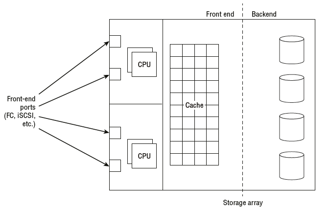

На рисунке показана высокоуровневая структурная схема массива хранения данных — SAN или NAS — с указанием основных компонентов.
Начиная слева, у нас есть ***порты front-end***. Они подключаются к сети хранения данных и позволяют хостам получать доступ к экспортированным ресурсам хранения данных и использовать их. Порты front-end обычно являются FC или Ethernet (iSCSI, FCoE, NFS, SMB).

 Хосты, которые хотят использовать общие ресурсы из массива хранения данных, должны подключаться к сети по тому же протоколу, что и массив хранения данных. Поэтому, если вы хотите получить доступ к блочным LUN через Fibre Channel, вам необходимо установить на сервере адаптер главной шины Fibre Channel (HBA).

Если мы переместимся вправо от портов front-end, мы попадем в ***процессоры*** . Теперь это почти всегда процессоры Intel. Они запускают прошивку массива и управляют портами front-end и вводом-выводом, который поступает и выходит через них.

Если продолжить движение вправо, то за процессорами находится ***кэш-память*** . Она используется для ускорения производительности массива, а в массивах на основе механических дисков абсолютно необходима для достойной производительности. Нет кэша — нет производительности!

Выйдя из кэша, вы попадаете в область ***бэкенда*** . Здесь может быть больше ЦП и портов, которые подключаются к дискам, составляющим большую часть бэкенда. Иногда те же ЦП, которые управляют фронтендом, управляют и бэкендом.

# 8. Архитектурные принципы
Теперь давайте рассмотрим некоторые основные архитектурные принципы, общие для массивов хранения данных.

## 8.1 Избыточность
Избыточность в ИТ-проектах — это принцип наличия более одного экземпляра каждого компонента, чтобы при (а не если ) отказе компонентов ваши системы могли работать и продолжать предоставлять услуги. Избыточные проекты часто имеют структуру N+1 , что означает, что каждый компонент (N) имеет один запасной компонент, который может взять на себя нагрузку в случае отказа N. 

Избыточная ИТ-проектирование — это основа для постоянно работающих предприятий в цифровую эпоху, где даже небольшое количество простоев может иметь катастрофические последствия для бизнеса.

Различные массивы хранения данных построены с разными уровнями избыточности — и вы получаете то, за что платите. Дешевые массивы будут поставляться с минимальным количеством избыточных деталей, тогда как массивы корпоративного класса будут поставляться с избыточностью, встроенной почти в каждый компонент — блоки питания , порты front-end, процессоры, внутренние пути, модули кэширования, полки для дисков и диски. Большинство этих компонентов поддерживают горячую замену. Конечная цель — чтобы массив мог выдерживать удары и продолжать обслуживать ввод-вывод, несмотря на отказы нескольких компонентов.

***Горячая замена*** относится к возможности замены физических компонентов в компьютерной системе без необходимости ее выключения. Распространенным примером является дисковод, который всегда должен быть доступен для замены, пока система работает и обслуживает ввод-вывод.

## 8.2 Архитектуры с двумя контроллерами
Архитектуры с двумя контроллерами представляют собой именно то, на что они похожи: массивы хранения данных с двумя контроллерами.

Почти во всех конфигурациях с двумя контроллерами, хотя оба контроллера активны одновременно, они не являются по-настоящему активными/активными. ***Каждый LUN принадлежит только одному из контроллеров.*** Обычно нечетные LUN принадлежат одному контроллеру, в то время как четные LUN принадлежат другому контроллеру. 

***Только контроллер, которому принадлежит LUN, может читать и писать на него напрямую.*** В этом смысле массивы с двумя контроллерами являются **активными/пассивными** на основе LUN — один контроллер владеет LUN и, следовательно, активен для этого LUN, тогда как другой контроллер является пассивным и не читает и не пишет на него напрямую. Это известно как ***асимметричный доступ к логическим единицам (ALUA)***.

Если хост обращается к LUN через контроллер, не являющийся владельцем, должен будет переслать запрос контроллеру, являющемуся владельцем, что увеличит задержку в процессе. Если эта ситуация сохраняется, следует изменить владельца LUN (контроллера, который владеет LUN и может читать и писать напрямую). Специальное программное обеспечение, установленное на хосте, называемое программным обеспечением для ***многопутевого доступа (multipathing)***, помогает управлять этим, и ***владелец контроллера обычно автоматически меняется системой*** без вмешательства пользователя.

Давайте рассмотрим краткий пример системы с двумя контроллерами, реализующей ALUA. Допустим, у вас есть система с двумя контроллерами, один из которых называется CTL0, а другой — CTL1. В этой системе 10 LUN. CTL0 владеет всеми нечетными LUN, а CTL1 владеет всеми четными LUN. Когда я говорю, что ***контроллер владеет LUN, я имею в виду, что он имеет исключительную возможность чтения и записи для этого LUN***. В этой конфигурации вы можете видеть, что оба контроллера -активны — отсюда и причина, по которой некоторые называют их активными/активными. Однако ***только один контроллер имеет доступ для чтения/записи к любому LUN в любой момент времени***.

Если один из контроллеров выходит из строя в системе с двумя контроллерами, выживший контроллер захватывает право собственности на LUN, которые ранее принадлежали вышедшему из строя контроллеру. Отлично — это может показаться нормальным, пока вы не поймете, что вы, вероятно, удвоили рабочую нагрузку выжившего контроллера. А если оба контроллера уже были заняты, выживший контроллер может оказаться с большим объемом работы, чем он может обработать. Это никогда не бывает хорошим местом! Мораль истории в том, чтобы планировать отказы и не перегружать свои системы.

Системы с двумя контроллерами существуют уже много лет, они относительно просты в реализации и дешевы в приобретении. В результате они популярны в средах малого и среднего размера и часто называются массивами среднего уровня .

### 8.2.1 Недостатки двойного контроллера
Ниже приведены основные проблемы, с которыми следует ознакомиться при использовании архитектур с двумя контроллерами:

- Когда один контроллер выходит из строя, другой контроллер берет на себя нагрузку вышедшего из строя контроллера. Очевидно, что это увеличивает нагрузку на выживший контроллер. Должно быть легко увидеть, что массив из двух контроллеров, где оба контроллера работают на 80 процентов от проектной мощности, будет иметь проблемы с производительностью, если один контроллер выйдет из строя.

- Когда контроллер выходит из строя в системе с двумя контроллерами, система должна перейти в так называемый ***режим сквозной записи (write-through mode)***. В этом режиме ввод-вывод должен быть защищен на внутреннем диске до того, как хосту будет выдано подтверждение (ACK). Это важно, поскольку выдача ACK, когда данные находятся в кэше (но не зеркалируются на другой контроллер, поскольку он выключен), приведет к потере данных, если выживший контроллер также выйдет из строя.
Поскольку режим сквозной записи не выдает ACK, когда ввод-вывод попадает в кэш, производительность серьезно снижается!

- Архитектуры с двумя контроллерами существенно ограничены в масштабируемости и не могут иметь более двух узлов контроллеров. 

### Примечание
Я видел много проблем с производительностью, возникающих в производственных средах, которые доводят массивы с двумя контроллерами до предела, только чтобы оставшийся контроллер не справлялся с нагрузкой, когда один из контроллеров выходит из строя. Неоднократно я видел, как системы электронной почты не могли своевременно отправлять и получать почту, когда базовый массив хранения был вынужден работать на одном контроллере. Даже когда неисправный контроллер заменяется, почтовым очередям могут потребоваться часы, а иногда и дни, чтобы обработать накопившиеся данные и вернуться к нормальному обслуживанию.

## 8.3 Архитектуры сетевых хранилищ (Grid storage architectures)
Архитектуры хранения Grid , иногда называемые кластерными или масштабируемыми архитектурами , являются ответом на ограничения архитектур с двумя контроллерами. Они состоят из более чем двух контроллеров и являются гораздо более современными и лучше подходят для сегодняшних требований, чем устаревшие архитектуры с двумя контроллерами.

### 8.3.1 Истинное владение активным/активным LUN
Главное отличие дизайна по сравнению с большинством архитектур с двумя контроллерами заключается в том, что все контроллеры в сетевом массиве действуют как единое логическое устройство и, следовательно, работают в истинной конфигурации ***«активный/активный»***. Когда я говорю «истинный активный/активный» , я имею в виду, что это ***не ограничивается ни одной из махинаций ALUA, которыми мы ограничены в архитектурах с двумя контроллерами***. В сетевых архитектурах несколько узлов могут владеть и записывать данные на любые и все LUN. Это означает, что ***хост может выдавать данные ввода-вывода на LUN по любому из доступных путей к LUN, которые у него есть, без добавления задержки***, которая возникает, когда контроллер, не являющийся владельцем, должен пересылать запрос контроллеру-владельцу. 

Напротив, в массивах с двумя контроллерами хост может выдавать данные ввода-вывода на конкретный LUN только по путям к контроллеру-владельцу, не создавая дополнительной задержки.

Термин «масштабирование» (scale-out) означает, что вы можете независимо добавлять больше узлов, которые могут содержать процессоры, память и порты в систему, а также больше дисков. Это отличается от систем масштабирования вверх, которые могут добавлять только больше дисков.

Давайте вернемся к нашему простому примеру из раздела «Архитектуры с двумя контроллерами», где у нас есть 10 LUN на нашем массиве, на этот раз в массиве с четырьмя контроллерами. Поскольку это сеточная архитектура, все четыре узла могут быть активны и записывать данные на все 10 LUN. Это может значительно повысить производительность.

### 8.3.2 Бесперебойные сбои контроллера (Seamless Controller Failures)
Сетевые хранилища также могут более изящно справляться со сбоями контроллеров.

Это потому, что они не должны переходить в режим сквозной записи кэша — я говорю «не должны», потому что не все массивы достаточно умны, чтобы делать это. 

Четырехузловой массив с одним отказавшим контроллером все еще будет иметь три контроллера, работающих. Нет никаких причин, кроме плохой конструкции, что эти три выживших контроллера не смогут продолжать предоставлять зеркальный (защищенный) кэш, хотя и меньший по полезной емкости, пока неисправный контроллер заменяется.

Вот краткий пример: предположим, что каждый контроллер в нашем массиве из четырех контроллеров имеет 10 ГБ кэша, то есть общий кэш системы составляет 40 ГБ. Для простоты предположим, что кэш защищен зеркалированием, то есть половина из 40 ГБ доступна для использования — 20 ГБ. Когда один контроллер выходит из строя, общий доступный кэш уменьшается до 30 ГБ. Это все еще может быть защищено зеркалированием на оставшихся трех контроллерах, оставляя ~15 ГБ доступного кэша. Важный момент заключается в том, что, хотя объем кэша уменьшается, системе не нужно переходить в режим сквозной записи кэша. Это приводит к значительному снижению производительности во время сбоев узлов.
Кроме того, массив из четырех узлов, который теряет один узел контроллера, снижает производительность (процессоры, кэш и количество портов front-end) всего на 25 процентов, а не на 50 процентов. Аналогично, массив из восьми узлов снизит производительность всего на 12,5 процента. Добавьте к этому отсутствие необходимости переходить в режим сквозной записи кэша, и вы получите гораздо более надежную и отказоустойчивую систему.

### 8.3.3 Возможность масштабирования
Сетевые хранилища также масштабируются гораздо лучше, чем массивы с двумя контроллерами. Это связано с тем, что вы можете добавлять ЦП, кэш, пропускную способность и диски. Архитектуры с двумя контроллерами часто позволяют добавлять только диски.

Предположим, что у вас есть контроллер, который может справиться с 10 000 операций ввода-вывода в секунду (IOPS). Двухконтроллерный массив на основе этих контроллеров может обрабатывать максимум 20 000 операций ввода-вывода в секунду, хотя если один из контроллеров выйдет из строя, это число упадет до 10 000. Даже если вы добавите достаточно дисковых накопителей за контроллерами, чтобы иметь возможность обрабатывать 40 000 операций ввода-вывода в секунду, контроллеры на передней стороне никогда не смогут вывести диски на их потенциал в 40 000 операций ввода-вывода в секунду. Если бы это была архитектура на основе сетки, вы также могли бы добавить больше контроллеров на переднюю сторону, так что фронтенд был бы достаточно мощной, чтобы вывести диски на их предел.

Эта повышенная масштабируемость, производительность и отказоустойчивость обходятся дорого! Сетевые массивы обычно считаются корпоративным классом и имеют соответственно более высокую цену.

### 8.3.4 Массивы корпоративного класса
Вы часто будете слышать, как люди называют массивы класса предприятия (enterprise class). Что это значит? К сожалению, официального определения нет, и поставщики склонны злоупотреблять этим термином. Но обычно термин enterprise class подразумевает следующее:
- Несколько контроллеров
- Минимальное воздействие при выходе из строя контроллеров
- Онлайн-обновления без прерывания работы (NDU)
- Масштабирование до более чем 1000 дисков
- Высокая доступность
- Высокая производительность
- Масштабируемый
- Всегда включен
- Предсказуемая производительность
- Дорогой!

Список можно продолжать, но по сути, корпоративный класс — это то, что вы бы покупали каждый раз, если бы могли себе позволить!

Большинство поставщиков систем хранения будут предлагать как массивы среднего, так и корпоративного класса. В целом, архитектуры на основе сетки попадают в категорию корпоративного класса, тогда как архитектуры с двумя контроллерами часто считаются средними.

### 8.3.5 Массивы среднего диапазона
В то время как корпоративные массивы имеют все необходимые функции и нацелены на клиентов с глубокими карманами, массивы среднего уровня больше нацелены на клиентов, заботящихся о стоимости. Следовательно, массивы среднего уровня чаще ассоциируются с двухконтроллерными архитектурами.

Хотя массивы среднего уровня ни в коем случае не плохи, они определенно отстают от корпоративных массивов в следующих областях:
- Производительность
- Масштабируемость
- Доступность

Однако они, как правило, требуют значительно меньших затрат (как капитальных, так и эксплуатационных).

Если говорить о массиве как о среднем, то это не совсем бюджетный вариант. Хотя эти массивы могут не соответствовать корпоративным массивам, они часто обладают хорошей производительностью, доступностью и приличным набором функций по более приемлемой цене.

### 8.3.6 Массивы All-Flash
Что касается систем хранения и ИТ-администраторов, массивы хранения all-flash работают и ведут себя почти так же, как и традиционные массивы хранения, только быстрее! Или, по крайней мере, такова цель. Говоря, что они ведут себя так же, я имею в виду, что у них есть порты front-end, обычно некоторый кэш DRAM, внутренние шины, внутренние диски и тому подобное. Они берут флэш-накопители, объединяют их вместе, разделяют на тома и защищают их с помощью RAID или какой-либо другой подобной схемы защиты. Многие даже предлагают услуги моментальных снимков и репликации, тонкое выделение ресурсов, дедупликацию и сжатие. Массивы all-flash могут быть двухконтроллерными, одноконтроллерными или масштабируемыми (и, несомненно, любыми другими, которые появятся в будущем).

Однако есть тонкие и существенные различия под капотом, о которых вам нужно знать. Давайте посмотрим.

Твердотельная технология потрясает индустрию хранения данных и меняет большинство правил! Это означает, что вы ***не можете просто взять устаревшую архитектуру, которая была разработана и отточена за годы для работы с вращающимся диском, и напихать в нее твердотельную технологию***. На самом деле, вы можете это сделать, и некоторые поставщики так и сделали, но вы абсолютно ***не получите максимум от вашего массива*** или твердотельной технологии, которую вы в него вставляете.

Твердотельное хранилище меняет большинство правил, поскольку ведет себя совершенно иначе, чем вращающийся диск. Это означает, что все тонкие настройки, которые были внесены в конструкцию массива хранения за последние 20+ лет — массивные кэши на передней панели, оптимизированное размещение данных, алгоритмы предварительной выборки, макет бэкэнда, производительность бэкэнд-пути и т. д. — все это ***можно выбросить***.

### 8.3.7 Кэш в массивах All-Flash
Основная цель кэша — скрыть механические задержки (медлительность) вращающегося диска. Что ж, флэш-память не страдает ни от одной из этих болезней, что делает этот большой и дорогой кэш менее полезным. Массивы all-flash, вероятно, все еще будут иметь кэш DRAM, потому что как бы быстра ни была флэш-память, DRAM все равно быстрее. Однако объем кэша DRAM в массивах all-flash будет меньше и в основном будет использоваться для ***кэширования метаданных***.
Алгоритмы кэширования также должны понимать, когда они общаются с флэш-бэкендом. Больше нет необходимости выполнять большие предварительные выборки и опережающие чтения. Чтение из флэш-памяти в любом случае происходит очень быстро, и нет необходимости ждать, пока головки переместятся или пластина повернет в нужное положение.

### 8.3.8 Flash обеспечивает дедупликацию
Массив all-flash будет хорошо подходить для технологии, которая исторически считалась препятствующей производительности: первичное хранилище. Но помните, флэш-память меняет правила.

Во-первых, стоимость за терабайт массивов all-flash требует технологий сокращения данных, таких как дедупликация и сжатие, для достижения конкурентоспособного соотношения $/TB. При правильной реализации, поверх современной архитектуры — разработанной для работы с твердотельными накопителями — встроенная дедупликация первичного хранилища может иметь нулевое влияние на производительность. 

Это может работать следующим образом: современные процессоры поставляются с функциями разгрузки (***ofload functions***), которые могут использоваться для выполнения чрезвычайно ***низкозатратных легких хэшей в отношении входящих данных***. 

***Если хэш предполагает, что данные могли быть просмотрены ранее и, следовательно, являются кандидатом на дедупликацию, можно выполнить побитовое сравнение с фактическими данными.***

 И вот в чем магия: ***побитовое сравнение выполняется молниеносно на флэш-носителях***, поскольку по сути это операции чтения. На вращающемся диске они были медленными! ***Реализация встроенной дедупликации на архитектурах вращающихся дисков требовала сильных хэшей, чтобы снизить необходимость в побитовых сравнениях***. Эти сильные хэши дороги с точки зрения циклов ЦП, поэтому они накладывают накладные расходы на архитектуры вращающихся дисков. Это не проблема для массивов на основе флэш-памяти!

Кроме того, при наличии ***умеренного кэша перед флэш-памятью эти хэши могут выполняться асинхронно — после отправки ACK хосту***.

***Дедупликация также приводит к несмежному расположению данных на бэкэнде***. Это может иметь существенное влияние на производительность архитектур со вращающимися дисками, поскольку приводит к большой задержке поиска и вращения. Ни один из этих факторов не является фактором для архитектур на основе флэш-памяти.

Тем не менее, дедупликация все еще может быть неподходящей для флэш-массивов, нацеленных на рынок сверхвысокой производительности уровня 0. Но для всего остального (включая уровень 1) предложение дедупликации должно быть практически обязательным!

На протяжении всей главы я использую термин «уровень» и концепцию многоуровневости для обозначения множества различных вещей. Например, важное бизнес-приложение в организации может называться приложением уровня 1, в то время как массивы хранения высокого класса я также называю массивами хранения уровня 1. Я также использую этот термин для обозначения дисков. Диски уровня 1 — самые быстрые и высокопроизводительные диски, тогда как диски уровня 3 — самые медленные и низкопроизводительные диски. Последний момент по многоуровневости: в отрасли принято использовать термин «уровень 0» для обозначения сверхвысокопроизводительных дисков и ¬массивов хранения. Я могу иногда использовать этот термин.

### 8.3.9 Flash для виртуальных серверных сред
Технологии гипервизора, как правило, создают то, что в отрасли известно как ***эффект смешивания ввода-вывода (I/O blender effect)***. Это нежелательный побочный эффект запуска десятков виртуальных машин на одном физическом сервере. Наличие такого количества рабочих нагрузок, работающих на одном физическом сервере, приводит к тому, что все операции ввода-вывода, выходящие с этого сервера, оказываются сильно рандомизированными — как будто все это кинули в миксер и смешали! И мы знаем, что вращающийся диск не любит случайных операций ввода-вывода. Твердотельное хранилище, с другой стороны, практически живет для этого, что делает массивы ***all-flash идеальными для высоковиртуализированных рабочих нагрузок***.

### 8.3.10 Производительность уровня 0 или уровня 1
Существует определенное разделение в целях некоторых массивов all-flash. Есть те, кто стремится открыть новый рынок, так называемый рынок уровня 0, где сверхвысокая производительность и доллар за IOP (\$/IOP) являются названием игры. Эти массивы являются драгстерами мира хранения, хвастаясь миллионами IOPS. С другой стороны, есть массивы all-flash, которые нацелены на текущий рынок хранения уровня 1. Эти массивы обеспечивают более высокую и более предсказуемую производительность, чем существующие массивы вращающихся дисков уровня 1, но они не обеспечивают производительность в диапазоне драгстеров ввода-вывода рынка уровня 0. Вместо этого они больше фокусируются на функциях, функциональности и внедрении технологий экономии пространства, таких как дедупликация, чтобы выйти на конкурентоспособную цену доллара за гигабайт ($/ГБ).

# 9. Преимущества массива хранения данных
Массивы хранения позволяют вам объединять ресурсы хранения, тем самым более эффективно используя как емкость, так и производительность. С точки зрения производительности, распараллелив использование ресурсов, вы можете выжать больше производительности из вашего комплекта. Это позволяет вам лучше использовать емкость и производительность.

## 9.1 Емкость
С точки зрения емкости массивы хранения помогают предотвратить накопление неиспользуемой емкости, также известной как острова емкости. 

Давайте рассмотрим простой пример: 10 серверов с 1 ТБ локального хранилища каждый. Пять серверов использовали более 900 ГБ и нуждаются в дополнительном хранилище, тогда как остальные пять серверов использовали только 200 ГБ. 

Поскольку это хранилище подключено локально, нет возможности разрешить пяти серверам, у которых заканчивается емкость, использовать свободную емкость с пяти серверов, которые использовали только 200 ГБ каждый. Это приводит к неиспользуемой емкости.

Теперь предположим, что 10 ТБ емкости были объединены в массиве хранения со всеми 10 подключенными серверами. Вся доступная емкость может быть динамически разделена между 10 подключенными серверами. Неиспользуемой емкости нет.

## 9.2 Производительность
Преимущества производительности массивов хранения аналогичны преимуществам емкости. Продолжая наш пример с 10 серверами, предположим, что на каждом сервере есть два диска, каждый из которых способен на 100 IOPS. Теперь предположим, что некоторым серверам требуется больше, чем 200 IOPS, которые могут предоставить локально установленные диски, тогда как другие серверы едва используют свои доступные IOPS. При локально подключенном хранилище IOPS каждого дискового накопителя доступен только серверу, на котором установлен накопитель. Объединяя все диски в массив хранения, способный использовать их все параллельно, все IOPS потенциально доступны любому или всем серверам.

## 9.3 Управление
Массивы хранения данных упрощают управление емкостью и производительностью. Если придерживаться нашего примера с 10 серверами, если бы все хранилище было локально подключено к 10 серверам, то было бы 10 точек управления. Но если вы используете массив хранения данных, хранилище для этих серверов ¬может управляться из одной точки. Это может быть существенно в больших средах с сотнями или даже тысячами серверов, которые в противном случае потребовали бы индивидуального управления хранилищем.

## 9.4 Расширенная функциональность
Массивы хранения, как правило, предлагают расширенные функции, включая репликацию, моментальные снимки, тонкое обеспечение, дедупликацию, сжатие, высокую доступность и разгрузку ОС/гипервизора. Конечно, облако теперь угрожает превосходству массива хранения, заставляя поставщиков массивов хранения повышать свою игру во многих отношениях.

## 9.5 Повышенная надежность
Пока массив хранения имеет по крайней мере два контроллера, например, в системе с двумя контроллерами, он может пережить отказ любого отдельного компонента, включая целый контроллер, не теряя доступа к данным. Конечно, производительность может быть затронута, пока не будет заменен неисправный компонент; однако вы не потеряете свои данные. Этого нельзя сказать о подходах с прямым подключением к хранилищу (DAS), где хранилище устанавливается непосредственно на сервере. В подходе с DAS отказ материнской платы сервера или внутреннего контроллера хранилища может привести к потере данных системой.

# 10. Минусы массива хранения
Хотя массивы хранения имеют много положительных сторон, есть и некоторые недостатки. В этом разделе вы рассмотрите некоторые из них.

# 10.1 Задержка
Задержка — это одна из областей, где массивы хранения не зажигают мир. Даже при самой быстрой сети хранения с самой низкой задержкой задержка чтения и записи в массив хранения всегда будет ***больше, чем задержка чтения и записи на локальный диск через внутреннюю шину PCIe***. 

Поэтому, для нишевых вариантов использования, где требуется сверхнизкая задержка, вам может быть лучше использовать локальное хранилище. А если вам нужны высокие случайные IOPS в дополнение к низкой задержке, то локально подключенная флэш-память на базе PCIe может быть лучшим вариантом. Однако подавляющее большинство требований к хранению приложений может быть удовлетворено массивом хранения. Только требования сверхнизкой задержки требуют локально подключенного хранилища.

# 10.2 Блокировка
Массивы хранения могут запереть вас, если вы не будете осторожны. Вы инвестируете в значительную часть инфраструктуры с большими первоначальными капитальными затратами и постоянным обслуживанием ¬. И в течение четырех-пяти лет вам нужно будет заменить ее в рамках цикла обновления технологий. Миграция служб на новый массив хранения в рамках обновления технологий часто может быть мини-проектом сама по себе. Хотя появляются технологии, упрощающие миграцию, это все еще может быть серьезной проблемой. Обязательно учитывайте требования обновления технологий при покупке хранилища. Хотя пять лет могут показаться долгим сроком, когда вы придете обновлять свой комплект, вы будете ругать себя, если вам придется приложить много усилий для миграции на новую платформу хранения.

# 10.3 Расходы
От этого никуда не деться: массивы хранения, как правило, дороги. Но, эй, вы получаете то, за что платите, верно? Вам решать, вести ли жесткую сделку с вашим поставщиком хранения. Если они не предлагают вам достаточно хорошую цену, это свободный рынок с множеством других поставщиков, которые будут более чем рады продать вам свои комплекты. Не совершайте ошибку, просто доверяя продавцу и не проводя собственное исследование.

# 11. Анатомия массива хранения данных
Давайте теперь немного заглянем под капот. На рисунке показаны основные компоненты массива хранения
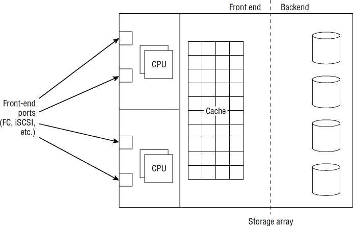

## 11.1 Front-End
Front-end массива хранения — это то место, где массив взаимодействует с сетью хранения и хостами — шлюз в массив и из него, если хотите. Это также место, где происходит большая часть магии.

Если вы знаете свой SCSI, то ***порты front-end на массиве хранения SAN действуют как цели SCSI*** для ввода-вывода хоста, тогда как ***HBA на хосте действует как инициатор SCSI***. 

Если ваш массив является массивом NAS, то порты front-end являются сетевыми endpoints с IP-адресами и именами хостов системы доменных имен (DNS).

## 11.2 Порты и связь
Серверы взаимодействуют с массивом хранения через порты на передней панели, которые часто называют портами front-end . Количество и тип портов front-end зависят от типа и размера массива хранения. Крупные корпоративные массивы могут иметь сотни портов front-end, и в зависимости от типа массива хранения эти порты бывают следующих видов:
- FC, 
- SAS
- Ethernet (протоколы FCoE и iSCSI).

Большинство массивов хранения данных высокого класса имеют интерфейсные порты с возможностью горячей замены, что означает, что в случае отказа порта его можно заменить, не останавливая массив и не прекращая обслуживание ввода-вывода.

Хосты могут подключаться к массивам хранения различными способами, например, прокладывая кабель напрямую от сервера к массиву хранения в прямом подключении или подключаясь через сеть. Также возможно иметь несколько соединений или путей между хостом и массивом хранения, все из которых требуют управления. Давайте более подробно рассмотрим каждую из этих концепций.

### 11.2.1 Прямое подключение
Хосты могут подключаться напрямую к портам front-end без промежуточного коммутатора SAN в режиме подключения, известном как direct attached. Прямое подключение имеет свое место в небольших развертываниях, но не масштабируется хорошо. В конфигурации с прямым подключением может быть только сопоставление хостов с портами хранения один к одному. Если ваш массив хранения имеет восемь front-end портов, вы можете подключить максимум восемь серверов. Фактически, поскольку большинство людей следуют общепринятой в отрасли практике наличия нескольких путей к хранилищу (***каждый хост подключен как минимум к двум портам массива хранения***), это уменьшит ваше соотношение хостов к портам хранения с один к одному до один к двум, что означает, что ***массив хранения с восемью портами может обслуживать только четыре хоста*** — каждый с двумя путями к массиву хранения. Это не масштабируется никаким воображением.

### 11.2.2 SAN подключение 
Гораздо более популярным и масштабируемым, чем прямое подключение, является подключение SAN. Подключение SAN размещает коммутатор между сервером и массивом хранения и позволяет нескольким серверам совместно использовать один и тот же порт хранения. Этот метод совместного использования несколькими серверами одного внешнего порта часто называют ***объединением по входу (fan-in)***, поскольку на схеме он напоминает карманный вентилятор. Объединение по входу показано на рисунке 
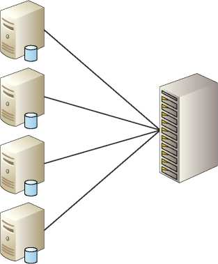

### 11.2.3 Многопутевой ввод/вывод (Multipath I/O)
Основой всех хороших проектов хранения является избыточность. Вам нужна ***избыточность на каждом уровне, включая пути по сети от хоста до массива хранения***. Важно, чтобы каждый сервер, подключающийся к хранилищу, имел по крайней мере два порта для подключения к сети хранения, чтобы в случае отказа одного из них или его отключения другой мог использоваться для доступа к хранилищу. В идеале эти порты будут на отдельных картах PCIe.

Однако в средах микросерверов и блейд-серверов развертывается один HBA с двумя портами. ***Наличие одного PCIe HBA с двумя портами не является такой избыточной конфигурацией***, как наличие двух отдельных карт PCIe HBA, поскольку двухпортовый PCIe HBA ***является единой точкой отказа***. Каждый из этих портов должен быть подключен к отдельным коммутаторам, и каждый коммутатор должен быть подключен к разным портам на разных контроллерах в массиве хранения данных. Эта конструкция показана на рисунке

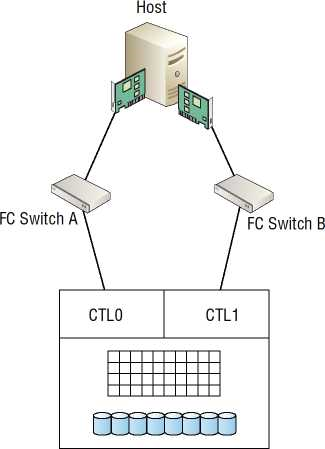

Программное обеспечение на базе хоста, называемое программным обеспечением ***многопутевого ввода-вывода multipath I/O(MPIO)*** , управляет маршрутизацией данных или балансировкой нагрузки по этим нескольким каналам, а также заботится о бесперебойной работе в случае отказа или нестабильности каналов.

К распространенным алгоритмам балансировки нагрузки MPIO относятся следующие:
- ***Только отказоустойчивость***. Если один путь к LUN активен, а другой пассивен, балансировка нагрузки по нескольким путям не выполняется.
***Циклический ввод-вывод*** чередуется по всем путям.
***Наименьшая глубина очереди***. Для следующего ввода-вывода будет использоваться путь с наименьшим количеством ожидающих операций ввода-вывода.

***Все современные операционные системы поставляются с собственной функциональностью MPIO***, которая обеспечивает хорошее управление отказами путей и балансировку нагрузки. Архитектуры MPIO ОС и гипервизоров, как правило, являются фреймворками, для которых поставщики массивов могут писать модули, специфичные для устройств. Эти модули, специфичные для устройств, добавляют функциональность фреймворку MPIO хоста, включая дополнительные алгоритмы балансировки нагрузки, которые настроены специально для массива поставщика.

#### 11.2.3.1 Упражнение настройки и балансировки нагрузки MPIO.
Следующая процедура описывает, как настроить политику балансировки нагрузки на Ubuntu - TBD


Некоторые поставщики также предлагают собственное программное обеспечение для многопутевого ввода-вывода. Лучшим примером этого является ***EMC PowerPath***. EMC PowerPath — это лицензированное программное обеспечение на базе хоста, которое стоит денег. Однако оно специально написано для обеспечения оптимизированного многопутевого ввода-вывода для массивов EMC. Оно также обеспечивает основу для более продвинутых технологий, чем просто MPIO.

Использование MPIO для массивов с двумя контроллерами, которые поддерживают только ALUA, требует, чтобы несколько путей к LUN были настроены только как отказоустойчивые, гарантируя, что ***используется только путь к активному контроллеру*** (контроллеру, которому принадлежит LUN). Доступ к LUN по неоптимизированному пути (путь через контроллер, которому не принадлежит LUN) может привести к низкой производительности по этому пути. Это связано с тем, что доступ к LUN по неоптимизированному пути приводит к необходимости передачи ввода-вывода с контроллера, которому не принадлежит LUN, через ***interconnects*** контроллеров на контроллер, которому он принадлежит. Это влечет за собой дополнительную задержку. Это показано на рисунке
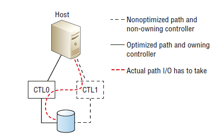

### 11.2.4 Скорость внешнего порта
Обычно порты front-end можно настроить на работу на нескольких разных скоростях в зависимости от типа порта front-end. Например, порт front-end FC на 16 Гбит/с обычно можно настроить на работу на скорости 16 Гбит/с, 8 Гбит/с или 4 Гбит/с. ***В Fibre Channel SAN всегда полезно жестко задавать скорость порта*** и не полагаться на протокол автосогласования. При этом убедитесь, что вы жестко задали для портов на обоих концах кабеля одинаковую скорость. Это обеспечит наиболее надежную и стабильную конфигурацию. Однако сети хранения данных на основе ***Ethernet должны использовать настройку автосогласования (AN)*** и не должны жестко задавать скорости портов.

## 11.3 Процессоры
Также ключом к front-end являются CPU. CPU, как правило, Intel, используются для питания front-end. Они выполняют прошивку ( часто называемую микрокодом специалистами по хранению), которая является мозгом массива хранения. Front-end CPU и микрокод, который они запускают, обычно отвечают за все следующее:
- Обработка ввода-вывода
- Кэширование
- Целостность данных
- Услуги репликации
- Локальные копировальные услуги
- Тонкое резервирование
- Сжатие
- Дедупликация
- Разгрузка гипервизора и ОС

Нередко крупные массивы хранения корпоративного класса имеют около 100 процессоров front-end, чтобы увеличить производительность front-end и обеспечить избыточность. Также часто небольшие массивы хранения low-end имеют очень мало процессоров и используют одни и те же процессоры для управления front-end и back-end массива.

Поставщики стремятся называть свои массивы хранения данных интеллектуальными, хотя это немного преувеличено и немного оскорбительно для всего действительно интеллектуального, если в массиве хранения данных есть какой-то интеллект, то этот интеллект находится в прошивке, которая управляет массивом.

Как уже упоминалось, термин ***«микрокод»*** часто используется в индустрии хранения данных для обозначения программного обеспечения/прошивки, которая является мозгом массива хранения данных.

Вы также можете увидеть сокращение термина до ucode. Технически говоря, это должно быть написано как μcode (символ μ является символом SI для микро), но поскольку символ μ не появляется ни на одной стандартной клавиатуре QWERTY, его проще заменить буквой u. Короче говоря, термин ucode относится к микрокоду, который управляет массивом. Он произносится как ю-код..

Поскольку прошивка — это мозг массива, вы правы, думая, что управление прошивкой имеет решающее значение для стабильности и производительности любого массива хранения. Если вы не заботитесь о ее обновлении, вы потеряете поддержку поставщика и подвергнете себя риску, когда возникнут проблемы. Вы действительно не можете позволить себе подвергать свое хранилище риску, не обновляя прошивку.
С другой стороны, вы, вероятно, не хотите быть на краю кровоточащей кромки -технологии фирменного ПО. Запуск самой последней версии прошивки в день ее выпуска (или, упаси бог, предварительной версии) в вашей производственной среде значительно увеличивает риск возникновения ошибок, что в лучшем случае тратит время и деньги, а в худшем может временно парализовать вашу организацию. Хорошее практическое правило — подождать как минимум три месяца после выхода в общий доступ (GA), прежде чем окунуться в новейшую и лучшую версию прошивки от поставщика.
Также хорошей идеей будет методично развернуть новую прошивку на вашем объекте. Обычный подход заключается в следующем:
1.	LAB. Сначала разверните в лаборатории и запустите ее как минимум на месяц, тестируя всю конфигурацию ¬, включая тестирование сценариев сбоев и перезагрузку подключенных серверов.
2.	DEV. Разверните в своей среде разработки и запустите в течение как минимум месяца.
3.	DR. Разверните на своих массивах аварийного восстановления disaster recovery(DR) (если вы используете живую/DR-среду) и запустите в течение одной недели.
4.	PROD. Развертывание в ваших действующих производственных массивах.

Очевидно, что этот список придется подгонять под вашу среду, поскольку не у всех есть роскошь полностью функциональной лаборатории, среды разработки и т. д. Однако вот несколько моментов, на которые стоит обратить внимание:
- Пусть кто-то другой найдет ошибки. Это главная причина, по которой коду нужно дать созреть в дикой природе в течение трех месяцев, прежде чем вы его возьмете. Обычно в течение трех месяцев после развертывания люди обнаруживают самые серьезные ошибки. Это также дает поставщику время исправить что-то серьезное.
- Не развертывайте напрямую в вашей рабочей среде. Вы хотите дать себе шанс на борьбу, чтобы отсеять любые потенциальные проблемы в ваших менее критически важных средах.
- Если вы реплицируете между массивами хранения, обычно не очень хорошая идея заставлять их работать ¬с разными версиями прошивки в течение длительного времени. Обычно хорошей идеей является обновление массива DR в одни выходные, а затем обновление живого производственного массива в следующие выходные. Однако, если у вас нет лаборатории или среды разработки, чтобы сначала провести тестирование, может быть лучше запустить DR в течение двух-четырех недель перед обновлением живых производственных массивов.

Всегда проверяйте у своего поставщика, обновляетесь ли вы через поддерживаемый маршрут. Некоторые поставщики не разрешат вам запускать разные версии кода на массивах, которые реплицируются друг на друга. Предыдущие правила являются только рекомендациями, и вам необходимо взаимодействовать с вашим поставщиком или партнером по каналу, чтобы убедиться, что вы делаете все по инструкции.

Очевидной причиной обойти предыдущие правила является то, что новая версия кода включает в себя исправление серьезной ошибки, которую вы ждете.

Еще одна вещь, о которой следует знать, заключается в том, что многие организации стандартизируют ежегодный план обновления прошивки. Ежегодное обновление позволяет вам оставаться достаточно актуальным и гарантирует, что вы не слишком отстанете.

Последний момент, который стоит отметить в теме управления прошивкой, — убедиться, что вы понимаете поведение вашего массива во время обновления прошивки. Хотя большинство обновлений прошивки в наши дни, как правило, являются NDU, вам нужно проверить. Последнее, что вы хотите сделать, это обновить прошивку только для того, чтобы на полпути обнаружить, что все порты front-end отключатся в процессе обновления, или весь контроллер отключится на некоторое время, что снизит общую производительность массива во время обновления!

## 11.4 LUNs, Volumes, Shares
Диски устанавливаются на бэкэнде, и их емкость делится на тома массивом. Если ваш массив хранения представляет собой массив SAN, эти тома представляются хостам через порты front-end как LUN. Правильно или нет, люди используют ***термины том и LUN взаимозаменяемо***. Для хоста, который видит LUN, он выглядит и ведет себя точно так же, как локально установленный дисковый накопитель. Если ваш массив представляет собой массив NAS, эти тома представляются хостам как сетевые ресурсы, обычно NFS или SMB/CIFS.

LUN на массиве хранения обычно расширяемы, то есть вы можете увеличивать их размер относительно легко. Иногда есть несколько осложнений, таких как ***реплицированные LUN***, но это не должно быть проблемой для любого приличного массива хранения. Если это так, вы покупаете что-то древнее.

### 11.4.1 Маскировка LUN
В качестве меры предосторожности все LUN, представленные из массива хранения SAN, должны быть замаскированы на массиве. Маскировка LUN — это процесс контроля того, какие серверы могут видеть какие LUN. На самом деле, это процесс контроля того, ***какие HBA могут видеть какие LUN***. По сути, это контроль доступа. Без маскировки LUN все LUN, представленные на фронте массива хранения, были бы видны всем подключенным серверам. Как вы можете себе представить, это был бы кошмар безопасности и повреждения данных.

В наши дни маскировка LUN почти всегда выполняется на массиве хранения — с использованием ***World Wide Port Name (WWPN) хоста HBA в средах FC*** и с использованием ***IP-адреса или iSCSI Qualiied Name (IQN) в средах iSCSI***. Например, на массиве хранения вы представляете LUN на внешнем порту. На этом порту есть список управления доступом, который определяет, каким хостам HBA WWPN разрешен доступ к каким LUN. При включенной маскировке LUN, если HBA WWPN вашего хоста не находится в списке управления доступом внешнего порта, вы не сможете увидеть никаких LUN на этом порту. Это просто реализовать и является стандартом для всех массивов хранения. 

Раньше люди применяли правила маскирования также и к хост-HBA. В современных средах хранения это делается редко, если вообще делается. Одна из главных причин заключается в том, что это никогда не было масштабируемым решением. Кроме того, это давало мало преимуществ, помимо выполнения маскирования LUN на массиве хранения и зонирования SAN в фабрике. 

Эквивалентом маскировки LUN в мире NAS является ограничение IP-адреса или -имени хоста, на который экспортируется том/общий ресурс. Помимо этого, вы также можете реализовать разрешения для файлов и папок.

### 11.4.2 Совместное использование LUN (LUN Sharing)
Хотя несколько хостов могут получать доступ и совместно использовать один и тот же блок LUN, делать это следует с особой осторожностью! Вообще говоря, единственный случай, когда нескольким серверам следует разрешать получать доступ и записывать данные в один и тот же общий LUN, — это кластерные конфигурации, в которых кластер работает под управлением надлежащего кластерного программного обеспечения, которое обеспечивает целостность данных на LUN — обычно путем обеспечения того, чтобы только один сервер мог записывать данные на LUN в любой момент времени.

Определенное программное обеспечение для резервного копирования и конструкции могут потребовать, чтобы сервер резервного копирования медиа монтировал общий LUN как доступный только для чтения, чтобы он мог выполнять резервное копирование данных на LUN. Но опять же, программное обеспечение для резервного копирования будет разработано для этого.

Если два сервера будут записывать данные на один и тот же LUN без надлежащего программного обеспечения кластеризации, данные на LUN почти наверняка будут повреждены.

### 11.4.3 Толстые и тонкие LUN
LUN на массиве хранения могут быть толстыми или тонкими. Традиционно они всегда были толстыми, но в наши дни чаще всего они тонкие. 

## 11.5 Кэш
Можно сказать, что кэш — это сердце массива хранения. Это, безусловно, Центральный вокзал массива. В большинстве массивов хранения все должно проходить через кэш. Все записи в массив сначала попадают в кэш, а затем переносятся на внутренний диск в более позднее время. Все чтения из массива помещаются в кэш перед отправкой на хост. Даже создание клона тома в пределах одного массива требует, чтобы блоки данных были считаны из внутреннего интерфейса, помещены в кэш, а затем скопированы в новые местоположения на том же внутреннем интерфейсе. Все это означает, что кэш чрезвычайно важен.

Кэш также имеет решающее значение для массивов хранения на основе флэш-памяти, но обычно его у них меньше, поскольку бэкэнд основан на твердотельных носителях, поэтому нет такой отчаянной необходимости в повышении производительности от кэша. Массивы хранения на основе флэш-памяти, как правило, используют кэш DRAM больше для кэширования метаданных и меньше для кэширования пользовательских данных.

### 11.5.1 Преимущества кэширования в производительности
Смысл кэша в массиве хранения на основе вращающихся дисков заключается в повышении производительности. Если ввод-вывод может быть выполнен из кэша без необходимости обращения к диску на бэкэнде, этот ввод-вывод будет обслуживаться в сотни раз быстрее! По сути, хорошо реализованный кэш скрывает за собой более низкую производительность механических дисков.

Что касается массивов, полностью состоящих из флэш-памяти, ***кэш-память DRAM по-прежнему быстрее флэш-памяти*** и может использоваться аналогичным образом, однако прямые преимущества в производительности не столь очевидны.

Необходимо, чтобы ***ввод-вывод записи поступил в массив хранения и был защищен в двух отдельных областях кэша, прежде чем хосту будет выдано подтверждение (ACK)***. 

Затем этот ввод-вывод записи переносится на бэкэнд в более поздний момент времени. Такое поведение значительно повышает скорость ACK. Этот modus operandi называется ***кэшированием с обратной записью (write-back caching)***. Если есть сбои в кэше, в той степени, в которой входящие записи не могут быть зеркально отражены в кэше (записаны в две отдельные области кэша), массив не выдаст ACK, пока данные не будут защищены на бэкэнде . Этот режим работы называется ***режимом сквозной записи (write-through mode)*** и оказывает огромное негативное влияние на производительность записи массива, снижая ее до производительности дисков.

Говоря о производительности и режиме сквозной записи, ***можно переполнить кэш массива хранения***, особенно если бэкэнд не обладает достаточной производительностью, чтобы данные в кэше достаточно быстро выгружались во время высоких всплесков активности записи. В этих сценариях кэш может заполняться до точки, обычно называемой ***высокой отметкой ожидания записи (high write pending watermark)***. После достижения этой отметки массивы, как правило, переходят в ***режим принудительной очистки (forced flush mode)*** или ***режим аварийной очистки кэша (emergency cache destage mode)***, в котором они эффективно работают в режиме сквозной записи кэша и выдают команды хостам, заставляя их снижать скорость отправки ввода-вывода. Это нехорошая ситуация!

### 11.5.2 Кэш чтения и кэш записи
Кэш-память для пользовательских данных также делится на области чтения и записи. Массивы различаются в зависимости от того, позволяют ли они/требуют ли они вручную разделять ресурсы кэша на кэш чтения и кэш записи. Люди склонны быть религиозными в отношении того, какой подход лучше. Позвольте пользователю решать или позвольте массиву решать. Я предпочитаю подход, позволяющий массиву решать, поскольку массив может реагировать быстрее, чем я, а также принимать упреждающие решения на лету, основываясь на текущих рабочих нагрузках ввода-вывода. Однако я вижу преимущество в возможности разбить свои ресурсы кэша на меньшие массивы с определенными, хорошо известными рабочими нагрузками. Однако на больших массивах со случайными и часто меняющимися рабочими нагрузками я бы предпочел оставить это на усмотрение массива.

По теме зеркалирования кэша: обычно зеркалирование только записывает ДАННЫЕ в кэш. Чтение кэша не требует зеркалирования, так как данные уже существуют на защищенном диске на бэкэнде, и если кэш потерян, данные чтения можно снова извлечь из бэкэнда. Если кэш чтения зеркалирован, он напрасно ¬тратит драгоценные ресурсы кэша.

### 11.5.3 Кэш данных и кэш управления
Массивы хранения высокого класса также, как правило, имеют выделенные области кэша для ***управляющих данных (метаданных)*** и выделенные области для ***пользовательских данных***. 

***Это увеличивает стоимость, но обеспечивает более высокую производительность и более предсказуемую производительность кэша.***

Дисковые массивы хранения зависимы от кэша для повышения производительности пользовательских данных, а также кэширования метаданных, к которым необходимо быстро получить доступ. 

Массивы all-flash в меньшей степени зависят от кэша для повышения производительности пользовательских данных, но все еще широко используют его для кэширования метаданных.

### 11.5.4 Попадания и промахи кэша
Попадание в кэш происходит для запроса на чтение, когда запрашиваемые данные уже доступны в кэше. Иногда это называется попаданием в кэш. Попадания в кэш являются самыми быстрыми типами чтения. Если данные отсутствуют в кэше и должны быть извлечены с внутреннего диска, то говорят, что произошел промах кэша или промах чтения . И промахи чтения могут быть шокирующе медленнее, чем попадания чтения. То, получите ли вы много попаданий чтения или нет, во многом зависит от рабочей нагрузки ввода-вывода. Если ваша рабочая нагрузка имеет высокую ссылочную локальность, вы должны получить хорошие результаты попаданий чтения.

Референтная локальность относится к тому, насколько широко ваши данные распределены по вашему адресному пространству. Рабочая нагрузка с хорошей референтной локальностью часто будет обращаться к данным, которые ссылочно близки или покрывают только небольшую область адресного пространства. Примером может служить большая база данных, которая преимущественно обращается только к данным за последние 24 часа.

### 11.5.4 Защита кэша
Поскольку кэш так важен для бесперебойной работы массива, он всегда защищен — обычно с помощью зеркалирования и батарей. На самом деле, я не могу вспомнить массив, достаточно жалкий, чтобы не иметь защищенного/зеркального кэша.

Существуют различные способы защиты кэша, и ***зеркалирование*** является наиболее распространенным. Существует более одного способа зеркалирования кэша. 

Некоторые способы лучше других. На высоком уровне массивы верхнего уровня принимают запись, которая попадает на порт front-end, и дублируют ее в две отдельные области кэша за одну операцию по быстрой внутренней шине. Это быстро.

Системы нижнего уровня часто принимают запись и фиксируют ее в кэше в одном контроллере, а затем с помощью второй операции копируют данные записи по внешней шине, возможно, Ethernet, в кэш в другом контроллере. Это медленнее, так как требует больше операций и более медленной внешней шины.

Помимо зеркалирования, все хорошие массивы хранения будут иметь батареи для питания кэша в случае отключения основного электричества. Помните, что кэш DRAM является энергозависимым ¬и теряет свое содержимое при отключении питания. Эти батареи часто используются либо для обеспечения достаточного питания, чтобы массив мог перенести содержимое кэша на бэкэнд ¬перед корректным отключением питания, либо для обеспечения достаточного заряда для модулей памяти Dual Inline Memory Modules (DIMM) кэша, чтобы сохранить их содержимое в безопасности до восстановления питания.

Защита кэша с помощью батарей делает кэш энергонезависимым. Энергонезависимый кэш часто называют энергонезависимой памятью с произвольным доступом (NVRAM).

Сейчас их перестают выпускать.

### 11.5.5 Сохранение кэша
Все хорошие массивы хранения высокого класса спроектированы таким образом, что отказы кэш-DIMM или даже отказы контроллеров не требуют перехода массива в режим сквозной записи кэша. Обычно это достигается путем реализации архитектуры сетки с более чем двумя контроллерами. Например, массив из четырех узлов может потерять до двух узлов контроллеров, прежде чем он больше не сможет зеркалировать/защищать данные в кэше. 

Предположим, что этот массив из четырех узлов контроллеров имеет 24 ГБ кэша на узел, что в общей сложности составляет 96 ГБ кэша. Этот кэш зеркалируется, то есть для записи данных доступно только 48 ГБ. Теперь предположим, что узел контроллера умирает. Это уменьшает доступный кэш с 96 ГБ до 72 ГБ. Поскольку есть три выживших контроллера, каждый из которых имеет кэш, записи, поступающие в массив, по-прежнему могут быть защищены в кэше нескольких узлов. Очевидно, что теперь общий доступный кэш меньше, поскольку 24 ГБ были потеряны из-за отказавшего контроллера, но все еще есть 36 ГБ зеркалированного кэша, доступного для кэширования записи.

Такое поведение чрезвычайно важно, поскольку если вы удалите кэш из массива хранения данных, особенно из массива хранения данных на основе вращающихся дисков, вы окажетесь в мире страданий!

### 11.5.6 Распространенные алгоритмы и методы кэширования
***Предварительная выборка*** — это распространенная техника, которую массивы используют при обнаружении последовательных рабочих нагрузок. Например, если массив получил запрос на чтение 2 МБ непрерывных данных для чтения из бэкэнда, массив обычно предварительно выбирает следующий набор непрерывных данных в кэш, основываясь на высокой вероятности того, что хост запросит это. Это особенно важно для дисковых массивов, поскольку головки чтения/записи уже будут находиться в правильном положении для извлечения этих данных без необходимости выполнять дорогостоящие операции поиска бэкэнда . Предварительная выборка гораздо менее полезна для массивов all-flash, поскольку массивы all-flash не страдают от механической и позиционной задержки, как вращающиеся дисковые накопители.

Большинство массивов также используют некоторую форму ***алгоритма очередей наименее недавно использованных least recently used(LRU)*** для данных в кэше. LRU основаны на принципе хранения в кэше последних использованных данных, тогда как данные, к которым последний раз обращались, будут выпадать из кэша. Обычно это немного больше, чем это, но очереди LRU являются основополагающими для большинства алгоритмов кэширования.

### 11.5.7 Флэш-кэширование
Все более популярным становится использование флэш-памяти в качестве формы кэша уровня 2 (L2) в массивах. Эти конфигурации по-прежнему имеют кэш L1 DRAM, но дополняют его дополнительным слоем флэш-кеша.

Предположим, что у вас есть массив с кэшем DRAM, выходящим на вращающиеся диски. Все запросы на чтение извлекают считанные данные в кэш, где они остаются до тех пор, пока не выпадут из очереди LRU. Обычно, как только эти данные выпадают из очереди LRU, они больше не находятся в кэше, и если вы хотите прочитать их снова, вам нужно пойти и извлечь их с дисков на бэкэнде. Это медлено! Если ваш кэш дополнен флэш-кешем L2, когда ваши данные выпадают из кэша L1 DRAM, они попадают во флэш-кеш L2. И поскольку флэш-памяти обычно намного больше, чем DRAM, данные могут оставаться там довольно долго, прежде чем о них забудут и, наконец, вытеснят со всех уровней кэша массива. Хотя флэш-кеши L2 не такие быстрые, как кэши L1 DRAM, они все равно намного быстрее, чем вращающиеся диски, и могут быть относительно дешевыми и большими! Они настоятельно рекомендуются.
Флэш-кэш может быть реализован различными способами. Самая простая и грубая реализация — использовать флэш-накопители SSD (Surface Solid State Drives) на бэкэнде и использовать их в качестве кэша L2. Это имеет недостаток производительности, поскольку они находятся на том же общем бэкэнде, что и вращающиеся диски. Это размещает флэш-память довольно далеко от контроллеров и делает доступ к ним подверженным любым конфликтам бэкэнда и задержкам, возникающим из-за необходимости проходить бэкэнд. Лучшие реализации размещают флэш-кэш L2 ближе к контроллерам, например флэш-память на основе PCIe, которая находится на линии PCIe на той же материнской плате, что и контроллеры, и кэш L1 DRAM.

### 11.5.8 Внешние флэш-кэши
Некоторые массивы теперь начинают интегрироваться с флэш-устройствами, установленными на хост-серверах. Эти системы, как правило, позволяют использовать флэш-ресурсы на базе PCIe на сервере в качестве расширения кэша массива — обычно кэша чтения.

Они делают это разными способами, но вот один из методов: когда сервер отправляет запрос на чтение массиву, соответствующие данные чтения сохраняются в кэше массива. Эти данные также сохраняются во флэш-памяти PCIe на сервере, чтобы они были ближе к хосту и не проходили через сеть хранения и не подвергались задержке, вызванной такой операцией. Попав во флэш-память PCIe сервера, они могут быть удалены из кэша массива. Этот подход может работать очень хорошо для серверов с преобладающей нагрузкой чтения.
Многим людям нравится знать как можно больше о кэше массива. Отлично. Я был одним из них. Меня интересовали размеры слотов, алгоритмы управления кэшем, иерархическая структура кэшей и т. д. Это хорошо для того, чтобы вы звучали так, будто знаете, о чем говорите, но в реальном мире это принесет вам мало пользы! Кроме того, большинство массивов хранения позволяют вам делать очень небольшую настройку кэша, и это, вероятно, хорошо.

## 11.6 Бэкэнд
Под backend массива хранения понимаются диски, полки дисков, внутренние порты и процессоры, которые всем этим управляют.

## 11.6.1 Процессоры
Массивы хранения данных ***высшего класса*** обычно имеют выделенные ЦП для управления внутренними функциями массива. Иногда эти ЦП отвечают за:
- расчеты четности RAID (XOR calcs), 
- оптимизацию ввода-вывода
- задачи по обслуживанию, такие как очистка дисков. 

Массивы ***среднего и низкого класса*** часто имеют меньше ЦП, и в результате внешние и внутренние операции контролируются одними и теми же ЦП.

## 11.6.2 Внутренние порты и возможности подключения
В настоящее время порты бэкэнда и подключение к дисковым накопителям в основном SAS. Большинство накопителей на бэкэнде имеют интерфейсы SAS и используют протокол SAS. Раньше были популярны Serial Advanced Technology Attachment (SATA) и FC-накопители, но их быстро заменяет SAS.
В 99 процентах случаев вам не нужно беспокоиться о протоколе и подключении бэкэнда. Единственная область, в которой FC имел преимущество, была в случае, если в центре обработки данных не было места для добавления дополнительных дисковых полок рядом с контроллерами массива. Диски, подключенные по FC, позволяли вам размещать диски на расстоянии нескольких метров от контроллеров, в другом проходе в центре обработки данных. Однако это редко реализовывалось.

## 11.6.3 Диски
Большинство современных дисков, механических и флэш-накопителей, основаны либо на SATA, либо на SAS. FC все еще встречается, но эти диски уже устарели. SAS становится все более популярным в массивах хранения, особенно в массивах хранения высокого класса, поскольку они двухпортовые, тогда как SATA по-прежнему популярен в настольных компьютерах и ноутбуках.
Диски, как правило, имеют стандартный форм-фактор 2,5 дюйма или 3,5 дюйма, причем 2,5-дюймовый становится все более популярным. А внутренние диски всегда поддерживают горячую замену!
Бэкенд или, по крайней мере, данные на бэкенде всегда должны быть защищены, и наиболее распространенным способом защиты данных на бэкенде является RAID. Да, технология RAID старая, но она работает, хорошо известна и надежно реализована.

Большинство современных массивов используют современные формы RAID, такие как сетевой RAID и параллельный RAID. Они, как правило, обеспечивают лучшую производительность и более быстрое восстановление при выходе из строя компонентов.

Большинство современных массивов также выполняют пул дисков на бэкэнде, часто называемый широким чередованием ***wide striping***. 

## 11.6.4 Питание
Почти каждый массив хранения на рынке будет поставляться с двумя блоками питания с возможностью горячей замены. Однако массивы высокого класса идут немного дальше. Вообще говоря, массивы высокого класса будут использовать несколько источников питания, которые должны быть из отдельных источников, и, как правило, предпочитают трехфазное питание от ИБП. Они также оснащены большими батареями, которые могут использоваться для питания массива в случае потери питания от обоих источников. Эти батареи питают массив достаточно долго, чтобы перенести содержимое кэша на диск или флэш-память или, в качестве альтернативы, сохранять содержимое кэша в течение длительных периодов времени (обычно один или два дня).

# 12. Интеллектуальный массив хранения данных

## 12.1 Репликация
Под репликацией будем иметь в виду удаленную репликацию. Смысл репликации заключается в создании удаленных копий (реплик) производственных данных. 

Допустим, у вас есть критически важная производственная база данных в вашем центре обработки данных в Москве, которую вы хотите реплицировать в ваш центр обработки данных в Нижнем Новгороде, чтобы у вас была актуальная копия ваших данных в  Нижнем Новгороде на случай, если ваши производственные системы в Москве выйдут из строя. Репликация — это то, что вам нужно для этого.

Эти копии, иногда называемые репликами , могут использоваться для различных целей, но чаще всего они используются для :
- Обеспечения непрерывности бизнеса в случае локальных сбоев, как описано выше
- Цели тестирования и разработки, такие как тестирование новых моделей и запросов на реальных данных в изолированной среде, где они не могут влиять на производственные системы или изменять производственные данные.

## 12.2 Непрерывность бизнеса
Репликация данных — это только один компонент надежного плана обеспечения ***непрерывности бизнеса Business Continuity (BC)***. Также крайне важно, чтобы планы обеспечения непрерывности бизнеса регулярно тестировались. Вы не хотите, чтобы в первый раз, когда вы используете свой план обеспечения непрерывности бизнеса, вы оказались в центре реальной катастрофы — надеясь, что все будет хорошо в ту же ночь. Скорее всего, этого не произойдет! Репетиции абсолютно необходимы для управления эффективными планами обеспечения непрерывности бизнеса. Тестируйте их и тестируйте снова!

## 12.3 Репликация на основе массива
При репликации на основе массива массив хранения управляет репликацией данных. Одним из преимуществ является то, что тяжелая работа по управлению репликацией выполняется массивом хранения, поэтому на серверах приложений не возникает никаких накладных расходов. Недостатком является то, что массив хранения не понимает приложений — поэтому ***репликация на основе массива хранения не является интеллектуальной***. Это означает, что реплицированные данные на удаленном сайте могут быть не в идеальном состоянии для чистого и надежного восстановления приложений, и что по каналу репликации может быть отправлено больше данных, чем при использовании репликации на основе приложений. Очевидно, что это чрезвычайно важно. По этой причине репликация на основе массива уступает место все более популярной репликации на основе приложений.
Репликация на основе массива почти всегда требует одного и того же типа массива на обоих концах соединения. Например, вы не могли бы реплицировать между массивом EMC VMAX в Нижнем Новгороде и NetApp FAS в Москве.

## 12.4 Репликация на основе приложений
Репликация на основе приложений не использует технологии репликации на основе массивов хранения. Во-первых, это означает, что накладные расходы на репликацию данных ложатся на серверы приложений. Это может быть неидеально, но большинство современных систем имеют достаточно мощности ЦП и других ресурсов, чтобы справиться с этим.
Вторым, и гораздо более важным, фактом о репликации на основе приложений является то, что она осознает приложение или является интеллектуальной. Это означает, что она понимает приложение, реплицирует данные так, как нравится приложению, и гарантирует, что состояние реплицированной копии данных находится в идеальном состоянии для использования приложением для быстрого и плавного восстановления.
Популярные примеры включают такие технологии, как Oracle Data Guard, и собственные технологии репликации, которые входят в состав технологий Microsoft, таких как Microsoft SQL Server и Microsoft Exchange Server.

## 12.5 Репликация на основе хоста и гипервизора
Некоторые менеджеры логических томов и гипервизоры начинают предлагать лучшие технологии репликации, и они существуют в различных формах. Некоторые формы технологий репликации на основе хоста/гипервизора не осознают ни приложения, ни массивы хранения. Они просто обеспечивают ту же неинтеллектуальную репликацию, которую предлагают массивы хранения, но без разгрузки бремени репликации на массив хранения. Это не лучший сценарий, но он часто дешев.
Существуют также технологии на основе гипервизора, которые либо выполняют репликацию, либо подключаются к технологиям репликации массива хранения. Примером технологий репликации на основе гипервизора является ***VMware vSphere Replication***, которая управляется ***VMware Site Recovery Manager***.

SRM также поддерживает репликацию на основе массива хранения и может быть интегрирована с технологиями репликации на основе массива. Это позволяет массиву выполнять тяжелую работу по репликации, но интегрирует это с возможностью SRM планировать и управлять отказоустойчивостью сайта.
Из двух вариантов с VMware SRM встроенная репликация vSphere является новой технологией и потенциально больше подходит для небольших сред, тогда как вариант интеграции SRM с технологиями репликации на основе массивов считается более надежным и масштабируемым.
Эти типы технологий репликации становятся все более популярными. Но будьте осторожны. Иногда они могут потребовать как лицензий на репликацию массива хранения, так и лицензий на программное обеспечение гипервизора!

## 12.6 Синхронная репликация
Синхронная репликация гарантирует нулевую потерю данных. Отлично! Я уверен, что мы все этого хотим. Однако всегда есть мелкий шрифт, и на этот раз мелкий шрифт говорит, что синхронная репликация имеет свою цену производительности.
Технологии синхронной репликации ***гарантируют нулевую потерю данных, гарантируя, что записи защищены в исходном и целевом массивах до того, как ACK будет выдан приложению, и приложение посчитает запись зафиксированной***. Это просто. К сожалению, ожидание завершения записи в целевом массиве часто может повлечь за собой ***значительную задержку***. Точная величина задержки зависит от нескольких факторов, но обычно она сводится к ***сетевому времени приема-передачи round-trip time (RTT)*** между исходным и целевым массивами. Сетевое RTT также обычно пропорционально расстоянию между исходным и целевым массивами.
На рисунке показана раскадровка синхронной репликации на основе массива.

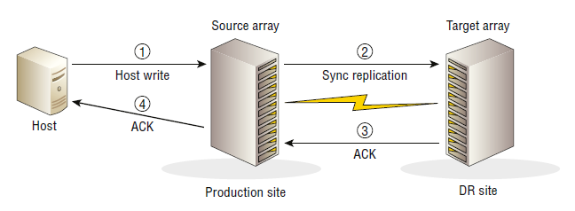

Поскольку синхронная репликация обеспечивает нулевую потерю данных, это дает ***нулевую цель точки восстановления recovery point objective (RPO)***. На высоком уровне RPO — это объем данных, которые могут быть потеряны, измеряемый в единицах времени. Например, RPO в 10 минут означает, что данные, используемые для восстановления приложения или службы, могут быть устаревшими максимум на 10 минут на момент потери.

Таким образом, RPO определяют технологии обеспечения непрерывности бизнеса, используемые для защиты бизнес-данных. Например, ежедневное резервное копирование приложения бесполезно, если RPO для этого приложения составляет 1 час.

### 12.6.1 Расстояния репликации и задержка
В качестве очень приблизительной цифры, расстояние в 75 миль между исходным и целевым массивами может повлечь за собой RTT в 1-2 миллисекунды (мс). Это 1-2 мс задержки, которая не возникла бы, если бы вы не синхронно реплицировали свои данные.

Если говорить о расстояниях, то примерная цифра для максимального расстояния, которое вы, возможно, захотите преодолеть в конфигурации синхронной репликации, может составлять ~100 миль. Однако важно проконсультироваться с поставщиком массива по таким вопросам, поскольку они могут накладывать другие ограничения и предлагать рекомендации в зависимости от своей конкретной технологии. Это не то, что вы хотите спроектировать самостоятельно и ошибиться.

При работе с каналами репликации между сайтами обязательно приглашайте поставщика массива и сетевую команду.

Всегда проверяйте, что, когда вы говорите о расстоянии между центрами обработки данных, вы указываете маршрут, пройденный сетью, а не расстояние, если вы путешествуете на машине. Расстояние может быть 60 миль на машине, но намного больше по маршруту, пройденному сетью.

Также важно иметь возможность тестировать и гарантировать задержку соединения. Вы можете получить гарантии задержки от вашего провайдера Wide Area Network (WAN).

### 12.6.2 Соображения относительно репликационной связи
При развертывании синхронной репликации вы также должны понимать важность сетевых соединений, соединяющих исходные и целевые массивы. Нестабильное соединение, которое постоянно то поднимается, то опускается, будет означать, что ваше решение не может гарантировать нулевую потерю данных без остановки записи ping в приложение, пока сетевое соединение не работает. Большинство организаций разрешают продолжать запись в приложение, пока репликация не работает; однако ***на время отключения репликации удаленная реплика будет несинхронизирована***. Если вы потеряете основную копию, пока репликация не работает, ваша реплика на удаленном сайте не будет обновлена, ваше соглашение об уровне обслуживания (SLA) будет нарушено, и вы столкнетесь со сценарием потери данных, если вам нужно будет поднять приложения в режиме DR.

Хотя это и редкость, некоторые организации имеют приложения, которые они отгораживают (прекращают запись), если удаленная реплика не может быть синхронизирована. Это, как правило, приложения специального случая.

Из-за всего этого важно иметь несколько надежных и разнообразных репликационных ссылок между вашими сайтами. Все центры обработки данных уровня 1 будут двуххвостыми — ***две ссылки между сайтами, каждая из которых использует разные маршруты***.

Вам также следует учесть ***размер вашей репликационной ссылки***. Если вы не определите размер вашей ссылки, чтобы справиться с самыми большими всплесками трафика, ссылка будет перегружена, когда вы столкнетесь с высокими всплесками записи данных, и впоследствии производительность ваших приложений упадет. Некоторые организации с радостью принимают это на себя, поскольку это означает, что им не придется увеличивать размер своих репликационных ссылок, чтобы справиться с пиковым трафиком. Важно то, что вы знаете свои требования при определении размера и спецификации репликационных ссылок. На рисунке показано использование пропускной способности сети с часовыми интервалами. Для того чтобы это решение гарантировало, что удаленная реплика не отстает от объема источника производства, сетевая ссылка должна быть рассчитана на то, чтобы справляться с пиковым трафиком.


## 12.7 Асинхронная репликация
Главное различие между синхронной и асинхронной репликацией заключается в том, что при асинхронной репликации каждая ***запись считается завершенной, когда локальный массив ее подтверждает***. Не нужно ждать, пока запись будет зафиксирована на томе реплики, прежде чем выдавать ACK.
Это означает несколько вещей:
- асинхронность не обеспечивает нулевой потери данных. Фактически, асинхронная репликация ***гарантирует вам потерю данных***! Объем потерянных данных полностью зависит от вашей конфигурации. Например, если ваше решение для репликации реплицирует только каждые 5 минут, вы можете потерять немного больше данных за 5 минут.

- асинхронная репликация ***не влечет за собой потери производительности***, которые возникают при синхронной репликации. Это происходит потому, что запись в удаленный массив выполняется ленивым образом в более позднее время.

- расстояния между исходным и целевым массивом могут быть намного больше, чем в синхронных конфигурациях. Это происходит потому, что ***RTT между исходным и целевым массивом больше не имеет значения***. Теоретически вы можете разместить исходный и целевой массивы на противоположных концах планеты.

- нет необходимости указывать сетевые соединения между сайтами для удовлетворения пикового спроса. Тем не менее, вам все равно следует указать сетевое соединение, чтобы не выйти за пределы согласованного RPO.

Все это хорошо, если вы можете спокойно спать по ночам, зная, что потеряете часть данных, если вам когда-нибудь придется вызывать DR.

Вызов ***Disaster Recovery DR (аварийного восстановления)*** означает запуск приложения с использованием его реплицированного хранилища. Обычно это включает в себя отказ приложения — включая сервер, сеть и хранилище — на резервном сервере, сети и хранилище в удаленном центре обработки данных аварийного восстановления.

Массивы хранения данных, как правило, реализуют асинхронную репликацию, показанную на рисунке, одним из двух способов:
- На основе моментального снимка (Snapshot based)
- На основе журнала (Journal based)

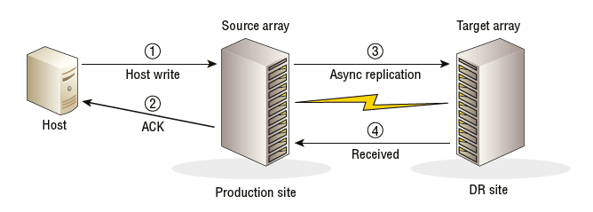

### 12.7.1 Асинхронная репликация на основе моментальных снимков
При асинхронной репликации на основе снимков исходный массив периодически делает моментальные снимки исходного тома на определенный момент времени, а затем реплицирует данные снимка по сети на целевой массив, где они применяются к тому-реплике.

Этот тип репликации основан на расписании, что означает, что вы планируете снимки и интервал репликации в соответствии с требуемой точкой восстановления (RPO). Предположим, вы согласовали SLA с бизнесом, чтобы иметь возможность восстанавливать данные в течение 10 минут с момента возникновения инцидента. Настройка интервала репликации в 5 минут будет соответствовать этому RPO и гарантировать, что тома реплик никогда не будут отставать от исходных томов более чем на ~5 минут.

Хорошие массивы хранения имеют интерфейс, который позволяет вам указать ваш RPO, и он настроит для вас особенности репликации, чтобы гарантировать, что ваш RPO SLA будет выполнен. Лучшие массивы хранения имеют RPO, доведенный до еще большей глубины. Например, если у вас есть некоторые тома, настроенные на 15-минутный RPO, а другие на 20-минутный RPO, если массив сталкивается с перегрузкой репликации, массив будет определять приоритеты репликации на основе того, какие RPO ближе всего к сбою. Это граничит с интеллектом массива!
Если ваш массив хранения застрял в 90-х и не понимает RPO и SLA, вам придется вручную учитывать эти моменты при настройке репликации.

Будьте осторожны. RPO в 10 минут не означает, что вы можете настроить ¬интервал обновления репликации в 10 минут! Это по сути потому, что ваши ¬данные моментального снимка не будут мгновенно поступать на целевой массив в момент отправки. Для передачи данных по сети требуется время, и часто провод, используемый для асинхронной репликации, является относительно дешевым проводом с низкой пропускной способностью. Если предположить, что все ваши данные поступают на целевой массив за 2 минуты, то это потенциально 12-минутный RPO, а не 10-минутный.

Обычно, если ваш массив поддерживает асинхронную репликацию на основе снимков, этот массив будет использовать тот же механизм снимков, который он использует для создания локальных снимков. В зависимости от вашего массива, это может означать, что снимки на основе репликации съедают максимальное количество снимков, поддерживаемых в массиве. Таким образом, если ваш массив поддерживает максимум 1024 снимка, и вы реплицируете 256 томов с помощью асинхронной репликации на основе снимков, вы, вероятно, съели 256 из максимальных 1024 снимков массива.

При ***асинхронной репликации на основе снимков остерегайтесь размера экстента снимка*** — гранулярности, с которой растут снимки. Если размер экстента снимка составляет 64 КБ, но все, что вы обновляете между интервалами репликации, — это один блок размером 4 КБ, то на самом деле по сети будет реплицировано 64 КБ — один экстент снимка. Ничего страшного, не так ли? Теперь предположим, что несколько больших массивов совместно используют удаленный канал репликации, каждый из которых использует репликацию на основе снимков. Вы обновляете 1000 уникальных блоков по 4 КБ и предполагаете, что это реплицирует чуть менее 4 МБ данных по сети. Однако каждое из этих обновлений по 4 КБ было в уникальном экстенте на каждом томе, что означает, что вы в конечном итоге реплицируете 1000 x 64 КБ вместо 1000 x 4 КБ. Разница тогда довольно велика — 62,5 МБ вместо 3,9 МБ!

Хорошая вещь в репликации на основе снимков заключается в том, что пока ваш массив имеет достойную технологию снимков, он будет объединять записи. Это означает, что если ваше приложение обновило один и тот же блок данных 1000 раз с момента последнего интервала репликации, только самое последнее обновление этого блока данных будет отправлено по сети со следующим набором дельт, а не все 1000 обновлений.

### 12.7.2 Асинхронная репликация на основе журнала
Технологии асинхронной репликации на основе журналов буферизуют данные записи в выделенные тома журналов , иногда называемые журналами намерений записи . Они должны быть соответствующего размера (обычно завышенного), чтобы справляться с большими всплесками трафика или моментами, когда ссылки репликации не работают. Если вы установите слишком маленький размер этих томов журналов, репликация прервется во время больших всплесков или длительных периодов простоя ссылок репликации. С другой стороны, если вы установите слишком большой размер, вы будете тратить пространство впустую в 99 процентах случаев. Это можно считать балансировкой или темным искусством. В любом случае, это довольно сложно с точки зрения проектирования.

Когда операции ввода-вывода записи поступают в исходный массив, они, как обычно, попадают в кэш, и массив отправляет хосту ACK. Операции ввода-вывода записи также помечаются метаданными, чтобы указать, что они предназначены для реплицированного тома, чтобы гарантировать, что данные также асинхронно копируются в локальные тома журнала. Затем данные удаляются на диск в соответствии со стандартным удалением кэша. Примерно в это же время данные также записываются в том журнала. Оттуда они реплицируются в целевой массив в момент, определяемый спецификой технологии репликации массива. Однако, в общем и целом, репликация на основе журнала не сильно отстает от исходного тома.
Хорошие массивы будут применять метаданные последовательности записи к данным, буферизованным в томах журнала, чтобы поддерживать правильный порядок записи при записи данных в целевой том на целевом массиве. После того, как данные зафиксированы на целевом массиве, их можно освободить из томов журнала на исходном массиве.

Реализации различаются в зависимости от того, отправляет ли исходный массив обновления в целевой массив или целевой массив извлекает обновления. Для вашей повседневной работы такие вещи не должны вас волновать, тем более не так сильно, как необходимость соблюдения SLA и RPO

Хотя асинхронная репликация не требует первоклассной пропускной способности сети между исходным и целевым массивами, убедитесь, что ваши сетевые соединения ¬не являются коротышкой сетевого мусора, низведенной до питания объедками, оставшимися после того, как все остальные получили свою долю. Если вы не предоставите ссылкам достаточную пропускную способность, вы будете слишком часто работать вне своих SLA, рискуя не только своей работой, но и данными вашей компании.

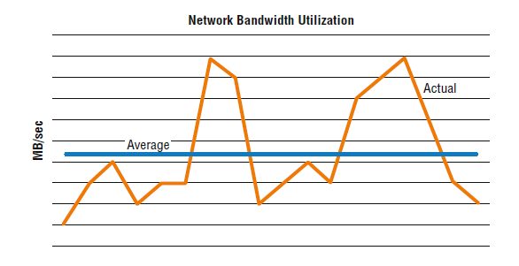

Рисунок показывает фактическое использование полосы пропускания, зафиксированное с часовыми интервалами, со средней линией. Ссылки асинхронной репликации не нужно подбирать для пиковых требований

## 12.8 Топологии репликации
Топология каскадной репликации с тремя сайтами использует промежуточный сайт, иногда называемый сайтом -бункером, для соединения исходного массива и целевого массива. На рисунке показан пример этой топологии.

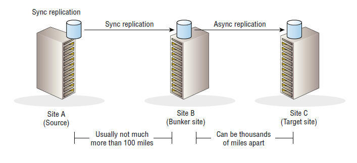

Как показано на рисунке 3.11, каскад из трех сайтов использует как синхронную, так и асинхронную репликацию 
- синхронную репликацию от исходного сайта к сайту-бункеровщику
- затем асинхронную ¬репликацию от сайта-бункера к целевому сайту.

Основным вариантом использования каскадных топологий с тремя площадками является обеспечение восстановления приложений с нулевой потерей данных в случае локализованной проблемы в вашем основном центре обработки данных, которая требует от вас вызова планов аварийного восстановления. В этой ситуации вы можете поднять свои приложения на площадке бункера с потенциально нулевой потерей данных. Однако, если крупная катастрофа сделает и основной центр обработки данных, и площадку бункера неработоспособными, у вас будет третья копия на удаленной площадке. 

Поскольку репликация между площадкой бункера и целевым сайтом асинхронна, расстояние может быть достаточно большим, чтобы даже крупная локальная катастрофа, которая затрагивает исходные и бункерные площадки, не затронет целевую площадку. И если катастрофа, достаточно большая, чтобы затронуть целевую площадку, действительно произойдет, есть большая вероятность, что восстановление приложений вашей компании будет последним, о чем вы подумаете!

Каскад из трех сайтов также позволяет вашим приложениям оставаться защищенными даже при выходе из строя исходного сайта. Это происходит потому, что все еще есть два сайта с репликационными связями между ними, и репликация между этими двумя сайтами все еще может работать.

Главной слабостью каскадной модели с тремя площадками является то, что отказ бункерной площадки также влияет на целевую площадку. По сути, если вы теряете бункерную площадку, ваша целевая площадка начинает все больше и больше отставать от производства, и ваш RPO становится опасно большим.

Эта модель также используется с вторичным массивом в основном центре обработки данных, а не на удаленной площадке-бункере, чтобы защититься от отказа основного массива, а не от полного отказа площадки.

## 12.9 Трехсайтовый многоцелевой
Топология с тремя площадками и несколькими целями одновременно реплицирует исходный массив на два целевых массива. Один целевой массив находится на относительно близком месте бункера — достаточно близко для синхронной ¬репликации. Другой целевой массив находится на большом расстоянии и реплицируется на него асинхронно. Эта конфигурация показана на рисунке.

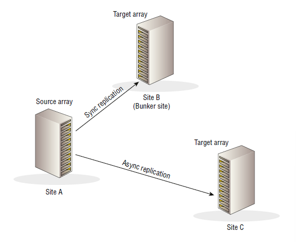

Главное преимущество трехсайтового мультитаргета перед трехсайтовым каскадом заключается в том, что отказ бункерного сайта не влияет на репликацию на целевой сайт. В этом отношении он более надежен.

Главным недостатком трехсайтовой многоцелевой топологии является то, что если исходный сайт потерян, репликация между сайтом бункера и целевым сайтом отсутствует. Это также может привести к более тяжелой нагрузке на первичный массив.

## 12.10 Треугольник из трех участков
Треугольник из трех сайтов похожа на многоцелевой с тремя сайтами и предлагает все те же опции, а также добавление резервного репликационного канала между бункером и целевым сайтом. При нормальных условиях работы этот дополнительный канал не отправляет активно репликационный трафик, но может быть включен, если исходный сайт становится недоступным. Топология треугольника из трех сайтов -показана на рисунке.

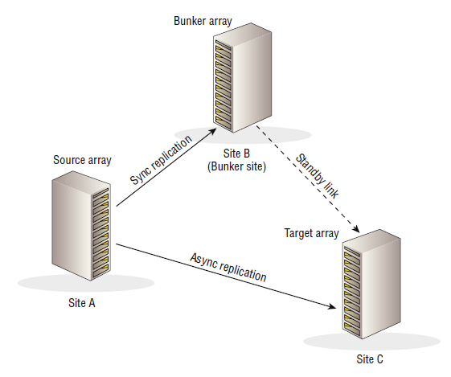

Если исходный сайт потерян, синхронизация репликации между сайтом бункера и целевым сайтом не требует полной синхронизации. Уцелевшие массивы в бункере и целевом сайте могут общаться и определять, какие обновления отсутствуют на целевом сайте, что позволяет выполнять инкрементальное обновление из массива бункера в целевой массив. Это позволяет вам снова запустить приложение и защитить его удаленной репликацией за короткий промежуток времени.

Не все массивы хранения поддерживают все топологии репликации. Крайне важно, чтобы вы проверили информацию у поставщика массива или в документации по массиву, прежде чем предположить, что ваш массив поддерживает определенную топологию репликации на нескольких сайтах.

## 12.11 Локальные снимки
Снимки не являются чем-то новым, а в некоторых случаях и технология, стоящая за ними, тоже. Некоторые реализации снимков являются древними. Мы раскроем некоторые из них.

Во-первых, давайте договоримся о терминологии: когда я говорю о ***снимках , я говорю о локальных копиях данных***. А под локальными я подразумеваю, что ***снимок существует на том же массиве, что и исходный том***. Вообще говоря, ***снимки — это копии на определенный момент времени oint-in-time(PIT)***.

***Эти два факта — локальный и момент времени — являются двумя основными различиями между локальными моментальными снимками и удаленными репликами.*** 

***Локальные моментальные снимки — это копии производственных томов, созданные и поддерживаемые на локальном массиве, тогда как удаленные реплики хранятся на удаленном массиве.***

***Кроме того, локальные моментальные снимки — это копии на момент времени, тогда как удаленные реплики обычно хранятся в синхронизации или полусинхронизации с основным производственным томом.***

Наконец, я использую термины ***исходный том (source volume)*** и ***первичный том (primary volume)*** для обозначения живого производственного тома. И я использую термин ***снимок (snapshot)*** для обозначения копии живого производственного тома на определенный момент времени . Это показано на рисунке.

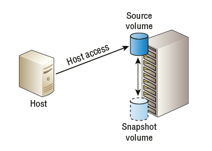

***Снимки*** и ***клоны*** создаются мгновенно, и в зависимости от вашего массива снимки и клоны могут быть помечены как доступные только для чтения или для чтения/записи. 

Все хорошие массивы поддерживают снимки:
- только для чтения 
- для чтения-записи.

Снимки — это не резервные копии! Возьмите это утверждение, запечатлейте его в своей голове, защитите его RAID с как минимум двойной четностью и закрепите его в высокопроизводительном кэше своего мозга, чтобы он всегда был доступен для быстрого вызова. Снимки — это не резервные копии! Почему? Если вы потеряете RAID-набор, массив или сайт, на котором размещены основные тома, вы потеряете и снимки. Вы не хотите оказаться в таком затруднительном положении.

## 12.12 Снимки на основе массива
Обычно используются два типа технологий моментальных снимков на основе массивов:
- Компактные снимки
- Полные клоны
Хотя они могут называться по-разному, эта книга придерживается этих двух названий. В этом разделе рассматриваются такие темы, как размер экстента снимка, резервирование пространства, количество снимков, как можно использовать многоуровневое хранение снимков, согласованность снимков и разница между снимками копирования при записи и перенаправления при записи.
