# 1. Введение
Основные типы массивов хранения данных:
- Storage Area Network (SAN)
- Network Attached Storage (NAS)

# 2. Массивы хранения данных — подготовка сцены
Традиционно массивы хранения представляли собой большие, гудящие рамы вращающихся дисков, которые занимали огромное количество площади в центре обработки данных и потребляли достаточно электроэнергии, чтобы обеспечить электроэнергией небольшую страну. Самый большой мог быть длиной более 10 шкафов, вмещая тысячи дисководов, сотни интерфейсных портов и терабайты кэша. Они, как правило, поставлялись в специализированных шкафах, которые были худшим кошмаром для менеджера центра обработки данных. Вдобавок ко всему, они были дорогими в покупке, сложными в управлении и примерно такими же негибкими, как гранит. Это было прекрасно, если вы хотели заработать много денег в качестве консультанта, но не так хорошо, если вы хотели управлять бережливым и эффективным ИТ-магазином, который мог бы быстро реагировать на требования бизнеса.

На рисунке показан массив EMC VMAX из 11 рам.К счастью, все это меняется, в немалой степени из-за влияния твердотельных накопителей и облака. Обе технологии являются чрезвычайно разрушительными и заставляют поставщиков хранилищ -повышать свою игру. Массивы хранения становятся более энергоэффективными, более простыми в управлении , более осведомленными о приложениях и гипервизорах, более компактными, более стандартизированными и в некоторых случаях более дешевыми!


Вот краткий обзор терминологии, прежде чем вы углубитесь в детали: термины storage array , storage subsystem , storage frame и SAN array часто используются для обозначения одного и того же. Хотя это может быть не самым точным с технической точки зрения, в этой книге в основном используется термин storage array или просто array , поскольку это, вероятно, наиболее широко используемые термины в отрасли

# 3. Что такое массив хранения данных?
Массив хранения данных — это компьютерная система, разработанная и предназначенная для предоставления хранилища внешним компьютерам, обычно через сеть хранения данных. Традиционно таким хранилищем был вращающийся диск, но мы видим все большее количество твердотельных носителей в массивах хранения данных. Нередко большой массив хранения данных имеет более петабайта (ПБ) памяти.

Массивы хранения данных подключаются к хост-компьютерам через общую сеть и обычно обеспечивают повышенную надежность и расширенную функциональность. 

Массивы хранения данных бывают трех основных видов:
- SAN
- NAS
- Унифицированный (SAN и NAS)

Массивы хранения SAN , иногда называемые массивами блочного хранения , обеспечивают подключение через блочные протоколы, такие как Fibre Channel (FC), Fibre Channel over Ethernet (FCoE), Internet Small Computer System Interface (iSCSI) или Serial Attached SCSI (SAS). Массивы блочного хранения отправляют низкоуровневые команды доступа к диску, называемые блоками дескрипторов команд SCSI (CDB), такие как READ block , WRITE block и READ CAPACITY через SAN.

Массивы хранения NAS , иногда называемые файлерами , обеспечивают подключение по файловым протоколам, таким как сетевая файловая система (NFS) и SMB/CIFS. Файловые протоколы работают на более высоком уровне, чем низкоуровневые блочные команды. Они манипулируют файлами и каталогами с помощью команд, которые выполняют такие действия, как создание файлов, переименование файлов, блокировка диапазона байтов в файле, закрытие файла и т. д

```
Хотя на самом деле протокол называется Server Message Block (SMB), чаще всего его называют по его старому названию Common Internet File System (CIFS). Произносится как сифс.
```

Унифицированные массивы хранения , иногда называемые многопротокольными массивами , обеспечивают общее хранилище как по блочным, так и по файловым протоколам. Лучшее из обоих миров, не так ли? Иногда, а иногда нет.
Целью всех массивов хранения, SAN и NAS, является объединение ресурсов хранения и предоставление этих ресурсов хостам, подключенным через сеть хранения. Помимо этого, большинство массивов хранения предоставляют следующие расширенные функции и возможности:
- Репликация (Replication)
- Снимки (Snapshots)
- Разгрузки (Offloads)
- Высокая доступность и отказоустойчивость (High availability and resiliency)
- Высокая производительность (High performance)
- Эффективность использования пространства (Space efficiency)

Хотя существуют всевозможные массивы хранения, нефункциональной целью каждого массива хранения является обеспечение идеальной среды и экосистемы для выживания и процветания дисковых накопителей и твердотельных накопителей. Эти массивы спроектированы и точно настроены для обеспечения оптимального -охлаждающего воздушного потока, гашения вибраций и чистого защищенного источника питания, а также для выполнения таких задач, как регулярная очистка дисков и другие проверки работоспособности. По сути, если бы вы были дисковым накопителем, вы бы хотели жить в массиве хранения!

```
SCSI Enclosure Services (SES) — один из примеров видов услуг, которые массивы хранения предоставляют для дисковых накопителей. SES — это фоновая технология, о которой вам, возможно, никогда не придется знать, но она предоставляет жизненно важную услугу. SES контролирует питание и напряжение, вентиляторы и охлаждение, промежуточные платы и другие факторы, связанные с окружающей средой в вашем массиве хранения. В центрах обработки данных с отключенным светом SES может предупредить вас о том, что у вас может быть семья голубей, гнездящихся в теплом бэкэнде вашего производственного массива хранения уровня 1.
```

# 4. SAN-хранилище
Как отмечалось ранее, массивы хранения SAN обеспечивают подключение к ресурсам хранения через блочные протоколы, такие как FC, FCoE и iSCSI. Ресурсы хранения представляются хостам как логические номера устройств SCSI (***LUN***) . Представьте себе LUN как необработанное дисковое устройство, которое с точки зрения операционной системы или гипервизора выглядит и ведет себя точно так же, как локально установленный дисковый накопитель — по сути, кусок необработанной емкости. Таким образом, ОС/гипервизор знает, что ему нужно отформатировать LUN и записать на него файловую систему.

Хотя это и спорно, по сравнению с хранилищем NAS, массивы хранения SAN исторически воспринимались как более производительные и более дорогие. Они предоставляют все службы моментальных снимков и репликации, которые вы также получили бы на массиве NAS, но поскольку массивы хранения SAN не владеют файловой системой на томе и не имеют никаких знаний о ней, в некоторых отношениях они немного глуповаты по сравнению со своими собратьями NAS.
Одной из основных причин, по которой массивы SAN считаются более производительными, чем массивы NAS, является выделенная сеть Fibre Channel, которая часто требуется для массива SAN. Сети Fibre Channel обычно предназначены для трафика хранения, часто используют методы коммутации cut-through и работают на высоких уровнях пропускной способности. Поэтому они обычно работают со значительно меньшей задержкой, чем совместное использование сети Ethernet 1 Gigabit или даже 10 Gigabit, которые являются обычными при использовании массива NAS.

Одной из основных причин, по которой массивы SAN считаются более производительными, чем массивы NAS, является выделенная сеть Fibre Channel, которая часто требуется для массива SAN. Сети Fibre Channel обычно предназначены для трафика хранения, часто используют методы коммутации cut-through и работают на высоких уровнях пропускной способности. Поэтому они обычно работают со значительно меньшей задержкой, чем совместное использование сети Ethernet 1 Gigabit или даже 10 Gigabit, которые являются обычными при использовании массива NAS.

# 5. NAS-хранилище
Массивы хранения NAS работают с файлами, а не с блоками. Эти массивы обеспечивают подключение через протоколы обмена файлами на основе TCP/IP, такие как NFS и SMB/CIFS. Они часто используются для консолидации файловых серверов Windows и Linux, где хосты монтируют экспорты и общие ресурсы из NAS точно так же, как они монтируют общий ресурс NFS или CIFS из файлового сервера Linux или Windows. Благодаря этому хосты знают, что эти экспорты и общие ресурсы не являются локальными томами, то есть нет необходимости записывать файловую систему на смонтированный том, поскольку это работа массива NAS.
Хост Windows, желающий сопоставить общий ресурс SMB/CIFS с массива NAS, сделает это точно так же, как он сопоставляет общий ресурс с файлового сервера Windows, используя путь в формате UNC, например \\legendary-file-server\shares\tech .
Поскольку протоколы NAS работают через общие сети Ethernet, они обычно страдают от более высокой сетевой задержки, чем хранилище SAN, и более подвержены проблемам, связанным с сетью. Кроме того, поскольку массивы хранения NAS работают с файлами и каталогами, им приходится иметь дело с разрешениями файлов, учетными записями пользователей, Active Directory, Network Information Service (NIS), блокировкой файлов и другими технологиями, связанными с файлами. Одной из распространенных проблем является интеграция проверки на вирусы с хранилищем NAS. В этом нет никаких сомнений: хранилище NAS — это совершенно другой зверь, чем хранилище SAN.

Массивы NAS часто упоминаются с использованием термина NetApp filers, поэтому не редкость услышать, как кто-то говорит: «Мы обновляем код на производственных filers в эти выходные ». Контроллеры NAS часто называют головками или головками NAS. Поэтому такое утверждение, как «Поставщик находится на месте, заменяя неисправную головку на NAS в Нью-Йорке», относится к замене неисправного контроллера NAS.

Массивы NAS исторически считались более дешевыми и менее производительными, чем массивы SAN. Это не обязательно так. Фактически, поскольку массивы NAS владеют и понимают базовую файловую систему, используемую на экспортируемом томе, и, следовательно, понимают файлы и метаданные, они часто могут иметь преимущество перед массивами SAN. Как и в большинстве случаев, вы можете купить дешевые, низкопроизводительные устройства NAS или вы можете копнуть немного глубже и купить дорогие , высокопроизводительные NAS. Конечно, большинство поставщиков скажут вам, что их устройства NAS недорогие и высокопроизводительные. Просто убедитесь, что вы знаете, что покупаете, прежде чем расстаться с кровно заработанными деньгами вашей компании.

# 6. Унифицированное хранилище
Унифицированные массивы обеспечивают блочное и файловое хранилище — SAN и NAS. Разные поставщики реализуют унифицированные массивы по-разному, но конечный результат — сетевой массив хранения, который позволяет хостам получать доступ к ресурсам хранения либо как к блочным LUN по блочным протоколам, либо как к сетевым общим ресурсам по протоколам обмена файлами. Эти массивы хорошо подходят для клиентов с приложениями, которым требуется блочное хранилище, например Microsoft Exchange Server, но также могут захотеть консолидировать файловые серверы и использовать массив NAS.
Иногда эти так называемые унифицированные массивы буквально представляют собой массив SAN и массив NAS, каждый со своими собственными выделенными дисками, скрепленными вместе блестящей дверцей, приделанной спереди, чтобы скрыть мешанину позади. Такие массивы ласково называют Frankenstorage . Альтернативой конструкции Frankenstorage является наличие одного массива с общим пулом дисков, работающих под управлением одной программы микрокода, которая обрабатывает как блоки, так и файлы.
Существуют аргументы за и против каждого подхода к проектированию. Проект Frankenstorage, как правило, более расточителен по ресурсам и сложнее в управлении, но он может обеспечить лучшую и более предсказуемую производительность, поскольку компоненты SAN и NAS фактически изолированы и работают как изолированные системы, если смотреть под капот. В общем, объединение массива SAN и массива NAS с помощью только общего графического интерфейса не является хорошим проектом и указывает на устаревшую технологию.

# 7. Обзор архитектуры массива хранения данных
В этом разделе вы изучите основные компоненты, общие для большинства архитектур массивов хранения данных, чтобы заложить основу для оставшейся части этой главы.


На рисунке показана высокоуровневая структурная схема массива хранения данных — SAN или NAS — с указанием основных компонентов.
Начиная слева, у нас есть ***порты front-end***. Они подключаются к сети хранения данных и позволяют хостам получать доступ к экспортированным ресурсам хранения данных и использовать их. Порты front-end обычно являются FC или Ethernet (iSCSI, FCoE, NFS, SMB).

 Хосты, которые хотят использовать общие ресурсы из массива хранения данных, должны подключаться к сети по тому же протоколу, что и массив хранения данных. Поэтому, если вы хотите получить доступ к блочным LUN через Fibre Channel, вам необходимо установить на сервере адаптер главной шины Fibre Channel (HBA).

Если мы переместимся вправо от портов front-end, мы попадем в ***процессоры*** . Теперь это почти всегда процессоры Intel. Они запускают прошивку массива и управляют портами front-end и вводом-выводом, который поступает и выходит через них.

Если продолжить движение вправо, то за процессорами находится ***кэш-память*** . Она используется для ускорения производительности массива, а в массивах на основе механических дисков абсолютно необходима для достойной производительности. Нет кэша — нет производительности!

Выйдя из кэша, вы попадаете в область ***бэкенда*** . Здесь может быть больше ЦП и портов, которые подключаются к дискам, составляющим большую часть бэкенда. Иногда те же ЦП, которые управляют фронтендом, управляют и бэкендом.

# 8. Архитектурные принципы
Теперь давайте рассмотрим некоторые основные архитектурные принципы, общие для массивов хранения данных.

## 8.1 Избыточность
Избыточность в ИТ-проектах — это принцип наличия более одного экземпляра каждого компонента, чтобы при (а не если ) отказе компонентов ваши системы могли работать и продолжать предоставлять услуги. Избыточные проекты часто имеют структуру N+1 , что означает, что каждый компонент (N) имеет один запасной компонент, который может взять на себя нагрузку в случае отказа N. 

Избыточная ИТ-проектирование — это основа для постоянно работающих предприятий в цифровую эпоху, где даже небольшое количество простоев может иметь катастрофические последствия для бизнеса.

Различные массивы хранения данных построены с разными уровнями избыточности — и вы получаете то, за что платите. Дешевые массивы будут поставляться с минимальным количеством избыточных деталей, тогда как массивы корпоративного класса будут поставляться с избыточностью, встроенной почти в каждый компонент — блоки питания , порты front-end, процессоры, внутренние пути, модули кэширования, полки для дисков и диски. Большинство этих компонентов поддерживают горячую замену. Конечная цель — чтобы массив мог выдерживать удары и продолжать обслуживать ввод-вывод, несмотря на отказы нескольких компонентов.

***Горячая замена*** относится к возможности замены физических компонентов в компьютерной системе без необходимости ее выключения. Распространенным примером является дисковод, который всегда должен быть доступен для замены, пока система работает и обслуживает ввод-вывод.

## 8.2 Архитектуры с двумя контроллерами
Архитектуры с двумя контроллерами представляют собой именно то, на что они похожи: массивы хранения данных с двумя контроллерами.

Почти во всех конфигурациях с двумя контроллерами, хотя оба контроллера активны одновременно, они не являются по-настоящему активными/активными. ***Каждый LUN принадлежит только одному из контроллеров.*** Обычно нечетные LUN принадлежат одному контроллеру, в то время как четные LUN принадлежат другому контроллеру. 

***Только контроллер, которому принадлежит LUN, может читать и писать на него напрямую.*** В этом смысле массивы с двумя контроллерами являются **активными/пассивными** на основе LUN — один контроллер владеет LUN и, следовательно, активен для этого LUN, тогда как другой контроллер является пассивным и не читает и не пишет на него напрямую. Это известно как ***асимметричный доступ к логическим единицам (ALUA)***.

Если хост обращается к LUN через контроллер, не являющийся владельцем, должен будет переслать запрос контроллеру, являющемуся владельцем, что увеличит задержку в процессе. Если эта ситуация сохраняется, следует изменить владельца LUN (контроллера, который владеет LUN и может читать и писать напрямую). Специальное программное обеспечение, установленное на хосте, называемое программным обеспечением для ***многопутевого доступа (multipathing)***, помогает управлять этим, и ***владелец контроллера обычно автоматически меняется системой*** без вмешательства пользователя.

Давайте рассмотрим краткий пример системы с двумя контроллерами, реализующей ALUA. Допустим, у вас есть система с двумя контроллерами, один из которых называется CTL0, а другой — CTL1. В этой системе 10 LUN. CTL0 владеет всеми нечетными LUN, а CTL1 владеет всеми четными LUN. Когда я говорю, что ***контроллер владеет LUN, я имею в виду, что он имеет исключительную возможность чтения и записи для этого LUN***. В этой конфигурации вы можете видеть, что оба контроллера -активны — отсюда и причина, по которой некоторые называют их активными/активными. Однако ***только один контроллер имеет доступ для чтения/записи к любому LUN в любой момент времени***.

Если один из контроллеров выходит из строя в системе с двумя контроллерами, выживший контроллер захватывает право собственности на LUN, которые ранее принадлежали вышедшему из строя контроллеру. Отлично — это может показаться нормальным, пока вы не поймете, что вы, вероятно, удвоили рабочую нагрузку выжившего контроллера. А если оба контроллера уже были заняты, выживший контроллер может оказаться с большим объемом работы, чем он может обработать. Это никогда не бывает хорошим местом! Мораль истории в том, чтобы планировать отказы и не перегружать свои системы.

Системы с двумя контроллерами существуют уже много лет, они относительно просты в реализации и дешевы в приобретении. В результате они популярны в средах малого и среднего размера и часто называются массивами среднего уровня .

### 8.2.1 Недостатки двойного контроллера
Ниже приведены основные проблемы, с которыми следует ознакомиться при использовании архитектур с двумя контроллерами:

- Когда один контроллер выходит из строя, другой контроллер берет на себя нагрузку вышедшего из строя контроллера. Очевидно, что это увеличивает нагрузку на выживший контроллер. Должно быть легко увидеть, что массив из двух контроллеров, где оба контроллера работают на 80 процентов от проектной мощности, будет иметь проблемы с производительностью, если один контроллер выйдет из строя.

- Когда контроллер выходит из строя в системе с двумя контроллерами, система должна перейти в так называемый ***режим сквозной записи (write-through mode)***. В этом режиме ввод-вывод должен быть защищен на внутреннем диске до того, как хосту будет выдано подтверждение (ACK). Это важно, поскольку выдача ACK, когда данные находятся в кэше (но не зеркалируются на другой контроллер, поскольку он выключен), приведет к потере данных, если выживший контроллер также выйдет из строя.
Поскольку режим сквозной записи не выдает ACK, когда ввод-вывод попадает в кэш, производительность серьезно снижается!

- Архитектуры с двумя контроллерами существенно ограничены в масштабируемости и не могут иметь более двух узлов контроллеров. 

### Примечание
Я видел много проблем с производительностью, возникающих в производственных средах, которые доводят массивы с двумя контроллерами до предела, только чтобы оставшийся контроллер не справлялся с нагрузкой, когда один из контроллеров выходит из строя. Неоднократно я видел, как системы электронной почты не могли своевременно отправлять и получать почту, когда базовый массив хранения был вынужден работать на одном контроллере. Даже когда неисправный контроллер заменяется, почтовым очередям могут потребоваться часы, а иногда и дни, чтобы обработать накопившиеся данные и вернуться к нормальному обслуживанию.

## 8.3 Архитектуры сетевых хранилищ (Grid storage architectures)
Архитектуры хранения Grid , иногда называемые кластерными или масштабируемыми архитектурами , являются ответом на ограничения архитектур с двумя контроллерами. Они состоят из более чем двух контроллеров и являются гораздо более современными и лучше подходят для сегодняшних требований, чем устаревшие архитектуры с двумя контроллерами.

### 8.3.1 Истинное владение активным/активным LUN
Главное отличие дизайна по сравнению с большинством архитектур с двумя контроллерами заключается в том, что все контроллеры в сетевом массиве действуют как единое логическое устройство и, следовательно, работают в истинной конфигурации ***«активный/активный»***. Когда я говорю «истинный активный/активный» , я имею в виду, что это ***не ограничивается ни одной из махинаций ALUA, которыми мы ограничены в архитектурах с двумя контроллерами***. В сетевых архитектурах несколько узлов могут владеть и записывать данные на любые и все LUN. Это означает, что ***хост может выдавать данные ввода-вывода на LUN по любому из доступных путей к LUN, которые у него есть, без добавления задержки***, которая возникает, когда контроллер, не являющийся владельцем, должен пересылать запрос контроллеру-владельцу. 

Напротив, в массивах с двумя контроллерами хост может выдавать данные ввода-вывода на конкретный LUN только по путям к контроллеру-владельцу, не создавая дополнительной задержки.

Термин «масштабирование» (scale-out) означает, что вы можете независимо добавлять больше узлов, которые могут содержать процессоры, память и порты в систему, а также больше дисков. Это отличается от систем масштабирования вверх, которые могут добавлять только больше дисков.

Давайте вернемся к нашему простому примеру из раздела «Архитектуры с двумя контроллерами», где у нас есть 10 LUN на нашем массиве, на этот раз в массиве с четырьмя контроллерами. Поскольку это сеточная архитектура, все четыре узла могут быть активны и записывать данные на все 10 LUN. Это может значительно повысить производительность.

### 8.3.2 Бесперебойные сбои контроллера (Seamless Controller Failures)
Сетевые хранилища также могут более изящно справляться со сбоями контроллеров.

Это потому, что они не должны переходить в режим сквозной записи кэша — я говорю «не должны», потому что не все массивы достаточно умны, чтобы делать это. 

Четырехузловой массив с одним отказавшим контроллером все еще будет иметь три контроллера, работающих. Нет никаких причин, кроме плохой конструкции, что эти три выживших контроллера не смогут продолжать предоставлять зеркальный (защищенный) кэш, хотя и меньший по полезной емкости, пока неисправный контроллер заменяется.

Вот краткий пример: предположим, что каждый контроллер в нашем массиве из четырех контроллеров имеет 10 ГБ кэша, то есть общий кэш системы составляет 40 ГБ. Для простоты предположим, что кэш защищен зеркалированием, то есть половина из 40 ГБ доступна для использования — 20 ГБ. Когда один контроллер выходит из строя, общий доступный кэш уменьшается до 30 ГБ. Это все еще может быть защищено зеркалированием на оставшихся трех контроллерах, оставляя ~15 ГБ доступного кэша. Важный момент заключается в том, что, хотя объем кэша уменьшается, системе не нужно переходить в режим сквозной записи кэша. Это приводит к значительному снижению производительности во время сбоев узлов.
Кроме того, массив из четырех узлов, который теряет один узел контроллера, снижает производительность (процессоры, кэш и количество портов front-end) всего на 25 процентов, а не на 50 процентов. Аналогично, массив из восьми узлов снизит производительность всего на 12,5 процента. Добавьте к этому отсутствие необходимости переходить в режим сквозной записи кэша, и вы получите гораздо более надежную и отказоустойчивую систему.

### 8.3.3 Возможность масштабирования
Сетевые хранилища также масштабируются гораздо лучше, чем массивы с двумя контроллерами. Это связано с тем, что вы можете добавлять ЦП, кэш, пропускную способность и диски. Архитектуры с двумя контроллерами часто позволяют добавлять только диски.

Предположим, что у вас есть контроллер, который может справиться с 10 000 операций ввода-вывода в секунду (IOPS). Двухконтроллерный массив на основе этих контроллеров может обрабатывать максимум 20 000 операций ввода-вывода в секунду, хотя если один из контроллеров выйдет из строя, это число упадет до 10 000. Даже если вы добавите достаточно дисковых накопителей за контроллерами, чтобы иметь возможность обрабатывать 40 000 операций ввода-вывода в секунду, контроллеры на передней стороне никогда не смогут вывести диски на их потенциал в 40 000 операций ввода-вывода в секунду. Если бы это была архитектура на основе сетки, вы также могли бы добавить больше контроллеров на переднюю сторону, так что фронтенд был бы достаточно мощной, чтобы вывести диски на их предел.

Эта повышенная масштабируемость, производительность и отказоустойчивость обходятся дорого! Сетевые массивы обычно считаются корпоративным классом и имеют соответственно более высокую цену.

### 8.3.4 Массивы корпоративного класса
Вы часто будете слышать, как люди называют массивы класса предприятия (enterprise class). Что это значит? К сожалению, официального определения нет, и поставщики склонны злоупотреблять этим термином. Но обычно термин enterprise class подразумевает следующее:
- Несколько контроллеров
- Минимальное воздействие при выходе из строя контроллеров
- Онлайн-обновления без прерывания работы (NDU)
- Масштабирование до более чем 1000 дисков
- Высокая доступность
- Высокая производительность
- Масштабируемый
- Всегда включен
- Предсказуемая производительность
- Дорогой!

Список можно продолжать, но по сути, корпоративный класс — это то, что вы бы покупали каждый раз, если бы могли себе позволить!

Большинство поставщиков систем хранения будут предлагать как массивы среднего, так и корпоративного класса. В целом, архитектуры на основе сетки попадают в категорию корпоративного класса, тогда как архитектуры с двумя контроллерами часто считаются средними.

### 8.3.5 Массивы среднего диапазона
В то время как корпоративные массивы имеют все необходимые функции и нацелены на клиентов с глубокими карманами, массивы среднего уровня больше нацелены на клиентов, заботящихся о стоимости. Следовательно, массивы среднего уровня чаще ассоциируются с двухконтроллерными архитектурами.

Хотя массивы среднего уровня ни в коем случае не плохи, они определенно отстают от корпоративных массивов в следующих областях:
- Производительность
- Масштабируемость
- Доступность

Однако они, как правило, требуют значительно меньших затрат (как капитальных, так и эксплуатационных).

Если говорить о массиве как о среднем, то это не совсем бюджетный вариант. Хотя эти массивы могут не соответствовать корпоративным массивам, они часто обладают хорошей производительностью, доступностью и приличным набором функций по более приемлемой цене.

### 8.3.6 Массивы All-Flash
Что касается систем хранения и ИТ-администраторов, массивы хранения all-flash работают и ведут себя почти так же, как и традиционные массивы хранения, только быстрее! Или, по крайней мере, такова цель. Говоря, что они ведут себя так же, я имею в виду, что у них есть порты front-end, обычно некоторый кэш DRAM, внутренние шины, внутренние диски и тому подобное. Они берут флэш-накопители, объединяют их вместе, разделяют на тома и защищают их с помощью RAID или какой-либо другой подобной схемы защиты. Многие даже предлагают услуги моментальных снимков и репликации, тонкое выделение ресурсов, дедупликацию и сжатие. Массивы all-flash могут быть двухконтроллерными, одноконтроллерными или масштабируемыми (и, несомненно, любыми другими, которые появятся в будущем).

Однако есть тонкие и существенные различия под капотом, о которых вам нужно знать. Давайте посмотрим.

Твердотельная технология потрясает индустрию хранения данных и меняет большинство правил! Это означает, что вы ***не можете просто взять устаревшую архитектуру, которая была разработана и отточена за годы для работы с вращающимся диском, и напихать в нее твердотельную технологию***. На самом деле, вы можете это сделать, и некоторые поставщики так и сделали, но вы абсолютно ***не получите максимум от вашего массива*** или твердотельной технологии, которую вы в него вставляете.

Твердотельное хранилище меняет большинство правил, поскольку ведет себя совершенно иначе, чем вращающийся диск. Это означает, что все тонкие настройки, которые были внесены в конструкцию массива хранения за последние 20+ лет — массивные кэши на передней панели, оптимизированное размещение данных, алгоритмы предварительной выборки, макет бэкэнда, производительность бэкэнд-пути и т. д. — все это ***можно выбросить***.

### 8.3.7 Кэш в массивах All-Flash
Основная цель кэша — скрыть механические задержки (медлительность) вращающегося диска. Что ж, флэш-память не страдает ни от одной из этих болезней, что делает этот большой и дорогой кэш менее полезным. Массивы all-flash, вероятно, все еще будут иметь кэш DRAM, потому что как бы быстра ни была флэш-память, DRAM все равно быстрее. Однако объем кэша DRAM в массивах all-flash будет меньше и в основном будет использоваться для ***кэширования метаданных***.
Алгоритмы кэширования также должны понимать, когда они общаются с флэш-бэкендом. Больше нет необходимости выполнять большие предварительные выборки и опережающие чтения. Чтение из флэш-памяти в любом случае происходит очень быстро, и нет необходимости ждать, пока головки переместятся или пластина повернет в нужное положение.

### 8.3.8 Flash обеспечивает дедупликацию
Массив all-flash будет хорошо подходить для технологии, которая исторически считалась препятствующей производительности: первичное хранилище. Но помните, флэш-память меняет правила.

Во-первых, стоимость за терабайт массивов all-flash требует технологий сокращения данных, таких как дедупликация и сжатие, для достижения конкурентоспособного соотношения $/TB. При правильной реализации, поверх современной архитектуры — разработанной для работы с твердотельными накопителями — встроенная дедупликация первичного хранилища может иметь нулевое влияние на производительность. 

Это может работать следующим образом: современные процессоры поставляются с функциями разгрузки (***ofload functions***), которые могут использоваться для выполнения чрезвычайно ***низкозатратных легких хэшей в отношении входящих данных***. 

***Если хэш предполагает, что данные могли быть просмотрены ранее и, следовательно, являются кандидатом на дедупликацию, можно выполнить побитовое сравнение с фактическими данными.***

 И вот в чем магия: ***побитовое сравнение выполняется молниеносно на флэш-носителях***, поскольку по сути это операции чтения. На вращающемся диске они были медленными! ***Реализация встроенной дедупликации на архитектурах вращающихся дисков требовала сильных хэшей, чтобы снизить необходимость в побитовых сравнениях***. Эти сильные хэши дороги с точки зрения циклов ЦП, поэтому они накладывают накладные расходы на архитектуры вращающихся дисков. Это не проблема для массивов на основе флэш-памяти!

Кроме того, при наличии ***умеренного кэша перед флэш-памятью эти хэши могут выполняться асинхронно — после отправки ACK хосту***.

***Дедупликация также приводит к несмежному расположению данных на бэкэнде***. Это может иметь существенное влияние на производительность архитектур со вращающимися дисками, поскольку приводит к большой задержке поиска и вращения. Ни один из этих факторов не является фактором для архитектур на основе флэш-памяти.

Тем не менее, дедупликация все еще может быть неподходящей для флэш-массивов, нацеленных на рынок сверхвысокой производительности уровня 0. Но для всего остального (включая уровень 1) предложение дедупликации должно быть практически обязательным!

На протяжении всей главы я использую термин «уровень» и концепцию многоуровневости для обозначения множества различных вещей. Например, важное бизнес-приложение в организации может называться приложением уровня 1, в то время как массивы хранения высокого класса я также называю массивами хранения уровня 1. Я также использую этот термин для обозначения дисков. Диски уровня 1 — самые быстрые и высокопроизводительные диски, тогда как диски уровня 3 — самые медленные и низкопроизводительные диски. Последний момент по многоуровневости: в отрасли принято использовать термин «уровень 0» для обозначения сверхвысокопроизводительных дисков и массивов хранения. Я могу иногда использовать этот термин.

### 8.3.9 Flash для виртуальных серверных сред
Технологии гипервизора, как правило, создают то, что в отрасли известно как ***эффект смешивания ввода-вывода (I/O blender effect)***. Это нежелательный побочный эффект запуска десятков виртуальных машин на одном физическом сервере. Наличие такого количества рабочих нагрузок, работающих на одном физическом сервере, приводит к тому, что все операции ввода-вывода, выходящие с этого сервера, оказываются сильно рандомизированными — как будто все это кинули в миксер и смешали! И мы знаем, что вращающийся диск не любит случайных операций ввода-вывода. Твердотельное хранилище, с другой стороны, практически живет для этого, что делает массивы ***all-flash идеальными для высоковиртуализированных рабочих нагрузок***.

### 8.3.10 Производительность уровня 0 или уровня 1
Существует определенное разделение в целях некоторых массивов all-flash. Есть те, кто стремится открыть новый рынок, так называемый рынок уровня 0, где сверхвысокая производительность и доллар за IOP (\$/IOP) являются названием игры. Эти массивы являются драгстерами мира хранения, хвастаясь миллионами IOPS. С другой стороны, есть массивы all-flash, которые нацелены на текущий рынок хранения уровня 1. Эти массивы обеспечивают более высокую и более предсказуемую производительность, чем существующие массивы вращающихся дисков уровня 1, но они не обеспечивают производительность в диапазоне драгстеров ввода-вывода рынка уровня 0. Вместо этого они больше фокусируются на функциях, функциональности и внедрении технологий экономии пространства, таких как дедупликация, чтобы выйти на конкурентоспособную цену доллара за гигабайт ($/ГБ).

# 9. Преимущества массива хранения данных
Массивы хранения позволяют вам объединять ресурсы хранения, тем самым более эффективно используя как емкость, так и производительность. С точки зрения производительности, распараллелив использование ресурсов, вы можете выжать больше производительности из вашего комплекта. Это позволяет вам лучше использовать емкость и производительность.

## 9.1 Емкость
С точки зрения емкости массивы хранения помогают предотвратить накопление неиспользуемой емкости, также известной как острова емкости. 

Давайте рассмотрим простой пример: 10 серверов с 1 ТБ локального хранилища каждый. Пять серверов использовали более 900 ГБ и нуждаются в дополнительном хранилище, тогда как остальные пять серверов использовали только 200 ГБ. 

Поскольку это хранилище подключено локально, нет возможности разрешить пяти серверам, у которых заканчивается емкость, использовать свободную емкость с пяти серверов, которые использовали только 200 ГБ каждый. Это приводит к неиспользуемой емкости.

Теперь предположим, что 10 ТБ емкости были объединены в массиве хранения со всеми 10 подключенными серверами. Вся доступная емкость может быть динамически разделена между 10 подключенными серверами. Неиспользуемой емкости нет.

## 9.2 Производительность
Преимущества производительности массивов хранения аналогичны преимуществам емкости. Продолжая наш пример с 10 серверами, предположим, что на каждом сервере есть два диска, каждый из которых способен на 100 IOPS. Теперь предположим, что некоторым серверам требуется больше, чем 200 IOPS, которые могут предоставить локально установленные диски, тогда как другие серверы едва используют свои доступные IOPS. При локально подключенном хранилище IOPS каждого дискового накопителя доступен только серверу, на котором установлен накопитель. Объединяя все диски в массив хранения, способный использовать их все параллельно, все IOPS потенциально доступны любому или всем серверам.

## 9.3 Управление
Массивы хранения данных упрощают управление емкостью и производительностью. Если придерживаться нашего примера с 10 серверами, если бы все хранилище было локально подключено к 10 серверам, то было бы 10 точек управления. Но если вы используете массив хранения данных, хранилище для этих серверов может управляться из одной точки. Это может быть существенно в больших средах с сотнями или даже тысячами серверов, которые в противном случае потребовали бы индивидуального управления хранилищем.

## 9.4 Расширенная функциональность
Массивы хранения, как правило, предлагают расширенные функции, включая репликацию, моментальные снимки, тонкое обеспечение, дедупликацию, сжатие, высокую доступность и разгрузку ОС/гипервизора. Конечно, облако теперь угрожает превосходству массива хранения, заставляя поставщиков массивов хранения повышать свою игру во многих отношениях.

## 9.5 Повышенная надежность
Пока массив хранения имеет по крайней мере два контроллера, например, в системе с двумя контроллерами, он может пережить отказ любого отдельного компонента, включая целый контроллер, не теряя доступа к данным. Конечно, производительность может быть затронута, пока не будет заменен неисправный компонент; однако вы не потеряете свои данные. Этого нельзя сказать о подходах с прямым подключением к хранилищу (DAS), где хранилище устанавливается непосредственно на сервере. В подходе с DAS отказ материнской платы сервера или внутреннего контроллера хранилища может привести к потере данных системой.

# 10. Минусы массива хранения
Хотя массивы хранения имеют много положительных сторон, есть и некоторые недостатки. В этом разделе вы рассмотрите некоторые из них.

# 10.1 Задержка
Задержка — это одна из областей, где массивы хранения не зажигают мир. Даже при самой быстрой сети хранения с самой низкой задержкой задержка чтения и записи в массив хранения всегда будет ***больше, чем задержка чтения и записи на локальный диск через внутреннюю шину PCIe***. 

Поэтому, для нишевых вариантов использования, где требуется сверхнизкая задержка, вам может быть лучше использовать локальное хранилище. А если вам нужны высокие случайные IOPS в дополнение к низкой задержке, то локально подключенная флэш-память на базе PCIe может быть лучшим вариантом. Однако подавляющее большинство требований к хранению приложений может быть удовлетворено массивом хранения. Только требования сверхнизкой задержки требуют локально подключенного хранилища.

# 10.2 Блокировка
Массивы хранения могут запереть вас, если вы не будете осторожны. Вы инвестируете в значительную часть инфраструктуры с большими первоначальными капитальными затратами и постоянным обслуживанием . И в течение четырех-пяти лет вам нужно будет заменить ее в рамках цикла обновления технологий. Миграция служб на новый массив хранения в рамках обновления технологий часто может быть мини-проектом сама по себе. Хотя появляются технологии, упрощающие миграцию, это все еще может быть серьезной проблемой. Обязательно учитывайте требования обновления технологий при покупке хранилища. Хотя пять лет могут показаться долгим сроком, когда вы придете обновлять свой комплект, вы будете ругать себя, если вам придется приложить много усилий для миграции на новую платформу хранения.

# 10.3 Расходы
От этого никуда не деться: массивы хранения, как правило, дороги. Но, эй, вы получаете то, за что платите, верно? Вам решать, вести ли жесткую сделку с вашим поставщиком хранения. Если они не предлагают вам достаточно хорошую цену, это свободный рынок с множеством других поставщиков, которые будут более чем рады продать вам свои комплекты. Не совершайте ошибку, просто доверяя продавцу и не проводя собственное исследование.

# 11. Анатомия массива хранения данных
Давайте теперь немного заглянем под капот. На рисунке показаны основные компоненты массива хранения


## 11.1 Front-End
Front-end массива хранения — это то место, где массив взаимодействует с сетью хранения и хостами — шлюз в массив и из него, если хотите. Это также место, где происходит большая часть магии.

Если вы знаете свой SCSI, то ***порты front-end на массиве хранения SAN действуют как цели SCSI*** для ввода-вывода хоста, тогда как ***HBA на хосте действует как инициатор SCSI***. 

Если ваш массив является массивом NAS, то порты front-end являются сетевыми endpoints с IP-адресами и именами хостов системы доменных имен (DNS).

## 11.2 Порты и связь
Серверы взаимодействуют с массивом хранения через порты на передней панели, которые часто называют портами front-end . Количество и тип портов front-end зависят от типа и размера массива хранения. Крупные корпоративные массивы могут иметь сотни портов front-end, и в зависимости от типа массива хранения эти порты бывают следующих видов:
- FC, 
- SAS
- Ethernet (протоколы FCoE и iSCSI).

Большинство массивов хранения данных высокого класса имеют интерфейсные порты с возможностью горячей замены, что означает, что в случае отказа порта его можно заменить, не останавливая массив и не прекращая обслуживание ввода-вывода.

Хосты могут подключаться к массивам хранения различными способами, например, прокладывая кабель напрямую от сервера к массиву хранения в прямом подключении или подключаясь через сеть. Также возможно иметь несколько соединений или путей между хостом и массивом хранения, все из которых требуют управления. Давайте более подробно рассмотрим каждую из этих концепций.

### 11.2.1 Прямое подключение
Хосты могут подключаться напрямую к портам front-end без промежуточного коммутатора SAN в режиме подключения, известном как direct attached. Прямое подключение имеет свое место в небольших развертываниях, но не масштабируется хорошо. В конфигурации с прямым подключением может быть только сопоставление хостов с портами хранения один к одному. Если ваш массив хранения имеет восемь front-end портов, вы можете подключить максимум восемь серверов. Фактически, поскольку большинство людей следуют общепринятой в отрасли практике наличия нескольких путей к хранилищу (***каждый хост подключен как минимум к двум портам массива хранения***), это уменьшит ваше соотношение хостов к портам хранения с один к одному до один к двум, что означает, что ***массив хранения с восемью портами может обслуживать только четыре хоста*** — каждый с двумя путями к массиву хранения. Это не масштабируется никаким воображением.

### 11.2.2 SAN подключение 
Гораздо более популярным и масштабируемым, чем прямое подключение, является подключение SAN. Подключение SAN размещает коммутатор между сервером и массивом хранения и позволяет нескольким серверам совместно использовать один и тот же порт хранения. Этот метод совместного использования несколькими серверами одного внешнего порта часто называют ***объединением по входу (fan-in)***, поскольку на схеме он напоминает карманный вентилятор. Объединение по входу показано на рисунке 


### 11.2.3 Многопутевой ввод/вывод (Multipath I/O)
Основой всех хороших проектов хранения является избыточность. Вам нужна ***избыточность на каждом уровне, включая пути по сети от хоста до массива хранения***. Важно, чтобы каждый сервер, подключающийся к хранилищу, имел по крайней мере два порта для подключения к сети хранения, чтобы в случае отказа одного из них или его отключения другой мог использоваться для доступа к хранилищу. В идеале эти порты будут на отдельных картах PCIe.

Однако в средах микросерверов и блейд-серверов развертывается один HBA с двумя портами. ***Наличие одного PCIe HBA с двумя портами не является такой избыточной конфигурацией***, как наличие двух отдельных карт PCIe HBA, поскольку двухпортовый PCIe HBA ***является единой точкой отказа***. Каждый из этих портов должен быть подключен к отдельным коммутаторам, и каждый коммутатор должен быть подключен к разным портам на разных контроллерах в массиве хранения данных. Эта конструкция показана на рисунке


Программное обеспечение на базе хоста, называемое программным обеспечением ***многопутевого ввода-вывода multipath I/O(MPIO)*** , управляет маршрутизацией данных или балансировкой нагрузки по этим нескольким каналам, а также заботится о бесперебойной работе в случае отказа или нестабильности каналов.

К распространенным алгоритмам балансировки нагрузки MPIO относятся следующие:
- ***Только отказоустойчивость***. Если один путь к LUN активен, а другой пассивен, балансировка нагрузки по нескольким путям не выполняется.
***Циклический ввод-вывод*** чередуется по всем путям.
***Наименьшая глубина очереди***. Для следующего ввода-вывода будет использоваться путь с наименьшим количеством ожидающих операций ввода-вывода.

***Все современные операционные системы поставляются с собственной функциональностью MPIO***, которая обеспечивает хорошее управление отказами путей и балансировку нагрузки. Архитектуры MPIO ОС и гипервизоров, как правило, являются фреймворками, для которых поставщики массивов могут писать модули, специфичные для устройств. Эти модули, специфичные для устройств, добавляют функциональность фреймворку MPIO хоста, включая дополнительные алгоритмы балансировки нагрузки, которые настроены специально для массива поставщика.

#### 11.2.3.1 Упражнение настройки и балансировки нагрузки MPIO.
Следующая процедура описывает, как настроить политику балансировки нагрузки на Ubuntu - TBD


Некоторые поставщики также предлагают собственное программное обеспечение для многопутевого ввода-вывода. Лучшим примером этого является ***EMC PowerPath***. EMC PowerPath — это лицензированное программное обеспечение на базе хоста, которое стоит денег. Однако оно специально написано для обеспечения оптимизированного многопутевого ввода-вывода для массивов EMC. Оно также обеспечивает основу для более продвинутых технологий, чем просто MPIO.

Использование MPIO для массивов с двумя контроллерами, которые поддерживают только ALUA, требует, чтобы несколько путей к LUN были настроены только как отказоустойчивые, гарантируя, что ***используется только путь к активному контроллеру*** (контроллеру, которому принадлежит LUN). Доступ к LUN по неоптимизированному пути (путь через контроллер, которому не принадлежит LUN) может привести к низкой производительности по этому пути. Это связано с тем, что доступ к LUN по неоптимизированному пути приводит к необходимости передачи ввода-вывода с контроллера, которому не принадлежит LUN, через ***interconnects*** контроллеров на контроллер, которому он принадлежит. Это влечет за собой дополнительную задержку. Это показано на рисунке


### 11.2.4 Скорость внешнего порта
Обычно порты front-end можно настроить на работу на нескольких разных скоростях в зависимости от типа порта front-end. Например, порт front-end FC на 16 Гбит/с обычно можно настроить на работу на скорости 16 Гбит/с, 8 Гбит/с или 4 Гбит/с. ***В Fibre Channel SAN всегда полезно жестко задавать скорость порта*** и не полагаться на протокол автосогласования. При этом убедитесь, что вы жестко задали для портов на обоих концах кабеля одинаковую скорость. Это обеспечит наиболее надежную и стабильную конфигурацию. Однако сети хранения данных на основе ***Ethernet должны использовать настройку автосогласования (AN)*** и не должны жестко задавать скорости портов.

## 11.3 Процессоры
Также ключом к front-end являются CPU. CPU, как правило, Intel, используются для питания front-end. Они выполняют прошивку ( часто называемую микрокодом специалистами по хранению), которая является мозгом массива хранения. Front-end CPU и микрокод, который они запускают, обычно отвечают за все следующее:
- Обработка ввода-вывода
- Кэширование
- Целостность данных
- Услуги репликации
- Локальные копировальные услуги
- Тонкое резервирование
- Сжатие
- Дедупликация
- Разгрузка гипервизора и ОС

Нередко крупные массивы хранения корпоративного класса имеют около 100 процессоров front-end, чтобы увеличить производительность front-end и обеспечить избыточность. Также часто небольшие массивы хранения low-end имеют очень мало процессоров и используют одни и те же процессоры для управления front-end и back-end массива.

Поставщики стремятся называть свои массивы хранения данных интеллектуальными, хотя это немного преувеличено и немного оскорбительно для всего действительно интеллектуального, если в массиве хранения данных есть какой-то интеллект, то этот интеллект находится в прошивке, которая управляет массивом.

Как уже упоминалось, термин ***«микрокод»*** часто используется в индустрии хранения данных для обозначения программного обеспечения/прошивки, которая является мозгом массива хранения данных.

Вы также можете увидеть сокращение термина до ucode. Технически говоря, это должно быть написано как μcode (символ μ является символом SI для микро), но поскольку символ μ не появляется ни на одной стандартной клавиатуре QWERTY, его проще заменить буквой u. Короче говоря, термин ucode относится к микрокоду, который управляет массивом. Он произносится как ю-код..

Поскольку прошивка — это мозг массива, вы правы, думая, что управление прошивкой имеет решающее значение для стабильности и производительности любого массива хранения. Если вы не заботитесь о ее обновлении, вы потеряете поддержку поставщика и подвергнете себя риску, когда возникнут проблемы. Вы действительно не можете позволить себе подвергать свое хранилище риску, не обновляя прошивку.
С другой стороны, вы, вероятно, не хотите быть на краю кровоточащей кромки -технологии фирменного ПО. Запуск самой последней версии прошивки в день ее выпуска (или, упаси бог, предварительной версии) в вашей производственной среде значительно увеличивает риск возникновения ошибок, что в лучшем случае тратит время и деньги, а в худшем может временно парализовать вашу организацию. Хорошее практическое правило — подождать как минимум три месяца после выхода в общий доступ (GA), прежде чем окунуться в новейшую и лучшую версию прошивки от поставщика.
Также хорошей идеей будет методично развернуть новую прошивку на вашем объекте. Обычный подход заключается в следующем:
1.	LAB. Сначала разверните в лаборатории и запустите ее как минимум на месяц, тестируя всю конфигурацию , включая тестирование сценариев сбоев и перезагрузку подключенных серверов.
2.	DEV. Разверните в своей среде разработки и запустите в течение как минимум месяца.
3.	DR. Разверните на своих массивах аварийного восстановления disaster recovery(DR) (если вы используете живую/DR-среду) и запустите в течение одной недели.
4.	PROD. Развертывание в ваших действующих производственных массивах.

Очевидно, что этот список придется подгонять под вашу среду, поскольку не у всех есть роскошь полностью функциональной лаборатории, среды разработки и т. д. Однако вот несколько моментов, на которые стоит обратить внимание:
- Пусть кто-то другой найдет ошибки. Это главная причина, по которой коду нужно дать созреть в дикой природе в течение трех месяцев, прежде чем вы его возьмете. Обычно в течение трех месяцев после развертывания люди обнаруживают самые серьезные ошибки. Это также дает поставщику время исправить что-то серьезное.
- Не развертывайте напрямую в вашей рабочей среде. Вы хотите дать себе шанс на борьбу, чтобы отсеять любые потенциальные проблемы в ваших менее критически важных средах.
- Если вы реплицируете между массивами хранения, обычно не очень хорошая идея заставлять их работать с разными версиями прошивки в течение длительного времени. Обычно хорошей идеей является обновление массива DR в одни выходные, а затем обновление живого производственного массива в следующие выходные. Однако, если у вас нет лаборатории или среды разработки, чтобы сначала провести тестирование, может быть лучше запустить DR в течение двух-четырех недель перед обновлением живых производственных массивов.

Всегда проверяйте у своего поставщика, обновляетесь ли вы через поддерживаемый маршрут. Некоторые поставщики не разрешат вам запускать разные версии кода на массивах, которые реплицируются друг на друга. Предыдущие правила являются только рекомендациями, и вам необходимо взаимодействовать с вашим поставщиком или партнером по каналу, чтобы убедиться, что вы делаете все по инструкции.

Очевидной причиной обойти предыдущие правила является то, что новая версия кода включает в себя исправление серьезной ошибки, которую вы ждете.

Еще одна вещь, о которой следует знать, заключается в том, что многие организации стандартизируют ежегодный план обновления прошивки. Ежегодное обновление позволяет вам оставаться достаточно актуальным и гарантирует, что вы не слишком отстанете.

Последний момент, который стоит отметить в теме управления прошивкой, — убедиться, что вы понимаете поведение вашего массива во время обновления прошивки. Хотя большинство обновлений прошивки в наши дни, как правило, являются NDU, вам нужно проверить. Последнее, что вы хотите сделать, это обновить прошивку только для того, чтобы на полпути обнаружить, что все порты front-end отключатся в процессе обновления, или весь контроллер отключится на некоторое время, что снизит общую производительность массива во время обновления!

## 11.4 LUNs, Volumes, Shares
Диски устанавливаются на бэкэнде, и их емкость делится на тома массивом. Если ваш массив хранения представляет собой массив SAN, эти тома представляются хостам через порты front-end как LUN. Правильно или нет, люди используют ***термины том и LUN взаимозаменяемо***. Для хоста, который видит LUN, он выглядит и ведет себя точно так же, как локально установленный дисковый накопитель. Если ваш массив представляет собой массив NAS, эти тома представляются хостам как сетевые ресурсы, обычно NFS или SMB/CIFS.

LUN на массиве хранения обычно расширяемы, то есть вы можете увеличивать их размер относительно легко. Иногда есть несколько осложнений, таких как ***реплицированные LUN***, но это не должно быть проблемой для любого приличного массива хранения. Если это так, вы покупаете что-то древнее.

### 11.4.1 Маскировка LUN
В качестве меры предосторожности все LUN, представленные из массива хранения SAN, должны быть замаскированы на массиве. Маскировка LUN — это процесс контроля того, какие серверы могут видеть какие LUN. На самом деле, это процесс контроля того, ***какие HBA могут видеть какие LUN***. По сути, это контроль доступа. Без маскировки LUN все LUN, представленные на фронте массива хранения, были бы видны всем подключенным серверам. Как вы можете себе представить, это был бы кошмар безопасности и повреждения данных.

В наши дни маскировка LUN почти всегда выполняется на массиве хранения — с использованием ***World Wide Port Name (WWPN) хоста HBA в средах FC*** и с использованием ***IP-адреса или iSCSI Qualiied Name (IQN) в средах iSCSI***. Например, на массиве хранения вы представляете LUN на внешнем порту. На этом порту есть список управления доступом, который определяет, каким хостам HBA WWPN разрешен доступ к каким LUN. При включенной маскировке LUN, если HBA WWPN вашего хоста не находится в списке управления доступом внешнего порта, вы не сможете увидеть никаких LUN на этом порту. Это просто реализовать и является стандартом для всех массивов хранения. 

Раньше люди применяли правила маскирования также и к хост-HBA. В современных средах хранения это делается редко, если вообще делается. Одна из главных причин заключается в том, что это никогда не было масштабируемым решением. Кроме того, это давало мало преимуществ, помимо выполнения маскирования LUN на массиве хранения и зонирования SAN в фабрике. 

Эквивалентом маскировки LUN в мире NAS является ограничение IP-адреса или -имени хоста, на который экспортируется том/общий ресурс. Помимо этого, вы также можете реализовать разрешения для файлов и папок.

### 11.4.2 Совместное использование LUN (LUN Sharing)
Хотя несколько хостов могут получать доступ и совместно использовать один и тот же блок LUN, делать это следует с особой осторожностью! Вообще говоря, единственный случай, когда нескольким серверам следует разрешать получать доступ и записывать данные в один и тот же общий LUN, — это кластерные конфигурации, в которых кластер работает под управлением надлежащего кластерного программного обеспечения, которое обеспечивает целостность данных на LUN — обычно путем обеспечения того, чтобы только один сервер мог записывать данные на LUN в любой момент времени.

Определенное программное обеспечение для резервного копирования и конструкции могут потребовать, чтобы сервер резервного копирования медиа монтировал общий LUN как доступный только для чтения, чтобы он мог выполнять резервное копирование данных на LUN. Но опять же, программное обеспечение для резервного копирования будет разработано для этого.

Если два сервера будут записывать данные на один и тот же LUN без надлежащего программного обеспечения кластеризации, данные на LUN почти наверняка будут повреждены.

### 11.4.3 Толстые и тонкие LUN
LUN на массиве хранения могут быть толстыми или тонкими. Традиционно они всегда были толстыми, но в наши дни чаще всего они тонкие. 

## 11.5 Кэш
Можно сказать, что кэш — это сердце массива хранения. Это, безусловно, Центральный вокзал массива. В большинстве массивов хранения все должно проходить через кэш. Все записи в массив сначала попадают в кэш, а затем переносятся на внутренний диск в более позднее время. Все чтения из массива помещаются в кэш перед отправкой на хост. Даже создание клона тома в пределах одного массива требует, чтобы блоки данных были считаны из внутреннего интерфейса, помещены в кэш, а затем скопированы в новые местоположения на том же внутреннем интерфейсе. Все это означает, что кэш чрезвычайно важен.

Кэш также имеет решающее значение для массивов хранения на основе флэш-памяти, но обычно его у них меньше, поскольку бэкэнд основан на твердотельных носителях, поэтому нет такой отчаянной необходимости в повышении производительности от кэша. Массивы хранения на основе флэш-памяти, как правило, используют кэш DRAM больше для кэширования метаданных и меньше для кэширования пользовательских данных.

### 11.5.1 Преимущества кэширования в производительности
Смысл кэша в массиве хранения на основе вращающихся дисков заключается в повышении производительности. Если ввод-вывод может быть выполнен из кэша без необходимости обращения к диску на бэкэнде, этот ввод-вывод будет обслуживаться в сотни раз быстрее! По сути, хорошо реализованный кэш скрывает за собой более низкую производительность механических дисков.

Что касается массивов, полностью состоящих из флэш-памяти, ***кэш-память DRAM по-прежнему быстрее флэш-памяти*** и может использоваться аналогичным образом, однако прямые преимущества в производительности не столь очевидны.

Необходимо, чтобы ***ввод-вывод записи поступил в массив хранения и был защищен в двух отдельных областях кэша, прежде чем хосту будет выдано подтверждение (ACK)***. 

Затем этот ввод-вывод записи переносится на бэкэнд в более поздний момент времени. Такое поведение значительно повышает скорость ACK. Этот modus operandi называется ***кэшированием с обратной записью (write-back caching)***. Если есть сбои в кэше, в той степени, в которой входящие записи не могут быть зеркально отражены в кэше (записаны в две отдельные области кэша), массив не выдаст ACK, пока данные не будут защищены на бэкэнде . Этот режим работы называется ***режимом сквозной записи (write-through mode)*** и оказывает огромное негативное влияние на производительность записи массива, снижая ее до производительности дисков.

Говоря о производительности и режиме сквозной записи, ***можно переполнить кэш массива хранения***, особенно если бэкэнд не обладает достаточной производительностью, чтобы данные в кэше достаточно быстро выгружались во время высоких всплесков активности записи. В этих сценариях кэш может заполняться до точки, обычно называемой ***высокой отметкой ожидания записи (high write pending watermark)***. После достижения этой отметки массивы, как правило, переходят в ***режим принудительной очистки (forced flush mode)*** или ***режим аварийной очистки кэша (emergency cache destage mode)***, в котором они эффективно работают в режиме сквозной записи кэша и выдают команды хостам, заставляя их снижать скорость отправки ввода-вывода. Это нехорошая ситуация!

### 11.5.2 Кэш чтения и кэш записи
Кэш-память для пользовательских данных также делится на области чтения и записи. Массивы различаются в зависимости от того, позволяют ли они/требуют ли они вручную разделять ресурсы кэша на кэш чтения и кэш записи. Люди склонны быть религиозными в отношении того, какой подход лучше. Позвольте пользователю решать или позвольте массиву решать. Я предпочитаю подход, позволяющий массиву решать, поскольку массив может реагировать быстрее, чем я, а также принимать упреждающие решения на лету, основываясь на текущих рабочих нагрузках ввода-вывода. Однако я вижу преимущество в возможности разбить свои ресурсы кэша на меньшие массивы с определенными, хорошо известными рабочими нагрузками. Однако на больших массивах со случайными и часто меняющимися рабочими нагрузками я бы предпочел оставить это на усмотрение массива.

По теме зеркалирования кэша: обычно зеркалирование только записывает ДАННЫЕ в кэш. Чтение кэша не требует зеркалирования, так как данные уже существуют на защищенном диске на бэкэнде, и если кэш потерян, данные чтения можно снова извлечь из бэкэнда. Если кэш чтения зеркалирован, он напрасно тратит драгоценные ресурсы кэша.

### 11.5.3 Кэш данных и кэш управления
Массивы хранения высокого класса также, как правило, имеют выделенные области кэша для ***управляющих данных (метаданных)*** и выделенные области для ***пользовательских данных***. 

***Это увеличивает стоимость, но обеспечивает более высокую производительность и более предсказуемую производительность кэша.***

Дисковые массивы хранения зависимы от кэша для повышения производительности пользовательских данных, а также кэширования метаданных, к которым необходимо быстро получить доступ. 

Массивы all-flash в меньшей степени зависят от кэша для повышения производительности пользовательских данных, но все еще широко используют его для кэширования метаданных.

### 11.5.4 Попадания и промахи кэша
Попадание в кэш происходит для запроса на чтение, когда запрашиваемые данные уже доступны в кэше. Иногда это называется попаданием в кэш. Попадания в кэш являются самыми быстрыми типами чтения. Если данные отсутствуют в кэше и должны быть извлечены с внутреннего диска, то говорят, что произошел промах кэша или промах чтения . И промахи чтения могут быть шокирующе медленнее, чем попадания чтения. То, получите ли вы много попаданий чтения или нет, во многом зависит от рабочей нагрузки ввода-вывода. Если ваша рабочая нагрузка имеет высокую ссылочную локальность, вы должны получить хорошие результаты попаданий чтения.

Референтная локальность относится к тому, насколько широко ваши данные распределены по вашему адресному пространству. Рабочая нагрузка с хорошей референтной локальностью часто будет обращаться к данным, которые ссылочно близки или покрывают только небольшую область адресного пространства. Примером может служить большая база данных, которая преимущественно обращается только к данным за последние 24 часа.

### 11.5.4 Защита кэша
Поскольку кэш так важен для бесперебойной работы массива, он всегда защищен — обычно с помощью зеркалирования и батарей. На самом деле, я не могу вспомнить массив, достаточно жалкий, чтобы не иметь защищенного/зеркального кэша.

Существуют различные способы защиты кэша, и ***зеркалирование*** является наиболее распространенным. Существует более одного способа зеркалирования кэша. 

Некоторые способы лучше других. На высоком уровне массивы верхнего уровня принимают запись, которая попадает на порт front-end, и дублируют ее в две отдельные области кэша за одну операцию по быстрой внутренней шине. Это быстро.

Системы нижнего уровня часто принимают запись и фиксируют ее в кэше в одном контроллере, а затем с помощью второй операции копируют данные записи по внешней шине, возможно, Ethernet, в кэш в другом контроллере. Это медленнее, так как требует больше операций и более медленной внешней шины.

Помимо зеркалирования, все хорошие массивы хранения будут иметь батареи для питания кэша в случае отключения основного электричества. Помните, что кэш DRAM является энергозависимым и теряет свое содержимое при отключении питания. Эти батареи часто используются либо для обеспечения достаточного питания, чтобы массив мог перенести содержимое кэша на бэкэнд перед корректным отключением питания, либо для обеспечения достаточного заряда для модулей памяти Dual Inline Memory Modules (DIMM) кэша, чтобы сохранить их содержимое в безопасности до восстановления питания.

Защита кэша с помощью батарей делает кэш энергонезависимым. Энергонезависимый кэш часто называют энергонезависимой памятью с произвольным доступом (NVRAM).

Сейчас их перестают выпускать.

### 11.5.5 Сохранение кэша
Все хорошие массивы хранения высокого класса спроектированы таким образом, что отказы кэш-DIMM или даже отказы контроллеров не требуют перехода массива в режим сквозной записи кэша. Обычно это достигается путем реализации архитектуры сетки с более чем двумя контроллерами. Например, массив из четырех узлов может потерять до двух узлов контроллеров, прежде чем он больше не сможет зеркалировать/защищать данные в кэше. 

Предположим, что этот массив из четырех узлов контроллеров имеет 24 ГБ кэша на узел, что в общей сложности составляет 96 ГБ кэша. Этот кэш зеркалируется, то есть для записи данных доступно только 48 ГБ. Теперь предположим, что узел контроллера умирает. Это уменьшает доступный кэш с 96 ГБ до 72 ГБ. Поскольку есть три выживших контроллера, каждый из которых имеет кэш, записи, поступающие в массив, по-прежнему могут быть защищены в кэше нескольких узлов. Очевидно, что теперь общий доступный кэш меньше, поскольку 24 ГБ были потеряны из-за отказавшего контроллера, но все еще есть 36 ГБ зеркалированного кэша, доступного для кэширования записи.

Такое поведение чрезвычайно важно, поскольку если вы удалите кэш из массива хранения данных, особенно из массива хранения данных на основе вращающихся дисков, вы окажетесь в мире страданий!

### 11.5.6 Распространенные алгоритмы и методы кэширования
***Предварительная выборка*** — это распространенная техника, которую массивы используют при обнаружении последовательных рабочих нагрузок. Например, если массив получил запрос на чтение 2 МБ непрерывных данных для чтения из бэкэнда, массив обычно предварительно выбирает следующий набор непрерывных данных в кэш, основываясь на высокой вероятности того, что хост запросит это. Это особенно важно для дисковых массивов, поскольку головки чтения/записи уже будут находиться в правильном положении для извлечения этих данных без необходимости выполнять дорогостоящие операции поиска бэкэнда . Предварительная выборка гораздо менее полезна для массивов all-flash, поскольку массивы all-flash не страдают от механической и позиционной задержки, как вращающиеся дисковые накопители.

Большинство массивов также используют некоторую форму ***алгоритма очередей наименее недавно использованных least recently used(LRU)*** для данных в кэше. LRU основаны на принципе хранения в кэше последних использованных данных, тогда как данные, к которым последний раз обращались, будут выпадать из кэша. Обычно это немного больше, чем это, но очереди LRU являются основополагающими для большинства алгоритмов кэширования.

### 11.5.7 Флэш-кэширование
Все более популярным становится использование флэш-памяти в качестве формы кэша уровня 2 (L2) в массивах. Эти конфигурации по-прежнему имеют кэш L1 DRAM, но дополняют его дополнительным слоем флэш-кеша.

Предположим, что у вас есть массив с кэшем DRAM, выходящим на вращающиеся диски. Все запросы на чтение извлекают считанные данные в кэш, где они остаются до тех пор, пока не выпадут из очереди LRU. Обычно, как только эти данные выпадают из очереди LRU, они больше не находятся в кэше, и если вы хотите прочитать их снова, вам нужно пойти и извлечь их с дисков на бэкэнде. Это медлено! Если ваш кэш дополнен флэш-кешем L2, когда ваши данные выпадают из кэша L1 DRAM, они попадают во флэш-кеш L2. И поскольку флэш-памяти обычно намного больше, чем DRAM, данные могут оставаться там довольно долго, прежде чем о них забудут и, наконец, вытеснят со всех уровней кэша массива. Хотя флэш-кеши L2 не такие быстрые, как кэши L1 DRAM, они все равно намного быстрее, чем вращающиеся диски, и могут быть относительно дешевыми и большими! Они настоятельно рекомендуются.
Флэш-кэш может быть реализован различными способами. Самая простая и грубая реализация — использовать флэш-накопители SSD (Surface Solid State Drives) на бэкэнде и использовать их в качестве кэша L2. Это имеет недостаток производительности, поскольку они находятся на том же общем бэкэнде, что и вращающиеся диски. Это размещает флэш-память довольно далеко от контроллеров и делает доступ к ним подверженным любым конфликтам бэкэнда и задержкам, возникающим из-за необходимости проходить бэкэнд. Лучшие реализации размещают флэш-кэш L2 ближе к контроллерам, например флэш-память на основе PCIe, которая находится на линии PCIe на той же материнской плате, что и контроллеры, и кэш L1 DRAM.

### 11.5.8 Внешние флэш-кэши
Некоторые массивы теперь начинают интегрироваться с флэш-устройствами, установленными на хост-серверах. Эти системы, как правило, позволяют использовать флэш-ресурсы на базе PCIe на сервере в качестве расширения кэша массива — обычно кэша чтения.

Они делают это разными способами, но вот один из методов: когда сервер отправляет запрос на чтение массиву, соответствующие данные чтения сохраняются в кэше массива. Эти данные также сохраняются во флэш-памяти PCIe на сервере, чтобы они были ближе к хосту и не проходили через сеть хранения и не подвергались задержке, вызванной такой операцией. Попав во флэш-память PCIe сервера, они могут быть удалены из кэша массива. Этот подход может работать очень хорошо для серверов с преобладающей нагрузкой чтения.
Многим людям нравится знать как можно больше о кэше массива. Отлично. Я был одним из них. Меня интересовали размеры слотов, алгоритмы управления кэшем, иерархическая структура кэшей и т. д. Это хорошо для того, чтобы вы звучали так, будто знаете, о чем говорите, но в реальном мире это принесет вам мало пользы! Кроме того, большинство массивов хранения позволяют вам делать очень небольшую настройку кэша, и это, вероятно, хорошо.

## 11.6 Бэкэнд
Под backend массива хранения понимаются диски, полки дисков, внутренние порты и процессоры, которые всем этим управляют.

## 11.6.1 Процессоры
Массивы хранения данных ***высшего класса*** обычно имеют выделенные ЦП для управления внутренними функциями массива. Иногда эти ЦП отвечают за:
- расчеты четности RAID (XOR calcs), 
- оптимизацию ввода-вывода
- задачи по обслуживанию, такие как очистка дисков. 

Массивы ***среднего и низкого класса*** часто имеют меньше ЦП, и в результате внешние и внутренние операции контролируются одними и теми же ЦП.

## 11.6.2 Внутренние порты и возможности подключения
В настоящее время порты бэкэнда и подключение к дисковым накопителям в основном SAS. Большинство накопителей на бэкэнде имеют интерфейсы SAS и используют протокол SAS. Раньше были популярны Serial Advanced Technology Attachment (SATA) и FC-накопители, но их быстро заменяет SAS.
В 99 процентах случаев вам не нужно беспокоиться о протоколе и подключении бэкэнда. Единственная область, в которой FC имел преимущество, была в случае, если в центре обработки данных не было места для добавления дополнительных дисковых полок рядом с контроллерами массива. Диски, подключенные по FC, позволяли вам размещать диски на расстоянии нескольких метров от контроллеров, в другом проходе в центре обработки данных. Однако это редко реализовывалось.

## 11.6.3 Диски
Большинство современных дисков, механических и флэш-накопителей, основаны либо на SATA, либо на SAS. FC все еще встречается, но эти диски уже устарели. SAS становится все более популярным в массивах хранения, особенно в массивах хранения высокого класса, поскольку они двухпортовые, тогда как SATA по-прежнему популярен в настольных компьютерах и ноутбуках.
Диски, как правило, имеют стандартный форм-фактор 2,5 дюйма или 3,5 дюйма, причем 2,5-дюймовый становится все более популярным. А внутренние диски всегда поддерживают горячую замену!
Бэкенд или, по крайней мере, данные на бэкенде всегда должны быть защищены, и наиболее распространенным способом защиты данных на бэкенде является RAID. Да, технология RAID старая, но она работает, хорошо известна и надежно реализована.

Большинство современных массивов используют современные формы RAID, такие как сетевой RAID и параллельный RAID. Они, как правило, обеспечивают лучшую производительность и более быстрое восстановление при выходе из строя компонентов.

Большинство современных массивов также выполняют пул дисков на бэкэнде, часто называемый широким чередованием ***wide striping***. 

## 11.6.4 Питание
Почти каждый массив хранения на рынке будет поставляться с двумя блоками питания с возможностью горячей замены. Однако массивы высокого класса идут немного дальше. Вообще говоря, массивы высокого класса будут использовать несколько источников питания, которые должны быть из отдельных источников, и, как правило, предпочитают трехфазное питание от ИБП. Они также оснащены большими батареями, которые могут использоваться для питания массива в случае потери питания от обоих источников. Эти батареи питают массив достаточно долго, чтобы перенести содержимое кэша на диск или флэш-память или, в качестве альтернативы, сохранять содержимое кэша в течение длительных периодов времени (обычно один или два дня).

# 12. Интеллектуальный массив хранения данных

## 12.1 Репликация
Под репликацией будем иметь в виду удаленную репликацию. Смысл репликации заключается в создании удаленных копий (реплик) производственных данных. 

Допустим, у вас есть критически важная производственная база данных в вашем центре обработки данных в Москве, которую вы хотите реплицировать в ваш центр обработки данных в Нижнем Новгороде, чтобы у вас была актуальная копия ваших данных в  Нижнем Новгороде на случай, если ваши производственные системы в Москве выйдут из строя. Репликация — это то, что вам нужно для этого.

Эти копии, иногда называемые репликами , могут использоваться для различных целей, но чаще всего они используются для :
- Обеспечения непрерывности бизнеса в случае локальных сбоев, как описано выше
- Цели тестирования и разработки, такие как тестирование новых моделей и запросов на реальных данных в изолированной среде, где они не могут влиять на производственные системы или изменять производственные данные.

## 12.2 Непрерывность бизнеса
Репликация данных — это только один компонент надежного плана обеспечения ***непрерывности бизнеса Business Continuity (BC)***. Также крайне важно, чтобы планы обеспечения непрерывности бизнеса регулярно тестировались. Вы не хотите, чтобы в первый раз, когда вы используете свой план обеспечения непрерывности бизнеса, вы оказались в центре реальной катастрофы — надеясь, что все будет хорошо в ту же ночь. Скорее всего, этого не произойдет! Репетиции абсолютно необходимы для управления эффективными планами обеспечения непрерывности бизнеса. Тестируйте их и тестируйте снова!

## 12.3 Репликация на основе массива
При репликации на основе массива массив хранения управляет репликацией данных. Одним из преимуществ является то, что тяжелая работа по управлению репликацией выполняется массивом хранения, поэтому на серверах приложений не возникает никаких накладных расходов. Недостатком является то, что массив хранения не понимает приложений — поэтому ***репликация на основе массива хранения не является интеллектуальной***. Это означает, что реплицированные данные на удаленном сайте могут быть не в идеальном состоянии для чистого и надежного восстановления приложений, и что по каналу репликации может быть отправлено больше данных, чем при использовании репликации на основе приложений. Очевидно, что это чрезвычайно важно. По этой причине репликация на основе массива уступает место все более популярной репликации на основе приложений.
Репликация на основе массива почти всегда требует одного и того же типа массива на обоих концах соединения. Например, вы не могли бы реплицировать между массивом EMC VMAX в Нижнем Новгороде и NetApp FAS в Москве.

## 12.4 Репликация на основе приложений
Репликация на основе приложений не использует технологии репликации на основе массивов хранения. Во-первых, это означает, что накладные расходы на репликацию данных ложатся на серверы приложений. Это может быть неидеально, но большинство современных систем имеют достаточно мощности ЦП и других ресурсов, чтобы справиться с этим.
Вторым, и гораздо более важным, фактом о репликации на основе приложений является то, что она осознает приложение или является интеллектуальной. Это означает, что она понимает приложение, реплицирует данные так, как нравится приложению, и гарантирует, что состояние реплицированной копии данных находится в идеальном состоянии для использования приложением для быстрого и плавного восстановления.
Популярные примеры включают такие технологии, как Oracle Data Guard, и собственные технологии репликации, которые входят в состав технологий Microsoft, таких как Microsoft SQL Server и Microsoft Exchange Server.

## 12.5 Репликация на основе хоста и гипервизора
Некоторые менеджеры логических томов и гипервизоры начинают предлагать лучшие технологии репликации, и они существуют в различных формах. Некоторые формы технологий репликации на основе хоста/гипервизора не осознают ни приложения, ни массивы хранения. Они просто обеспечивают ту же неинтеллектуальную репликацию, которую предлагают массивы хранения, но без разгрузки бремени репликации на массив хранения. Это не лучший сценарий, но он часто дешев.
Существуют также технологии на основе гипервизора, которые либо выполняют репликацию, либо подключаются к технологиям репликации массива хранения. Примером технологий репликации на основе гипервизора является ***VMware vSphere Replication***, которая управляется ***VMware Site Recovery Manager***.

SRM также поддерживает репликацию на основе массива хранения и может быть интегрирована с технологиями репликации на основе массива. Это позволяет массиву выполнять тяжелую работу по репликации, но интегрирует это с возможностью SRM планировать и управлять отказоустойчивостью сайта.
Из двух вариантов с VMware SRM встроенная репликация vSphere является новой технологией и потенциально больше подходит для небольших сред, тогда как вариант интеграции SRM с технологиями репликации на основе массивов считается более надежным и масштабируемым.
Эти типы технологий репликации становятся все более популярными. Но будьте осторожны. Иногда они могут потребовать как лицензий на репликацию массива хранения, так и лицензий на программное обеспечение гипервизора!

## 12.6 Синхронная репликация
Синхронная репликация гарантирует нулевую потерю данных. Отлично! Я уверен, что мы все этого хотим. Однако всегда есть мелкий шрифт, и на этот раз мелкий шрифт говорит, что синхронная репликация имеет свою цену производительности.
Технологии синхронной репликации ***гарантируют нулевую потерю данных, гарантируя, что записи защищены в исходном и целевом массивах до того, как ACK будет выдан приложению, и приложение посчитает запись зафиксированной***. Это просто. К сожалению, ожидание завершения записи в целевом массиве часто может повлечь за собой ***значительную задержку***. Точная величина задержки зависит от нескольких факторов, но обычно она сводится к ***сетевому времени приема-передачи round-trip time (RTT)*** между исходным и целевым массивами. Сетевое RTT также обычно пропорционально расстоянию между исходным и целевым массивами.
На рисунке показана раскадровка синхронной репликации на основе массива.


Поскольку синхронная репликация обеспечивает нулевую потерю данных, это дает ***нулевую цель точки восстановления recovery point objective (RPO)***. На высоком уровне RPO — это объем данных, которые могут быть потеряны, измеряемый в единицах времени. Например, RPO в 10 минут означает, что данные, используемые для восстановления приложения или службы, могут быть устаревшими максимум на 10 минут на момент потери.

Таким образом, RPO определяют технологии обеспечения непрерывности бизнеса, используемые для защиты бизнес-данных. Например, ежедневное резервное копирование приложения бесполезно, если RPO для этого приложения составляет 1 час.

### 12.6.1 Расстояния репликации и задержка
В качестве очень приблизительной цифры, расстояние в 75 миль между исходным и целевым массивами может повлечь за собой RTT в 1-2 миллисекунды (мс). Это 1-2 мс задержки, которая не возникла бы, если бы вы не синхронно реплицировали свои данные.

Если говорить о расстояниях, то примерная цифра для максимального расстояния, которое вы, возможно, захотите преодолеть в конфигурации синхронной репликации, может составлять ~100 миль. Однако важно проконсультироваться с поставщиком массива по таким вопросам, поскольку они могут накладывать другие ограничения и предлагать рекомендации в зависимости от своей конкретной технологии. Это не то, что вы хотите спроектировать самостоятельно и ошибиться.

При работе с каналами репликации между сайтами обязательно приглашайте поставщика массива и сетевую команду.

Всегда проверяйте, что, когда вы говорите о расстоянии между центрами обработки данных, вы указываете маршрут, пройденный сетью, а не расстояние, если вы путешествуете на машине. Расстояние может быть 60 миль на машине, но намного больше по маршруту, пройденному сетью.

Также важно иметь возможность тестировать и гарантировать задержку соединения. Вы можете получить гарантии задержки от вашего провайдера Wide Area Network (WAN).

### 12.6.2 Соображения относительно репликационной связи
При развертывании синхронной репликации вы также должны понимать важность сетевых соединений, соединяющих исходные и целевые массивы. Нестабильное соединение, которое постоянно то поднимается, то опускается, будет означать, что ваше решение не может гарантировать нулевую потерю данных без остановки записи ping в приложение, пока сетевое соединение не работает. Большинство организаций разрешают продолжать запись в приложение, пока репликация не работает; однако ***на время отключения репликации удаленная реплика будет несинхронизирована***. Если вы потеряете основную копию, пока репликация не работает, ваша реплика на удаленном сайте не будет обновлена, ваше соглашение об уровне обслуживания (SLA) будет нарушено, и вы столкнетесь со сценарием потери данных, если вам нужно будет поднять приложения в режиме DR.

Хотя это и редкость, некоторые организации имеют приложения, которые они отгораживают (прекращают запись), если удаленная реплика не может быть синхронизирована. Это, как правило, приложения специального случая.

Из-за всего этого важно иметь несколько надежных и разнообразных репликационных ссылок между вашими сайтами. Все центры обработки данных уровня 1 будут двуххвостыми — ***две ссылки между сайтами, каждая из которых использует разные маршруты***.

Вам также следует учесть ***размер вашей репликационной ссылки***. Если вы не определите размер вашей ссылки, чтобы справиться с самыми большими всплесками трафика, ссылка будет перегружена, когда вы столкнетесь с высокими всплесками записи данных, и впоследствии производительность ваших приложений упадет. Некоторые организации с радостью принимают это на себя, поскольку это означает, что им не придется увеличивать размер своих репликационных ссылок, чтобы справиться с пиковым трафиком. Важно то, что вы знаете свои требования при определении размера и спецификации репликационных ссылок. На рисунке показано использование пропускной способности сети с часовыми интервалами. Для того чтобы это решение гарантировало, что удаленная реплика не отстает от объема источника производства, сетевая ссылка должна быть рассчитана на то, чтобы справляться с пиковым трафиком.
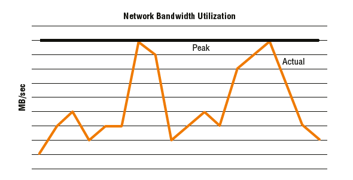

## 12.7 Асинхронная репликация
Главное различие между синхронной и асинхронной репликацией заключается в том, что при асинхронной репликации каждая ***запись считается завершенной, когда локальный массив ее подтверждает***. Не нужно ждать, пока запись будет зафиксирована на томе реплики, прежде чем выдавать ACK.
Это означает несколько вещей:
- асинхронность не обеспечивает нулевой потери данных. Фактически, асинхронная репликация ***гарантирует вам потерю данных***! Объем потерянных данных полностью зависит от вашей конфигурации. Например, если ваше решение для репликации реплицирует только каждые 5 минут, вы можете потерять немного больше данных за 5 минут.

- асинхронная репликация ***не влечет за собой потери производительности***, которые возникают при синхронной репликации. Это происходит потому, что запись в удаленный массив выполняется ленивым образом в более позднее время.

- расстояния между исходным и целевым массивом могут быть намного больше, чем в синхронных конфигурациях. Это происходит потому, что ***RTT между исходным и целевым массивом больше не имеет значения***. Теоретически вы можете разместить исходный и целевой массивы на противоположных концах планеты.

- нет необходимости указывать сетевые соединения между сайтами для удовлетворения пикового спроса. Тем не менее, вам все равно следует указать сетевое соединение, чтобы не выйти за пределы согласованного RPO.

Все это хорошо, если вы можете спокойно спать по ночам, зная, что потеряете часть данных, если вам когда-нибудь придется вызывать DR.

Вызов ***Disaster Recovery DR (аварийного восстановления)*** означает запуск приложения с использованием его реплицированного хранилища. Обычно это включает в себя отказ приложения — включая сервер, сеть и хранилище — на резервном сервере, сети и хранилище в удаленном центре обработки данных аварийного восстановления.

Массивы хранения данных, как правило, реализуют асинхронную репликацию, показанную на рисунке, одним из двух способов:
- На основе моментального снимка (Snapshot based)
- На основе журнала (Journal based)


### 12.7.1 Асинхронная репликация на основе моментальных снимков
При асинхронной репликации на основе снимков исходный массив периодически делает моментальные снимки исходного тома на определенный момент времени, а затем реплицирует данные снимка по сети на целевой массив, где они применяются к тому-реплике.

Этот тип репликации основан на расписании, что означает, что вы планируете снимки и интервал репликации в соответствии с требуемой точкой восстановления (RPO). Предположим, вы согласовали SLA с бизнесом, чтобы иметь возможность восстанавливать данные в течение 10 минут с момента возникновения инцидента. Настройка интервала репликации в 5 минут будет соответствовать этому RPO и гарантировать, что тома реплик никогда не будут отставать от исходных томов более чем на ~5 минут.

Хорошие массивы хранения имеют интерфейс, который позволяет вам указать ваш RPO, и он настроит для вас особенности репликации, чтобы гарантировать, что ваш RPO SLA будет выполнен. Лучшие массивы хранения имеют RPO, доведенный до еще большей глубины. Например, если у вас есть некоторые тома, настроенные на 15-минутный RPO, а другие на 20-минутный RPO, если массив сталкивается с перегрузкой репликации, массив будет определять приоритеты репликации на основе того, какие RPO ближе всего к сбою. Это граничит с интеллектом массива!
Если ваш массив хранения застрял в 90-х и не понимает RPO и SLA, вам придется вручную учитывать эти моменты при настройке репликации.

Будьте осторожны. RPO в 10 минут не означает, что вы можете настроить интервал обновления репликации в 10 минут! Это по сути потому, что ваши данные моментального снимка не будут мгновенно поступать на целевой массив в момент отправки. Для передачи данных по сети требуется время, и часто провод, используемый для асинхронной репликации, является относительно дешевым проводом с низкой пропускной способностью. Если предположить, что все ваши данные поступают на целевой массив за 2 минуты, то это потенциально 12-минутный RPO, а не 10-минутный.

Обычно, если ваш массив поддерживает асинхронную репликацию на основе снимков, этот массив будет использовать тот же механизм снимков, который он использует для создания локальных снимков. В зависимости от вашего массива, это может означать, что снимки на основе репликации съедают максимальное количество снимков, поддерживаемых в массиве. Таким образом, если ваш массив поддерживает максимум 1024 снимка, и вы реплицируете 256 томов с помощью асинхронной репликации на основе снимков, вы, вероятно, съели 256 из максимальных 1024 снимков массива.

При ***асинхронной репликации на основе снимков остерегайтесь размера экстента снимка*** — гранулярности, с которой растут снимки. Если размер экстента снимка составляет 64 КБ, но все, что вы обновляете между интервалами репликации, — это один блок размером 4 КБ, то на самом деле по сети будет реплицировано 64 КБ — один экстент снимка. Ничего страшного, не так ли? Теперь предположим, что несколько больших массивов совместно используют удаленный канал репликации, каждый из которых использует репликацию на основе снимков. Вы обновляете 1000 уникальных блоков по 4 КБ и предполагаете, что это реплицирует чуть менее 4 МБ данных по сети. Однако каждое из этих обновлений по 4 КБ было в уникальном экстенте на каждом томе, что означает, что вы в конечном итоге реплицируете 1000 x 64 КБ вместо 1000 x 4 КБ. Разница тогда довольно велика — 62,5 МБ вместо 3,9 МБ!

Хорошая вещь в репликации на основе снимков заключается в том, что пока ваш массив имеет достойную технологию снимков, он будет объединять записи. Это означает, что если ваше приложение обновило один и тот же блок данных 1000 раз с момента последнего интервала репликации, только самое последнее обновление этого блока данных будет отправлено по сети со следующим набором дельт, а не все 1000 обновлений.

### 12.7.2 Асинхронная репликация на основе журнала
Технологии асинхронной репликации на основе журналов буферизуют данные записи в выделенные тома журналов , иногда называемые журналами намерений записи . Они должны быть соответствующего размера (обычно завышенного), чтобы справляться с большими всплесками трафика или моментами, когда ссылки репликации не работают. Если вы установите слишком маленький размер этих томов журналов, репликация прервется во время больших всплесков или длительных периодов простоя ссылок репликации. С другой стороны, если вы установите слишком большой размер, вы будете тратить пространство впустую в 99 процентах случаев. Это можно считать балансировкой или темным искусством. В любом случае, это довольно сложно с точки зрения проектирования.

Когда операции ввода-вывода записи поступают в исходный массив, они, как обычно, попадают в кэш, и массив отправляет хосту ACK. Операции ввода-вывода записи также помечаются метаданными, чтобы указать, что они предназначены для реплицированного тома, чтобы гарантировать, что данные также асинхронно копируются в локальные тома журнала. Затем данные удаляются на диск в соответствии со стандартным удалением кэша. Примерно в это же время данные также записываются в том журнала. Оттуда они реплицируются в целевой массив в момент, определяемый спецификой технологии репликации массива. Однако, в общем и целом, репликация на основе журнала не сильно отстает от исходного тома.
Хорошие массивы будут применять метаданные последовательности записи к данным, буферизованным в томах журнала, чтобы поддерживать правильный порядок записи при записи данных в целевой том на целевом массиве. После того, как данные зафиксированы на целевом массиве, их можно освободить из томов журнала на исходном массиве.

Реализации различаются в зависимости от того, отправляет ли исходный массив обновления в целевой массив или целевой массив извлекает обновления. Для вашей повседневной работы такие вещи не должны вас волновать, тем более не так сильно, как необходимость соблюдения SLA и RPO

Хотя асинхронная репликация не требует первоклассной пропускной способности сети между исходным и целевым массивами, убедитесь, что ваши сетевые соединения не являются коротышкой сетевого мусора, низведенной до питания объедками, оставшимися после того, как все остальные получили свою долю. Если вы не предоставите ссылкам достаточную пропускную способность, вы будете слишком часто работать вне своих SLA, рискуя не только своей работой, но и данными вашей компании.


Рисунок показывает фактическое использование полосы пропускания, зафиксированное с часовыми интервалами, со средней линией. Ссылки асинхронной репликации не нужно подбирать для пиковых требований

## 12.8 Топологии репликации
Топология каскадной репликации с тремя сайтами использует промежуточный сайт, иногда называемый сайтом -бункером, для соединения исходного массива и целевого массива. На рисунке показан пример этой топологии.


Как показано на рисунке 3.11, каскад из трех сайтов использует как синхронную, так и асинхронную репликацию 
- синхронную репликацию от исходного сайта к сайту-бункеровщику
- затем асинхронную репликацию от сайта-бункера к целевому сайту.

Основным вариантом использования каскадных топологий с тремя площадками является обеспечение восстановления приложений с нулевой потерей данных в случае локализованной проблемы в вашем основном центре обработки данных, которая требует от вас вызова планов аварийного восстановления. В этой ситуации вы можете поднять свои приложения на площадке бункера с потенциально нулевой потерей данных. Однако, если крупная катастрофа сделает и основной центр обработки данных, и площадку бункера неработоспособными, у вас будет третья копия на удаленной площадке. 

Поскольку репликация между площадкой бункера и целевым сайтом асинхронна, расстояние может быть достаточно большим, чтобы даже крупная локальная катастрофа, которая затрагивает исходные и бункерные площадки, не затронет целевую площадку. И если катастрофа, достаточно большая, чтобы затронуть целевую площадку, действительно произойдет, есть большая вероятность, что восстановление приложений вашей компании будет последним, о чем вы подумаете!

Каскад из трех сайтов также позволяет вашим приложениям оставаться защищенными даже при выходе из строя исходного сайта. Это происходит потому, что все еще есть два сайта с репликационными связями между ними, и репликация между этими двумя сайтами все еще может работать.

Главной слабостью каскадной модели с тремя площадками является то, что отказ бункерной площадки также влияет на целевую площадку. По сути, если вы теряете бункерную площадку, ваша целевая площадка начинает все больше и больше отставать от производства, и ваш RPO становится опасно большим.

Эта модель также используется с вторичным массивом в основном центре обработки данных, а не на удаленной площадке-бункере, чтобы защититься от отказа основного массива, а не от полного отказа площадки.

## 12.9 Трехсайтовый многоцелевой
Топология с тремя площадками и несколькими целями одновременно реплицирует исходный массив на два целевых массива. Один целевой массив находится на относительно близком месте бункера — достаточно близко для синхронной репликации. Другой целевой массив находится на большом расстоянии и реплицируется на него асинхронно. Эта конфигурация показана на рисунке.


Главное преимущество трехсайтового мультитаргета перед трехсайтовым каскадом заключается в том, что отказ бункерного сайта не влияет на репликацию на целевой сайт. В этом отношении он более надежен.

Главным недостатком трехсайтовой многоцелевой топологии является то, что если исходный сайт потерян, репликация между сайтом бункера и целевым сайтом отсутствует. Это также может привести к более тяжелой нагрузке на первичный массив.

## 12.10 Треугольник из трех участков
Треугольник из трех сайтов похожа на многоцелевой с тремя сайтами и предлагает все те же опции, а также добавление резервного репликационного канала между бункером и целевым сайтом. При нормальных условиях работы этот дополнительный канал не отправляет активно репликационный трафик, но может быть включен, если исходный сайт становится недоступным. Топология треугольника из трех сайтов -показана на рисунке.


Если исходный сайт потерян, синхронизация репликации между сайтом бункера и целевым сайтом не требует полной синхронизации. Уцелевшие массивы в бункере и целевом сайте могут общаться и определять, какие обновления отсутствуют на целевом сайте, что позволяет выполнять инкрементальное обновление из массива бункера в целевой массив. Это позволяет вам снова запустить приложение и защитить его удаленной репликацией за короткий промежуток времени.

Не все массивы хранения поддерживают все топологии репликации. Крайне важно, чтобы вы проверили информацию у поставщика массива или в документации по массиву, прежде чем предположить, что ваш массив поддерживает определенную топологию репликации на нескольких сайтах.

## 12.11 Локальные снимки
Снимки не являются чем-то новым, а в некоторых случаях и технология, стоящая за ними, тоже. Некоторые реализации снимков являются древними. Мы раскроем некоторые из них.

Во-первых, давайте договоримся о терминологии: когда я говорю о ***снимках , я говорю о локальных копиях данных***. А под локальными я подразумеваю, что ***снимок существует на том же массиве, что и исходный том***. Вообще говоря, ***снимки — это копии на определенный момент времени oint-in-time(PIT)***.

***Эти два факта — локальный и момент времени — являются двумя основными различиями между локальными моментальными снимками и удаленными репликами.*** 

***Локальные моментальные снимки — это копии производственных томов, созданные и поддерживаемые на локальном массиве, тогда как удаленные реплики хранятся на удаленном массиве.***

***Кроме того, локальные моментальные снимки — это копии на момент времени, тогда как удаленные реплики обычно хранятся в синхронизации или полусинхронизации с основным производственным томом.***

Наконец, я использую термины ***исходный том (source volume)*** и ***первичный том (primary volume)*** для обозначения живого производственного тома. И я использую термин ***снимок (snapshot)*** для обозначения копии живого производственного тома на определенный момент времени . Это показано на рисунке.


***Снимки*** и ***клоны*** создаются мгновенно, и в зависимости от вашего массива снимки и клоны могут быть помечены как доступные только для чтения или для чтения/записи. 

Все хорошие массивы поддерживают снимки:
- только для чтения 
- для чтения-записи.

***Снимки — это не резервные копии!*** Возьмите это утверждение, запечатлейте его в своей голове, защитите его RAID с как минимум двойной четностью и закрепите его в высокопроизводительном кэше своего мозга, чтобы он всегда был доступен для быстрого вызова. Снимки — это не резервные копии! Почему? ***Если вы потеряете RAID-набор, массив или сайт, на котором размещены основные тома, вы потеряете и снимки***. Вы не хотите оказаться в таком затруднительном положении.

## 12.12 Снимки на основе массива
Обычно используются два типа технологий моментальных снимков на основе массивов:
- Компактные снимки
- Полные клоны

### 12.12.1  Компактные снимки
Компактные снимки обычно ***основаны на указателях***. Это говорит вам о двух важных вещах:

- ***Эффективное использование пространства*** означает, что снимок содержит только те части первичного тома, которые изменились с момента создания снимка.

- **На основе указателя** означает, что никакие данные, которые ***не изменились с момента создания снимка, не копируются в снимок***. Вместо этого указатели указывают на данные в исходном томе для любых данных, которые не изменились с момента создания снимка.

Давайте рассмотрим простой и быстрый пример с одной-двумя цифрами.
Предположим, что у вас есть основной том с именем LegendaryVol. LegendaryVol содержит 100 блоков, пронумерованных от 0 до 99. В 13:00 в понедельник вы делаете снимок LegendaryVol , экономящий место, и в этот момент все блоки в LegendaryVol устанавливаются в двоичный ноль (0). Ваш снимок называется LegendaryVol.snap . В момент создания снимка LegendaryVol.snap не занимает места . Если бы хост смонтировал этот снимок и прочитал его содержимое, все операции ввода-вывода для чтения были бы перенаправлены обратно к исходным данным, содержащимся в LegendaryVol . Все, что потребляет LegendaryVol.snap , — это указатели в памяти, которые перенаправляют операции ввода-вывода для чтения обратно к основному тому, где находятся данные.

Теперь предположим, что к 14:00 LegendaryVol обновил блоки 0-9, сделав их двоичными (1). Каждый раз, когда хост захочет прочитать данные в LegendaryVol.snap , он будет перенаправлен обратно на исходный том ( LegendaryVol ), за исключением чтения блоков 0-9. Это связано с тем, что блоки 0-9 изменились в основном томе, и для того, чтобы снимок выглядел точно так же, как и основной том в момент, когда был сделан снимок (13:00), исходное содержимое также было скопировано в снимок.

Итак, в 2 часа дня снимок по-прежнему является точным изображением того, каким был первичный том в 1 час дня — все блоки равны нулю. Работа сделана. Кроме того, снимок экономит место, поскольку все неизмененные данные с момента создания снимка по-прежнему являются просто указателями на исходные данные, а снимок занимает только то пространство, которое требуется для сохранения данных, изменившихся с тех пор.

### 12.12.2  Снимки полного клона
Полные клоны ***неэффективны с точки зрения пространства*** и, следовательно, ***не основаны на указателях***. Однако они являются ***копиями основных томов*** на определенный момент времени.

В момент создания полного клона берется точная полная копия первичного тома. Это означает, что если первичный том потребляет 2 ТБ хранилища на момент создания клона, каждый полный клон этого тома также будет потреблять 2 ТБ. Это, очевидно, означает, что ***полные клоны могут быть основными потребителями дискового пространства***.

Так зачем же возиться с полными клонами, а не с компактными снимками? Есть несколько распространенных причин:
- ***Чтение и запись в полный клон не оказывает прямого влияния на основной том.*** Это происходит потому, что полный клон полностью независим от основного тома и не содержит указателей. Таким образом, вы ***можете забивать клон запросами на чтение и запись, и это не повлияет на производительность основного тома***. Снимки, с другой стороны, делят много данных со своими основными томами, а это означает, что ***если вы забиваете снимок интенсивным чтением и записью ввода-вывода, вы также повлияете на производительность основного тома***.

- ***Полные клоны полностью независимы от основных томов***, из которых они были созданы. Это означает, что если физические диски, на которых находится основной том, выйдут из строя, клон не будет затронут (при условии, что вы не совершите ошибку, сохранив основной и полный клон на одних и тех же дисках). Напротив, в случае моментальных снимков, если диски за основным томом выйдут из строя, моментальный снимок также будет затронут, поскольку моментальный снимок просто указывает на основной том для большей части своего содержимого.
В современном мире ИТ, где бюджеты ограничены и постоянно сокращаются, моментальные снимки, как правило, гораздо популярнее полных клонов, поэтому мы уделим немного больше времени рассмотрению моментальных снимков, экономящих место.

### 12.12.3  Размер экстента моментального снимка
Когда дело доходит до снимков, эффективно использующих место, размер определенно имеет значение. И больше не значит лучше! Если ваш массив имеет ***размер экстента снимка*** (иногда называемый ***гранулярностью*** ) 4 КБ, он будет гораздо более эффективным с точки зрения пространства, чем массив с гранулярностью снимка 128 КБ. 

Вот краткий пример. 

Предположим, вы вносите 100 изменений в свой основной том с момента создания снимка. Если размер экстента снимка составляет 4 КБ, это составит максимум 400 КБ, потребляемых вашим снимком. С другой стороны, если размер экстента снимка составляет 128 КБ, максимальное пространство, потребляемое вашим снимком, просто подскочит до 12 800 КБ!

В качестве другого примера, если вы делаете обновление на 4 КБ для первичного тома, имеющего снимок, а размер экстента снимка составляет 128 КБ, возможно, придется выделить для вашего снимка дополнительные 128 КБ. Это связано с тем, что экстент является минимальной единицей роста снимка.

Хотя это может показаться не концом света, подумайте о том, какое влияние это оказывает, когда у вас много снимков и вы храните их в течение длительного времени. Эта неэффективность пространства вскоре накапливается. Это также влияет на объем данных, отправляемых по сети в конфигурациях асинхронной репликации, основанных на снимках. Поэтому, когда дело доходит до детализации снимка или ***размера экстента, меньше определенно лучше***.

### 12.12.4  Резервирование места для моментальных снимков
На массивах на основе устаревших архитектур вам нужно угадать, сколько места могут занять ваши снимки, а затем зарезервировать это место заранее! Все верно, в первый день вам придется открыть свой кошелек, купить и отложить место для потенциального использования снимков, место, которое может никогда не использоваться. Этот тип архитектуры еще хуже из-за того, что во многих случаях вам приходится готовиться к худшему варианту и часто в итоге ограждать слишком много места. Устаревшие архитектуры, подобные этой, непростительны в современном мире ИТ. К сожалению, устаревшие архитектуры массивов, построенные на этом подходе, все еще существуют и все еще продаются! Будьте осторожны.

Более современный подход заключается в том, чтобы ваши ***снимки динамически выделяли себе пространство из общего пула*** (обычно это не тот же пул, что и основной том). Этот общий пул будет использоваться другими томами — основными томами и томами снимков — и вам будет разрешено устанавливать политики для ситуаций, когда объем пространства в пуле заканчивается.

Например, вы можете установить ***политику, которая удаляет самые старые снимки***, когда пул достигает 90 процентов заполнения, чтобы гарантировать, что тонко подготовленные основные тома не пострадают за счет снимков.

### 12.12.5  Слишком много снимков
На большинстве массивов моментальные снимки считаются томами. Это означает, что если ваш массив поддерживает только 8192 тома, общее количество основных томов и томов моментальных снимков может быть 8192. Обычно это не означает 8192 тома плюс моментальные снимки. Всегда сверяйтесь с документацией вашего массива!

### 12.12.6  Многоуровневые снимки
Большинство современных массивов также позволяют контролировать тома снимков с помощью их алгоритмов автоматического распределения по уровням, что позволяет более старым снимкам просачиваться вниз по уровням и заканчивать свою жизнь, потребляя медленное, дешевое хранилище. 

Например, предположим, что ваш массив настроен и работает так, что блоки данных, к которым не обращались более 10 дней, автоматически перемещаются на диск более низкого уровня. Любой снимок, к которому не обращались в течение 10 дней или более, перестанет потреблять высокопроизводительный диск. Это позволяет вашим снимкам потреблять высокопроизводительный диск на ранних этапах его жизни, когда он с большей вероятностью будет использоваться, но затем переходить на диск более низкого уровня, готовясь к выходу на пенсию.

### 12.12.7  Снимки, устойчивые к сбоям и учитывающие особенности приложений
Подобно репликации на основе массива, моментальные снимки на основе массива в их обычной форме не имеют интеллекта — они не осведомлены о приложении! Моментальные снимки, которые не осведомлены о приложении, считаются устойчивыми к сбоям . Этот оксюморон термина в основном означает, что ***моментальные снимки могут быть бесполезны как средство восстановления приложения***; в глазах приложения данные, содержащиеся в моментальном снимке, хороши только так, как если бы сервер и приложение действительно вышли из строя, и могут считаться поврежденными. Это происходит потому, что ***большинство приложений и баз данных кэшируют данные в локальных буферах и лениво фиксируют эти записи на диск***. Это, как правило, делается из соображений производительности. Это означает, что в любой момент времени данные на диске неточно представляют состояние приложения.

К счастью, ***снимки на основе массивов можно сделать распознаваемыми приложениями***! Типичным примером является VSS. Большинство хороших массивов могут интегрироваться с ***Microsoft VSS***, чтобы массив и приложение координировали процесс создания снимков, гарантируя, что полученные снимки будут согласованными с приложениями снимками — снимками, из которых приложение может быть эффективно и действенно восстановлено. При создании снимков или клонировании приложений в мире Microsoft это определенно то, что вам нужно!

Однако если ваше приложение не поддерживает VSS или если вы запускаете свое приложение на Linux, вы, вероятно, сможете запустить ***скрипты, которые переводят ваше приложение в режим горячего резервного копирования***, при этом на массиве можно делать последовательные снимки. 

### 12.12.8  Копирование снимков при записи Copy-on-write (CoW)
Снимки Copy-on-write (CoW) — устаревшие и находящиеся в упадке. С другой стороны, они имеют накладные расходы на производительность первой записи, но с другой стороны, они поддерживают непрерывную компоновку первичного тома. Давайте быстро рассмотрим оба варианта:

- Штраф за копирование при первой записи приводит к тому, что каждая запись в основной том превращается в три ввода-вывода: чтение исходных данных, запись исходных данных в снимок и запись новых данных в основной том. Это также может увеличить усиление записи на флэш-томах, сокращая срок службы флэш-носителя.

- Хорошая вещь в снимках CoW заключается в том, что они сохраняют исходную непрерывную структуру первичного тома. Это рассматривается далее при обсуждении снимков redirect-on-write.

### 12.12.9  Снимки перенаправления при записи Redirect-on-write (RoW) / allocate-on-write
Снимки Redirect-on-write (RoW) , иногда называемые allocate-on-write , работают иначе, чем copy-on-write. Когда ввод-вывод записи попадает в блок, защищенный снимком, исходные данные в блоке не изменяются. Вместо этого они замораживаются и становятся частью снимка, ***обновленные данные просто записываются в новое место***, а таблица метаданных для основного тома обновляется.

Вот пример: том состоит из 100 смежных блоков, 0-99. Вы делаете снимок тома, а затем хотите обновить блок 50. При перенаправлении при записи содержимое блока 50 не изменится, а будет заморожено в своем исходном состоянии и станет частью адресного пространства тома снимка.

Данные записи, предназначенные для блока 50, записываются в другом месте (например, в блоке 365). Затем метаданные для основного тома обновляются, так что логический блок 50 теперь отображается в физический блок 365 на диске (запись метаданных выполняется настолько быстро, что не влияет на производительность тома).

Такое поведение начинает ***фрагментировать макет основного тома***, в результате чего он в конечном итоге становится сильно фрагментированным или несмежным. Такие несмежные макеты могут серьезно повлиять на производительность тома на основе вращающихся дисков. Однако это не проблема для томов на основе флэш-накопителей.

Популярность перенаправленных снимков растет, особенно в массивах, полностью состоящих из флэш-памяти, где несмежная компоновка основного тома, получаемая в результате снимков RoW, не вызывает проблем с производительностью.

## 12.13  Снимки на основе приложений и хостов
В целом моментальные снимки на уровне приложений и хостов, такие как те, которые предлагаются технологиями Logical Volume Manager (LVM), не перекладывают всю работу на массив.
Они также могут страдать от необходимости выдавать две записи на диск для каждой записи из приложения, и обычно ограничены представлением полученного снимка только тому же хосту, на котором запущен LVM. Однако они широко используются в небольших хранилищах.

### 12.13.1  Тонкое резервирование
В мире хранения данных ***тонкое резервирование thin provisioning (TP)*** является относительно новой технологией, но она была с энтузиазмом принята и широко распространена довольно быстрыми темпами. Основная причина ее быстрого внедрения заключается в том, что она помогает избежать напрасной траты пространства и, следовательно, может сэкономить деньги. И любой, кто знаком со средами хранения данных, знает, что там происходит много напрасной траты емкости.

Прежде чем углубляться в детали, давайте сразу договоримся о терминологии. В этой книге используются термины «толстые тома» и «тонкие тома» , но имейте в виду, что существуют и другие термины, такие как ***виртуальные тома virtual volumes*** и ***традиционные тома traditional volumes*** соответственно .

### 12.13.2  Толстые тома
Давайте начнем с обзора толстых томов. Они самые простые для понимания и существуют с нулевого года. Теория толстых томов заключается в том, что они ***резервируют 100 процентов своей сконфигурированной емкости в первый день***.

Давайте рассмотрим простой пример. Представьте, что у вас есть совершенно новый массив хранения с 100 ТБ полезного хранилища. Вы создаете один толстый том на 4 ТБ на этом массиве и ничего с ним не делаете. Вы даже не представляете его хосту. Вы мгновенно сократили доступную емкость на вашем массиве со 100 ТБ до 96 ТБ. Это нормально, если вы планируете использовать эти 4 ТБ в ближайшее время. Но часто это не так. Часто эти 4 ТБ остаются ужасно неиспользованными в течение долгого времени. И вот здесь толстые тома показывают свою настоящую слабость. Большинство людей берут себе столько хранилища, сколько могут, а затем никогда им не пользуются.

Давайте рассмотрим проблему более подробно.
Большинство владельцев приложений, которые запрашивают хранилище, значительно переоценивают свои требования. Вы же не хотите попасться на слишком малой емкости для вашего приложения, верно? Нередко люди делают слепые предположения о своих требованиях к емкости, а затем удваивают эту оценку на всякий случай, если их оценка неверна, а затем снова удваивают ее, просто чтобы быть в большей безопасности. Возьмите первоначальную приблизительную оценку в 250 ГБ, удвойте ее до 500 ГБ на всякий случай, если ваша оценка неверна, а затем снова удвойте ее до 1 ТБ, просто чтобы быть в большей безопасности. В первый день толстый том занимает 1 ТБ физического пространства на массивах, хотя приложению требуется всего 50 ГБ в первый день. Затем после трех лет использования приложение все еще потребляет всего жалкие 240 ГБ, хотя том занимает 1 ТБ физической емкости — фактически тратя более 750 ГБ.
Возможно, это не такая уж проблема в экономике с ликвидностью или если ваша компания владеет акрами земли, отведенными под выращивание денежных деревьев. Однако, если вы живете в реальном мире, это равносильно грубой трате дорогостоящих активов компании и по праву становится тяжким преступлением во многих организациях.

### 12.13.3  Тонкие тома
Вот тут-то и приходят на помощь тонкие тома. В то время как LUN толщиной 1 ТБ резервирует себе 1 ТБ физической емкости в момент своего создания, тонкие тома не резервируют ничего заранее и работают аналогично файлам, которые увеличиваются в размере только по мере записи в них.

На самом деле тонкие тома занимают место сразу после создания.
Однако это пространство обычно настолько мало, что может быть незначительным. Большинство массивов резервируют несколько мегабайт пространства для размещения данных, а остальное — указатели метаданных в кэш-памяти.

Давайте снова рассмотрим наш пример тома объемом 1 ТБ, только на этот раз как тонкий том. На этот раз наш тонкий том объемом 1 ТБ не резервирует физическую емкость заранее и потребляет только 50 ГБ физической емкости в первый день, поскольку приложение записало только 50 ГБ данных. А через три года оно потребляет только 240 ГБ. Это оставляет остальные 760 ГБ для массива, чтобы выделить их в другом месте.

### 12.13.4  Размер экстента тонкого резервирования
Мир тонкого резервирования похож на мир моментальных снимков, которые занимают мало места: размер имеет значение. И как и в мире моментальных снимков, которые занимают мало места, чем меньше, тем лучше.

Размер экстента TP — это единица роста, применяемая к тонкому тому. Предположим, что ваш том TP объемом 1 ТБ начинает свою жизнь с 0 МБ. Если размер экстента TP составляет 128 МБ, как только хост записывает 1 КБ в этот том, он потребляет один экстент TP размером 128 МБ в массиве хранения. Аналогично, если бы размер вашего экстента TP составлял 42 МБ, вы бы потребляли только 42 МБ внутреннего пространства при этой записи 1 КБ. Или если бы размер вашего экстента TP составлял 1 ГБ, вы бы потребляли относительно колоссальный 1 ГБ для этой записи 1 КБ. Это должно позволить легко увидеть, что с точки зрения емкости меньшие размеры экстентов лучше.

***Экстенты TP иногда называют страницами pages***.

### 12.13.5  Тонкое выделение ресурсов и производительность
Единственное место, где очень маленький размер экстента может быть невыгоден, это фронт производительности. Видите ли, каждый раз, когда новый экстент должен быть назначен тонкому тому, есть небольшая (очень небольшая) накладная стоимость производительности, пока массив выделяет новый экстент и добавляет его в карту метаданных тома. Однако это редко считается реальной проблемой, и большой размер экстента TP почти всегда является признаком того, что массив недостаточно мощный для обработки и отображения большого количества экстентов.
В целом, однако, поскольку тонкое резервирование построено поверх широкополосного/пулового, тонко резервированные тома распределены по большинству, если не по всем, дискам на бэкэнде , предоставляя им доступ ко всем IOPS и MB/sec на всем бэкэнде. Это, как правило, приводит к лучшей производительности.

Один из вариантов использования, когда тонко выделенные тома могут давать более низкую производительность, — это сильно последовательные чтения в массивах на основе вращающихся дисков. Последовательные чтения, например, данные, которые должны быть последовательно размещены на вращающемся диске, чтобы минимизировать перемещение головки. Поскольку тома TP занимают дисковое пространство только на бэкэнде, когда на них записываются данные, эти данные, как правило, не из смежных областей, что приводит к фрагментации адресного пространства тома на бэкэнде массива. (Хостовые инструменты дефрагментации ничего не могут с этим поделать.) Это может привести к тому, что тома TP будут работать значительно медленнее, чем толстые тома для этого конкретного типа рабочей нагрузки.

### 12.13.6  Избыточное обеспечение
Тонкое резервирование естественным образом приводит к возможности избыточного резервирования массива. Давайте рассмотрим пример.

Предположим, что массив имеет 100 ТБ физически установленной полезной емкости. Этот массив имеет 100 подключенных серверов (мы используем красивые круглые числа для простоты). Каждому серверу выделено 2 ТБ хранилища, что в общей сложности составляет 200 ТБ выделенного хранилища. Поскольку массив имеет только 100 ТБ физического хранилища, этот массив на 100 процентов избыточно обеспечен.

Такое избыточное выделение емкости невозможно при использовании толстых томов, поскольку каждый толстый том должен зарезервировать всю свою емкость в момент создания. После создания 50-го тома объемом 2 ТБ все пространство массива будет использовано, и создание дополнительных томов станет невозможным.

### 12.13.7  Избыточное обеспечение финансовых выгод
Давайте рассмотрим избыточное выделение ресурсов с финансовой точки зрения. Если мы предположим стоимость в $4000 за терабайт, наш массив хранения на 100 ТБ будет стоить $400 000. Однако, если бы мы не делали избыточного выделения ресурсов для этого массива и нам пришлось бы купить 200 ТБ для обслуживания 200 ТБ хранилища, которые мы выделили в нашем предыдущем примере, массив обошелся бы в $800 000. Поэтому не так уж сложно увидеть финансовые выгоды избыточного выделения ресурсов.

### 12.13.8  Риски избыточного резервирования
Хотя избыточное резервирование становится все более распространенным сегодня, его следует делать только тогда, когда вы понимаете использование вашей емкости и тенденции, а также цикл закупок вашей компании! И каждый его аспект должен быть тщательно протестирован — включая отчетность и тенденции — перед развертыванием в производственных средах.
Основной риск — это набег на ваш накопитель. Если вы перераспределите массив хранения и исчерпаете его емкость, все подключенные хосты могут оказаться неспособными записывать данные в массив, и вам следует ожидать потери работы. Поэтому хорошее планирование и хорошее управление массивом с перераспределителем имеют первостепенное значение!
Следует отметить, что избыточное выделение ресурсов — это своего рода одноразовый трюк. Вы можете использовать его в своих интересах только один раз. После этого требуется много внимания, чтобы убедиться, что у вас не закончится хранилище. Предположим снова, что у вас есть массив на 100 ТБ и вы выделили 100 ТБ, но фактически используется только 50 ТБ. Вы можете выделите избыточное, скажем, 180 ТБ выделенного хранилища, что даст вам в общей сложности 180 ТБ экспортируемого хранилища. Отлично, вы только что волшебным образом увеличили 80 ТБ при общей стоимости капитальных затрат в 0,00 долл. США. Руководство будет вам благодарно.
Однако в следующем году вы не сможете провернуть тот же трюк снова. Фактически, в следующем году вы будете работать с дополнительным риском, что если вы не будете управлять им правильно, у вас может закончиться хранилище и все ваши приложения будут закрыты. Этот повышенный риск реален и его ни в коем случае нельзя игнорировать или упускать из виду.
Из-за неотъемлемых рисков избыточного резервирования крайне важно, чтобы высшее руководство понимало риски, знало, с чем оно сталкивается, и официально одобрило использование избыточного резервирования.

### 12.13.9 Тенденция избыточного резервирования
После того, как вы начали избыточное выделение ресурсов, вам необходимо внимательно следить за использованием емкости и отслеживать тенденции. Ниже приведены ключевые показатели для мониторинга в избыточной среде:
- Установленная мощность
- Предоставленная/выделенная мощность
- Использованная мощность
Каждый из этих показателей необходимо регистрировать как минимум ежемесячно и отслеживать тенденции.

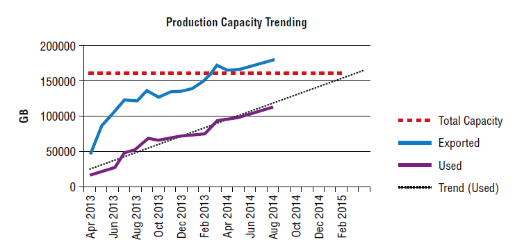

Рисунок показывает значения этих трех показателей за 16-месячный период на сегодняшний день. Он также имеет линию тренда, прогнозирующую будущий рост используемой емкости. Линия тренда показывает, что на основе текущих темпов роста этот массив исчерпает пространство около января или февраля 2015 года.

### 12.13.10 Когда следует приобретать емкость на массивах с избыточным резервированием
Вам необходимо установить согласованные пороговые значения с высшим руководством, которые запускают новые закупки мощностей, и крайне важно, чтобы они были определены с пониманием процесса закупок вашей компании. Например, если вашей компании требуется много времени для одобрения закупок, а вашему поставщику требуется много времени для составления сметы и поставки хранилища, вам не захочется вести дела слишком близко к сердцу.
Многие компании используют по крайней мере две точки срабатывания для закупок мощности. После достижения первой точки срабатывания выставляется заказ на закупку дополнительной мощности. Некоторые общие точки срабатывания включают следующее:
- Фактическая доступная мощность (установленная мощность за вычетом используемой мощности)
- Процент доступной мощности (процент установленной мощности, которая не используется)
- Процент избыточного резервирования
На основе этих триггеров вы можете реализовать следующие правила триггеров:
- Как только свободная емкость (установленная емкость за вычетом использованной емкости) станет менее 10 ТБ, вы начнете цикл закупки.
- Как только процент доступной мощности (установленная за вычетом используемой, выраженный в процентах ) станет менее 10 процентов, вы можете начать цикл закупок.
- Как только массив станет более чем на 60 процентов избыточным, вы можете начать цикл закупки мощностей.

Каждое из этих правил в значительной степени зависит от вашей среды, и вы должны понимать характеристики роста вашей среды. Например, ожидание, пока в массиве останется только 10 ТБ свободной емкости, будет бесполезным для вас, если темп роста этого массива составляет 15 ТБ в месяц, и вам требуется в среднем восемь недель, чтобы получить дополнительную емкость в вашей среде. В этом случае значение в 50 ТБ или более свободной емкости может быть лучшим значением.

## 12.14 Освобождение пространства (Space reclamation)
Освобождение пространства заключается в том, чтобы поддерживать тонкие тома тонкими. Тонкие тома позволяют избежать предварительного выделения емкости заранее и выделять ее только по требованию. Однако тонкие тома быстро раздуются, если массив тонкого выделения не сможет распознать, когда хост удаляет данные. Вот где в игру вступает освобождение пространства.

### 12.14.1 Восстановление нулевого пространства
На высоком уровне, восстановление нулевого пространства — это процесс распознавания удаленного пространства в тонком томе и освобождения этого пространства обратно в свободный пул, чтобы его могли использовать другие тома. Однако секретный соус заключается в том, что массив может знать, когда пространство больше не используется хостом.

### 12.14.2 Освоение пространства старым способом
Традиционно, когда ОС/гипервизор/файловая система удаляла данные, они на самом деле не удаляли их. Вместо этого они просто помечали удаленные данные как больше не нужные. Это было бесполезно для массивов, поскольку они не знали, что эти данные были удалены, поэтому они не могли освободить экстенты из тома TP. В этих случаях требовались скрипты или инструменты, которые физически записывали бы двоичные нули в удаленные области данных, чтобы массив знал, что есть емкость, которую можно освободить.

Восстановление нулевого пространства работает по принципу двоичных нулей. Чтобы массив вернул неиспользуемое пространство, это пространство должно быть обнулено — акт записи нулей в удаленные области

### 12.14.3 Восстановление пространства интеграции хоста
Современные операционные системы, такие как Red Hat Enterprise Linux 6 (RHEL), Windows Server 2012 и vSphere 5, знают все о тонком выделении ресурсов и важности поддержания тонких томов тонкими, поэтому они разработаны для бесперебойной работы с технологиями нулевого использования пространства на основе массивов.

Чтобы поддерживать тонкие тома тонкими, эти операционные системы реализуют основанную на стандартах T10 команду UNMAP , которая специально разработана для информирования массивов хранения о регионах, которые могут быть возвращены. Команда ***UNMAP*** информирует массив о том, что определенные диапазоны ***адресов логических блоков (LBA)*** больше не используются, и массив может затем освободить их из тома TP и назначить их обратно в свободный пул. Больше нет необходимости в скриптах и инструментах для обнуления неиспользуемого пространства; теперь ОС и файловая система позаботятся об этом за вас.

### 12.14.4 Встроенная или постобработка рекультивации пространства
Некоторые массивы достаточно умны, чтобы распознавать входящие нули на лету и динамически освобождать экстенты TP по мере поступления потоков нулей в массив. Другие массивы не настолько умны и требуют, чтобы администратор вручную запускал задания по освобождению пространства после обработки, чтобы освободить пространство, которое было обнулено на хосте.
Оба подхода работают, но встроенный подход, очевидно, намного проще и лучше в целом, если его можно реализовать таким образом, чтобы не повлиять на производительность массива.

### 12.14.5 Избыточное обеспечение требует рекультивации пространства
Если ваш массив поддерживает тонкое выделение, но не освобождение пространства, вы находитесь на дороге с односторонним движением в тупик. Да, вы избежите первоначальных потерь емкости толстых томов. Однако ваши тонкие тома быстро пострадают от раздувания, поскольку данные удаляются, но не освобождаются массивом. Если ваш массив поддерживает тонкое выделение, и вы планируете избыточное выделение, ***убедитесь, что ваш массив также поддерживает освобождение пространства!***

### 12.14.6 Проблема освоения пространства, о которой следует помнить
Обратите внимание на возможное влияние на производительность в двух областях:
- Приложения с интенсивно последовательными шаблонами чтения
- Накладные расходы на производительность каждый раз при выделении новой страницы или экстента

Если вы перераспределяете ресурсы, вам нужно пристально следить за использованием емкости и трендами вашего массива. Если вы отвлечетесь, у вас может закончиться место и вы окажетесь в мире боли.

## 12.15 Объединение и широкополосное распределение

Объединение в пул и широкополосное распределение часто используются как синонимы. Обе технологии относятся к объединению большого количества дисков и размещению LUN и томов по всем дискам в пуле. На рисунке показаны три тома с широкополосным распределением по всем 128 дискам в пуле.

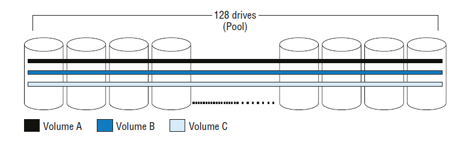

Следует сказать, что массивы, которые не реализуют широкополосный доступ, по большей части следует считать динозаврами. Все хорошие массивы поддерживают пул и широкополосный доступ.

### 12.15.1 Объединение (Pooling) и производительность
Объединение в пулы может улучшить производительность томов в вашем массиве хранения. Это связано с тем, что все тома потенциально имеют доступ ко всем IOPS и MB/sec всех дисков на бэкэнде.

Даже если пул не улучшит производительность определенных томов, он уменьшит горячие и холодные точки на бэкэнде, гарантируя, что вы получите максимальную производительность от бэкэнда вашего массива. При пуле вы не увидите, как некоторые диски простаивают, в то время как другие работают на пределе своих возможностей.

### 12.15.2 Объединение и упрощение управления
Помимо максимизации и балансировки производительности, рассвет ***широкого чередования (wide-striping)*** значительно упростил проектирование и администрирование хранилища. Раньше, до того, как у нас появились пулы и страйпы, администраторы и архитекторы хранилищ тратили часы на то, чтобы убедиться, что два занятых тома не используют одни и те же четыре или восемь дисков в массиве, так как это создавало бы горячие точки и узкие места производительности. Электронные таблицы Excel были доведены до предела, чтобы тщательно отслеживать и отображать, как тома были размещены на бэкэнде. К счастью, теперь это в прошлом!

В наши дни вы размещаете массив на земле, создаете пару пулов и начинаете создавать тома. Вы все еще, вероятно, захотите хранить тома данных и журналов в отдельных пулах, но помимо этого вы просто ***создаете свои тома в пуле и позволяете массиву их балансировать***. Горячие точки на бэкэнде и узкие места на основе шпинделя теперь встречаются крайне редко.

Убедитесь, что ваш массив ***поддерживает перебалансировку при добавлении дополнительных дисков в бэкэнд***. Последнее, что вам нужно, — это хорошо сбалансированный бэкэнд, где все диски используются на 80 процентов с точки зрения емкости и производительности , а затем установить 128 новых дисков и обнаружить, что они используются на 0 процентов в обоих отношениях. Это создаст ужасающий дисбаланс в бэкэнде, а также потребует много ручной работы по перебалансировке. Все хорошие массивы поддерживают перебалансировку при добавлении новых дисков в конфигурацию.

### 12.15.3 Будущее за пулами
Пулы и страйпы основные цели инноваций. Например, такие вещи, как тонкое выделение ресурсов, дедупликация и восстановление пространства, все это строится поверх пулов и не очень хорошо работает с традиционными группами RAID.

### 12.15.4 Пулы и бизнес
Некоторые критически важные для бизнеса приложения в некоторых организациях требуют изоляции, а по своей сути пул — это полная противоположность изоляции.

Владельцы приложений бизнес-линии уровня 1 любят чувствовать себя в безопасности и чувствовать, что они являются центром мира, и во многих случаях, что касается бизнеса, эти приложения являются центром мира. Поэтому размещение их любимых приложений на том же наборе шпинделей, что и все остальные недостойные приложения уровня 3 и уровня 4, просто не даст им теплых чувств. В таких случаях многие организации предпочитают создавать пулы с выделенными дисками и другими ресурсами или даже развертывать эти приложения на выделенных массивах и серверах.

Хотя пулы и широкополосное распределение могут не подходить для каждого приложения, они работают для подавляющего большинства. Исходя из многолетнего опыта работы в различных секторах промышленности, можно сказать, что пулы подходят по крайней мере в 80–90 процентах случаев. В наши дни вам редко придется развертывать тома против традиционных групп RAID, если вообще придется. Но что бы вы ни делали, поймите свои требования!

### 12.16 Сжатие
***Сжатие - процесс уменьшения размера набора данных путем поиска повторяющихся шаблонов, которые можно сделать меньше.***

 Для сжатия данных могут использоваться различные сложные алгоритмы, но суть, как правило, заключается в удалении наборов повторяющихся символов и другого пустого пространства.

Сжатие первичного хранилища никогда не было по-настоящему популярным. Да, мы видим это здесь и там, но основные игроки не спешат его внедрять.

***Первичное хранилище*** — это хранилище, которое используется для данных, находящихся в активном использовании. Даже данные, к которым редко обращаются и которые находятся на нижних уровнях, все равно считаются первичным хранилищем. 

Примерами непервичного хранилища являются ***архивное и резервное хранилище***.

***Сжатие первичного хранилища не получило распространения*** в первую очередь из-за его влияния на производительность. Никто не хочет ждать, пока их первичное хранилище распакует данные. Люди жалуются, если извлечение трехлетнего письма из архива занимает больше нескольких секунд, не говоря уже об ожидании долго выполняющегося запроса к тому, в который включено дополнительное ожидание, пока массив хранения распакует запрашиваемые данные.

Тем не менее, сжатие имеет свое место в мире хранения, особенно в случаях ***резервного копирования и архивирования**** и, что довольно интересно, в массивах хранения на основе SSD. Существует два распространенных подхода к сжатию:
- ***Inline*** - Встроенная компрессия
- ***Post-process*** - Сжатие после обработки

### 12.16.1 Встроенная компрессия
Встроенная компрессия сжимает данные в кэш-памяти до того, как они попадут на диски на заднем конце. Очевидно, что это может занять много кэша, и если массив испытывает большие объемы ввода-вывода, процесс сжатия данных может легко привести к более медленному времени отклика.

Однако с положительной стороны, встроенное сжатие может значительно сократить объем ввода-вывода записи на бэкенд. Это имеет очевидное дополнительное преимущество, заключающееся в том, что используется меньше дискового пространства бэкенда, но это также означает, что потребляется меньше внутренней пропускной способности. Последнее не всегда учитывается, но может быть существенным.

### 12.16.2 Сжатие после обработки
Сжатие после обработки сначала загружает несжатые данные на диски на внутреннем сервере, а затем позднее запускает фоновую задачу по сжатию данных.

Постобработка данных устраняет потенциальное влияние на производительность, но не делает ничего, чтобы помочь увеличить доступную внутреннюю пропускную способность массива, что, кстати, может быть основным бонусом технологии сжатия. В конце концов, внутренняя пропускная способность часто более дефицитна и всегда дороже, чем емкость диска.

Независимо от того, выполняется ли сжатие на лету или после обработки, распаковка, очевидно, должна выполняться на лету и по требованию.

### 12.16.3 Влияние на производительность
Серьезной проблемой производительности, возникающей из-за сжатия данных, может быть время, необходимое для распаковки данных. Всякий раз, когда хост отправляет запрос на чтение массиву, и эти данные должны быть извлечены из бэкэнда, это медленная операция. Если вы затем добавите к этому требования по распаковке данных, вы можете столкнуться со значительно более длительной операцией. Это никогда не бывает идеальным. Чтобы смягчить это, многие массивы хранения используют алгоритм сжатия Lempel-Ziv-Oberhumer (LZO), который не обеспечивает самого большого сжатия в мире, но является простым и быстрым.

### 12.16.4 Будущее сжатия в первичном хранении
С современными процессорами, имеющими циклы для записи и часто сжимающими разгрузки (ofloads), сжатие первичного хранилища становится более осуществимым.

Также помогает использование флэш-памяти в качестве носителя данных, поскольку задержка, возникающая при распаковке данных, меньше из-за более высокой скорости чтения флэш-памяти, а прирост полезной емкости может сделать флэш-память более экономически выгодным вариантом.

Некоторые системы хранения данных реализуют комбинацию методов встроенной и постобработки, выполняя встроенное сжатие, когда массив может себе это позволить, но когда уровни ввода-вывода возрастают и ситуация ухудшается, они возвращаются к постобработке данных.

В устройствах NAS следует убедиться, что ***сжатие выполняется на уровне блоков***, а не файлов. Последнее, что вам нужно, — это ***распаковывать целый файл, если вам нужно прочитать только небольшую его часть***. Фактически, в некоторых случаях, например, в массивах NAS с вращающимся диском, вы можете получить повышенную производительность, если используете хорошую технологию сжатия.

Два последних совета: как всегда, попробуйте перед покупкой и протестируйте перед развертыванием. В некоторых случаях сжатие будет работать, а в других — нет. Будьте осторожны.

## 12.17 Дедупликация
Дедупликация отличается от сжатия тем, что алгоритмы дедупликации ищут шаблоны в потоке данных, которые они уже видели раньше — возможно, очень давно.

 Например, в рукописи этой книги хранилище слов использовалось сотни раз. Простой алгоритм дедупликации мог бы взять один экземпляр хранилища слов и удалить все остальные экземпляры, заменив все остальные экземпляры указателем на исходный экземпляр. Если хранилище слов занимает 4 КБ, а указатель занимает всего 1 КБ, мы можем увидеть, откуда берется экономия. Очевидно, что это был слишком упрощенный пример.

В то время как сжатие устраняет небольшие повторяющиеся шаблоны, которые находятся близко друг к другу (например, один и тот же фрагмент размером 32–128 КБ), дедупликация устраняет более крупные дубликаты в более широком поле данных. Дедупликация имеет схожую со сжатием историю, поскольку она широко применялась для архивирования и резервного копирования, но не достигла звездных темпов внедрения в первичном хранилище. Опять же, это в основном связано с потенциальным падением производительности.

Как и сжатие, ***дедупликация всегда должна выполняться на уровне блоков*** и никогда на уровне файлов. Фактически, дедупликацию на уровне файлов, вероятно, точнее назвать единичным экземпляром . Очевидно, что блочные массивы будут выполнять только дедупликацию на основе блоков, но ваш поставщик NAS может попытаться пустить вам пыль в глаза, продав вам единичный экземпляр на уровне файлов как дедупликацию. Не позволяйте им делать это с вами! Дедупликация всегда должна выполняться на уровне блоков и, желательно, ***с небольшим размером блока***.

Подобно сжатию, это обычно работа, выполняемая в процессе обработки или после обработки.

### 12.17.1 Встроенная дедупликация
При встроенной дедупликации данные дедуплицируются на внешнем сервере перед сохранением на диск на внутреннем сервере.

Встроенная дедупликация ***требует хэшей, а затем поиска***. Сильные хэши потребляют ресурсы ЦП, но обеспечивают хорошую точность попаданий/промахов, тогда как более ***слабые хэши потребляют меньше ресурсов ЦП, но требуют больше бит-в-бит поиска*** (что медленно на вращающемся диске, но осуществимо на SSD).
Встроенная дедупликация не требует раздутой области приземления, но может повлиять на производительность интерфейса.

### 12.17.2 Постобработка дедупликации
Данные записываются на диск в раздутом виде, а затем проверяются, существуют ли они где-то еще. Если определяется, что шаблон данных уже существует где-то еще в массиве, этот экземпляр шаблона данных можно отбросить и заменить указателем.
Недостатком метода постобработки является то, что вам нужно достаточно емкости на бэкэнде, чтобы поместить данные в недедуплицированную форму. Однако это пространство необходимо только временно, пока данные не будут дедуплицированы. 

Это приводит к слишком большим бэкэндам.

Преимущество постобработки в том, что она ***не влияет на производительность на входе***.

### 12.17.3 На что следует обратить внимание
На массивах NAS вам нужно следить за тем, чтобы файловое одиночное копирование не было обманчиво названо дедупликацией. Как было отмечено ранее, это не одно и то же. При файловом одиночном копировании вам нужно, чтобы два файла были точными совпадениями, прежде чем вы сможете выполнить дедупликацию. Два документа Word размером 1 МБ, которые идентичны, за исключением одного символа во всем файле, не смогут быть дедуплицированы. Сравните это с уровнем блоков, который дедуплицирует весь файл, за исключением нескольких килобайт, содержащих разницу в один символ. Вам всегда нужна блочная дедупликация, и ***чем меньше размер блока***, тем лучше!

Область дедупликации также важна. В идеале вам нужен массив, который дедуплицирует глобально. Это означает, что при проверке шаблонов дублирующих данных массив будет проверять шаблоны дублирующихся данных по всему массиву. Проверка всего массива дает большую вероятность нахождения дубликатов, чем ограничение поиска только одним томом.

## 12.18 Автоматическое распределение по уровням (Auto-tiering)
Автоматическое распределение по уровням Sub-LUN теперь является основой всех хороших массивов хранения. Теория, лежащая в основе автоматического распределения по уровням, заключается в размещении данных на соответствующем уровне хранения в зависимости от профиля их использования. Обычно это означает, что данные, к которым осуществляется ***частый доступ — «горячие» данные*** — находятся на быстрых носителях, таких как флэш-память, и данные, к которым осуществляется ***редкий доступ — «холодные» данные*** — находятся на более медленных носителях, таких как большие диски 7.2K Near Line Serial Attached SCSI (NL-SAS).

### 12.18.1 Sub-LUN
Когда дело доходит до автоматического распределения по уровням, sub-LUN — это то место, где происходят действия. Ранние реализации автоматического распределения по уровням работали с целыми томами. Если к тому обращались часто, весь том продвигался на более высокие уровни хранения. Если к тому обращались не очень часто, весь том понижался на более низкие уровни хранения. 

Проблема заключалась в том, что части тома могли быть очень горячими, тогда как остальная часть могла быть холодной. Это могло привести к ситуациям, когда большой том, скажем, 500 ГБ, перемещался на флэш-уровень, когда только 10 МБ тома часто обращались, а оставшиеся 499,99 ГБ были холодными. Это не лучшее использование вашего дорогостоящего флэш-уровня.

***Технология Sub-LUN делит том на меньшие экстенты и отслеживает и перемещает экстенты, а не целые тома.*** Если предположить, что наш 500-гигабайтный том-пример из более раннего примера, если размер экстента был достаточно мал, то только горячие 10 МБ тома переместятся на уровень флэш-памяти, а оставшиеся холодные данные могут даже отфильтроваться на более низкие уровни. Это гораздо лучшее решение!

Цель состоит в том, что если, например, активны только 20 процентов ваших данных, а остальные 80 процентов относительно неактивны, вы можете разместить эти 20 процентов на высокопроизводительных дисках, а неактивные наборы данных перенести на более дешевые и медленные диски.

### 12.18.2 Размер экстента Sub-LUN
Как всегда, когда дело касается размеров экстентов — будь то экстенты моментальных снимков, экстенты с тонким выделением ресурсов или теперь уже экстенты sub-LUN — чем меньше, тем лучше.

***Размер экстента sub-LUN — это гранулярность, на которую разбивается том для целей мониторинга активности и миграции между уровнями.*** Размер экстента sub-LUN в 7,6 МБ означает, что минимальный объем данных в томе, который может быть перемещен по уровням, составляет 7,6 МБ.
Вообще говоря, массивы корпоративного высокого класса имеют меньшие размеры экстентов, чем массивы среднего уровня, но это не всегда так. Однако вам следует выяснить размер экстента, используемый вашим массивом, перед его покупкой. Эту информацию обычно можно легко найти в документации по продукту или быстро поискать в Интернете. Некоторые массивы среднего уровня имеют размер экстента sub-LUN 1 ГБ, что может быть чрезвычайно расточительным для премиум-ресурсов на основе флэш-памяти; никто в здравом уме не захочет перемещать 1 ГБ данных на уровень флэш-памяти, если только 50 МБ этого экстента фактически заняты.

### 12.18.3 Оценка уровней
Большинство массивов и многоуровневых хранилищ основаны на трех уровнях. Обычно эти уровни следующие:
- Уровень 1 : Флэш/SSD
- Уровень 2 : SAS 10K или 15K
- Уровень 3 : NL-SAS 7.2K или 5.4K

Объем закупки каждого уровня может во многом зависеть от вашей рабочей нагрузки, и ваш поставщик или партнер по сбыту должен иметь инструменты, которые помогут вам принять решение.

В общем случае соотношения трех уровней можно представить в виде пирамидальной диаграммы:

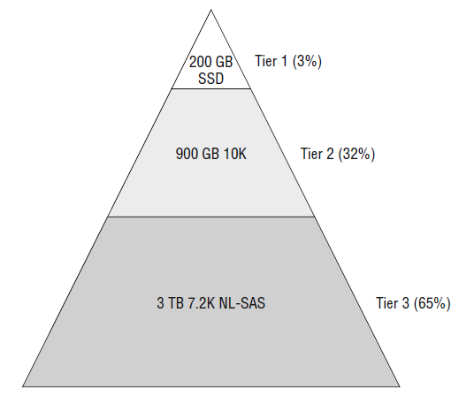

На рисунке процентные значения указывают процент емкости, а не процент дисков. Хотя мы не пытаемся предложить, чтобы проценты на диаграмме использовались в вашей среде, они адаптированы для массива смешанной рабочей нагрузки, в котором параметры рабочей нагрузки не были хорошо известны на момент проектирования, поэтому это может быть хорошей грубой отправной точкой для настройки вашей собственной конфигурации.

### 12.18.4 Период мониторинга
Чтобы принимать решения о том, какие экстенты перемещать вверх и вниз по доступным уровням, массиву необходимо отслеживать активность ввода-вывода на бэкэнде. Может быть важно отслеживать производительность бэкэнда в нужное время. Например, если ваша организация выполняет резервное копирование ночью, вы можете исключить окно резервного копирования из графика мониторинга, чтобы рабочие нагрузки резервного копирования не искажали статистику и не влияли на -процесс принятия решений. В 99 случаях из 100 вы не захотите, чтобы ваши тома резервного копирования потребляли ваши более высокие уровни хранения.

Распространенным подходом является мониторинг в основные рабочие часы в рабочие дни, но это может быть неподходящим для вашей среды.

#### 12.18.4.1 Планирование многоуровневых операций
В дополнение к решению о том, когда вы хотите контролировать свою систему, вам необходимо определить окна перемещения данных, в течение которых массиву разрешено перемещать экстенты между уровнями. Это, опять же, будет зависеть от ваших бизнес-требований и может быть ограничено в зависимости от того, как часто ваша технология массива позволяет вам перемещать данные. Но следует помнить, что перемещение данных на бэкэнде использует ресурсы бэкэнда и, во многих случаях, кэш.

Большинство компаний решают перемещать свои данные вне рабочего времени. Часто это происходит в ранние часы утра, например, между 1 и 4 часами утра, хотя в некоторых системах непрерывное перемещение — лучшая идея.

#### 12.18.4.2 Исключения и политика
Хорошие массивы хранения предоставляют вам возможность включать и исключать тома из операций автоматического распределения по уровням. Например, у вас могут быть некоторые тома, которые, как вы определили, должны всегда находиться на 100 процентов в среднем уровне.

У вас также могут быть тома, которые вы хотите контролировать с помощью алгоритма автоматического распределения по уровням, но вы хотите ограничить объем пространства уровня 1, которое они занимают, или вы можете захотеть убедиться, что они никогда не будут переведены на самый низкий уровень.

Ваш массив должен позволять вам создавать политики многоуровневого хранения, чтобы при необходимости добиться точного управления поведением автоматического многоуровневого хранения вашего массива.

#### 12.18.4.3 Автоматическое распределение по уровням с малыми массивами
Решения с автоматическим распределением по уровням, как правило, лучше подходят для больших конфигураций и меньше — для меньших массивов. Одна из главных причин заключается в том, что для обеспечения достаточной производительности каждому уровню требуется достаточное количество дисков. Если небольшой массив также имеет большой размер суб-LUN-экстента, это увеличит неэффективность. Кроме того, затраты на лицензирование, как правило, не делают решения с автоматическим распределением по уровням коммерчески жизнеспособными в меньших конфигурациях. С точки зрения стоимости, балансировки и производительности аргументы в пользу использования решений с автоматическим распределением по уровням, как правило, лучше складываются в более крупных массивах.


#### 12.18.4.4 Автоматическое распределение по уровням и удаленная репликация
С некоторыми решениями по автоматическому распределению по уровням легко оказаться в ситуации, когда ваши тома оптимально распределены по уровням в исходном массиве, но не в целевом массиве. Это может произойти по разным причинам, но основным фактором, способствующим этому, является то, что технологии репликации реплицируют данные записи только из источника в целевой массив. Запросы на чтение в исходный массив сильно влияют на компоновку тома в исходном массиве. Однако эффекты этих чтений не отражаются на целевом массиве, и, следовательно, том-реплика в целевом массиве вполне может занимать больший процент нижних уровней в целевом массиве. Очевидно, что если вам нужно вызвать DR, вы можете увидеть падение производительности из-за этого.

## 12.19 Виртуализация хранения
Здесь ***виртуализация хранения относится к виртуализации на основе контроллера***. Виртуализация на основе контроллера — это виртуализация одного массива хранения за другим, как показано на рисунке.

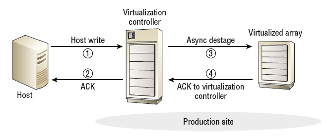

Далее в этом разделе вы можете увидеть, что операции ввода-вывода записи могут быть подтверждены, когда они достигают кэша в контроллере виртуализации. После того, как данные находятся в кэше контроллера виртуализации, их можно перенести в виртуализированный массив ленивым способом.

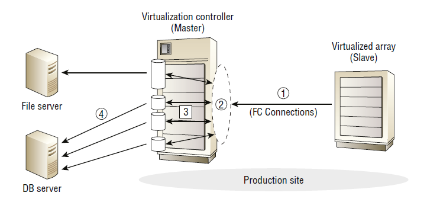

В настройке виртуализации хранилища один массив действует как мастер, а другой как ведомый (slave). Мы будем называть мастер ***контроллером виртуализации virtualization controller***, а ведомый — ***виртуализированным массивом virtualized array***.

- Контроллер виртуализации — это место, где находится весь интеллект и функциональность. 

- Виртуализированный массив просто обеспечивает защищенную RAID-массивом емкость. Никакие другие возможности и функции, изначально доступные в виртуализированном массиве, не используются.

Типичная конфигурация виртуализации хранилища
Настройка типичной виртуализации хранилища требует нескольких шагов:
1.	Настройка виртуализируемого массива
2.	Настройка контроллера виртуализации
3.	Подключение контроллера виртуализации и виртуализированного массива

### 12.19.1 Настройка виртуализируемого массива
Обычно первым делом необходимо настроить виртуализируемый массив. На этом массиве вы создаете обычные защищенные RAID-массивы и представляете их как SCSI LUN для контроллера виртуализации. Маскирование LUN следует использовать так, чтобы доступ к LUN имели только WWPN контроллера виртуализации. Эти LUN не нуждаются в каких-либо специальных параметрах конфигурации и используют обычные настройки кэша. Важно настроить все параметры режима хоста для этих LUN и портов front-end в соответствии с требованиями контроллера виртуализации . Например, если контроллер виртуализации имитирует хост Windows, вам нужно будет убедиться, что LUN и порты, подключающиеся к контроллеру виртуализации, настроены соответствующим образом.

Крайне важно, чтобы никакие другие хосты не имели доступа к LUN, представленным контроллеру виртуализации. Если это произойдет, данные на этих LUN будут повреждены. Наиболее распространенные конфигурации виртуализации хранения данных имеют все хранилище в виртуализированном массиве, представленное контроллеру виртуализации. Таким образом, нет необходимости в подключении каких-либо хостов к виртуализированному массиву.

### 12.19.2 Настройка контроллера виртуализации
После настройки массива вы настраиваете контроллер виртуализации. Здесь вы настраиваете два или более портов front-end в режим виртуализации. Это форма режима инициатора, которая позволяет портам подключаться к портам front-end массива, который виртуализируется, и обнаруживать и использовать его LUN. Для простоты порты на контроллере виртуализации, которые подключаются к массиву, который виртуализируется, будут эмулировать стандартный хост Windows или Linux, так что для массива, который виртуализируется, не нужно настраивать какие-либо специальные режимы хоста.

### 12.19.3 Подключение контроллера виртуализации и виртуализированного массива
Подключение обычно осуществляется через FC и может быть подключено напрямую или через SAN. Из-за критической природы этих подключений некоторые люди выбирают прямое подключение, чтобы сохранить путь между двумя массивами максимально простым и чистым.

После того, как контроллер виртуализации обнаружил и потребовал LUN, представленные из виртуализированного массива, он может использовать обнаруженную емкость так же, как он использовал бы емкость локально установленных дисков. Одним из распространенных исключений является то, что контроллер виртуализации обычно не применяет RAID к обнаруженным LUN. Низкоуровневые функции, такие как RAID, по-прежнему выполняются виртуализированным массивом.

На рисунке показан виртуализированный массив, представляющий пять LUN контроллеру виртуализации . Контроллер виртуализации входит в виртуализированный массив, обнаруживает и запрашивает LUN и формирует из них пул. Затем этот пул используется для предоставления емкости для четырех вновь созданных томов, которые представляются из интерфейса контроллера виртуализации двум хостам как SCSI LUN.


1.	LUN на виртуализированном массиве предоставляются WWPN контроллера виртуализации.
2.	Контроллер виртуализации заявляет эти LUN и использует их в качестве хранилища. В этом примере они формируются в пул.
3.	Тома создаются из пула, созданного на шаге 2.
4.	Тома, созданные на шаге 3, представляются хостам через внешние порты как LUN.

### 12.19.4 Продление срока службы внешнего массива
Одна из потенциальных причин виртуализации массива — продление его срока службы. Вместо того чтобы выключать старый массив, потому что он устарел и не поддерживает новейшие передовые функции, которые нам нужны, мы можем подключить его к нашему блестящему новому массиву и сделать ему пересадку мозга.

Эта идея в принципе работает, но реальность, как правило, несколько сложнее. 

По этой причине, даже в сложной экономике с сокращающимися ИТ-бюджетами, массивы редко виртуализируются для продления их срока службы.

Некоторые из осложнений включают в себя следующее:
- Необходимость поддерживать виртуализированный массив на контрактном обслуживании, соответствующем среде, которую он будет продолжать обслуживать. Не самая лучшая идея в мире — иметь старый виртуализированный массив на ответе на следующий рабочий день (NBD), если он все еще обслуживает ваши критически важные приложения уровня 1.
- Поддержка нескольких поставщиков может быть сложной, если вы виртуализируете массив от стороннего поставщика. Это становится еще более сложным, когда массив, который вы виртуализируете, старый, поскольку поставщик обычно не заинтересован в том, чтобы вы держали старый комплект на долгосрочном обслуживании , и поставщик обычно прекращает выпускать обновления прошивки.
Опыт показывает, что хотя виртуализация массива с целью продления его срока службы работает на бумаге, реальность, как правило, оказывается несколько запутанной.

### 12.19.5 Добавление функциональности к виртуализированному массиву
Обычно клиенты покупают новый массив корпоративного класса уровня 1 вместе с новым массивом среднего уровня 2/3 и виртуализируют массив среднего уровня за массивом корпоративного класса. Такая конфигурация позволяет расширить расширенные функции и интеллект массива уровня 1 до емкости, предоставляемой виртуализированным массивом уровня 2. Поскольку массив, выполняющий виртуализацию, обрабатывает емкость виртуализированного массива так же, как он обрабатывает внутренний диск, тома на виртуализированном массиве могут быть тонко выделены, дедуплицированы, реплицированы, сделаны моментальными снимками, многоуровневыми, гипервизорными и чем то еще...

### 12.19.6 Виртуализация хранения и автоматическое распределение по уровням
Все хорошие массивы хранения, которые поддерживают виртуализацию на основе контроллера, позволят емкости виртуализированного массива быть уровнем хранения, который может использоваться его алгоритмами автоматического распределения по уровням. Если ваш массив поддерживает это, то использование емкости вашего виртуализированного массива в качестве самого нижнего уровня хранения может иметь здравый финансовый и технический смысл.

Поскольку стоимость размещения диска в массиве уровня 1 может заставить вас заплакать — даже если это диск низкого уровня, такой как 4 ТБ NL-SAS — есть веские технические преимущества в использовании только внутренних слотов дисков массива уровня 1 для высокопроизводительных дисков. Помимо стоимости загрузки внутренних слотов дисков, они также обеспечивают меньшую задержку, чем подключение к емкости в виртуальном массиве. Таким образом, сохранение внутренних слотов для высокопроизводительных дисков выгодно как с финансовой, так и с технической точки зрения.

Это приводит к многоуровневой конфигурации, которая выглядит естественно, как показано на рисунке

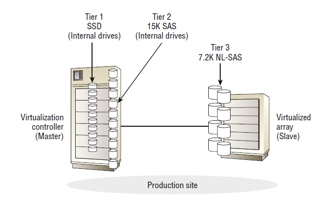

Нет никаких проблем с тем, чтобы горячие экстенты тома находились на внутреннем флэш-накопителе, теплые экстенты — на внутреннем высокопроизводительном SAS, а самые холодные и наименее часто используемые экстенты — на внешнем 7,2 К или 5,4 К NL-SAS. Такая конфигурация широко используется в реальном мире.
Конечно, все это предполагает, что ваша лицензия на виртуализацию не будет стоить вам кучу денег и, следовательно, не разрушит ваш бизнес-кейс.

### 12.19.6 Ошибки виртуализации
От этого никуда не деться: виртуализация хранения добавляет уровень сложности к вашей конфигурации. Это не то, от чего следует бежать, но это определенно то, о чем следует знать, прежде чем нырнуть в это с головой.

В зависимости от того, как ваш массив реализует виртуализацию хранения, а иногда и от того, как вы его настраиваете, вы можете тащить свое имущество по дороге с односторонним движением, из которой трудно выбраться. Остерегайтесь запереть себя в дизайне, который сложно распутать, если вы позже решите, что виртуализация хранения не для вас.

Если ваш массив не спроектирован и не рассчитан должным образом, производительность может стать проблемой. Например, если у вас недостаточно кэша в контроллере виртуализации для работы с емкостью на бэкэнде, включая емкость в любых виртуализированных массивах, вы можете настроить себя на кучу проблем с производительностью, за которыми последует дорогостоящее обновление. Кроме того, если массив, который вы виртуализируете, не обладает достаточной производительностью (обычно недостаточно дисков), чтобы иметь возможность достаточно быстро выходить из кэша, вы можете сделать кэш вашей головки виртуализации узким местом.

Говоря о производительности, на сегодняшний день наиболее распространенной реализацией виртуализации хранения является использование виртуализированного массива для дешевого и глубокого хранения уровня 3. Редко можно увидеть, как клиенты загружают виртуализированные массивы высокопроизводительными дисками.
Наконец, стоимость может стать проблемой, если вы не знаете, во что ввязываетесь. Лицензии на виртуализацию редко предоставляются бесплатно.

### 12.20 Аппаратные ускорители
Аппаратные разгрузки, иногда называемые аппаратными ускорителями, являются относительно новой тенденцией в мире открытых систем хранения данных. 

Аппаратная разгрузка — это действие по выполнению функции на выделенном оборудовании, а не на программном обеспечении. В отношении хранения данных это обычно означает, что операционные системы и гипервизоры разгружают функции, связанные с хранением, такие как большие задания копирования и обнуление в массиве хранения данных.

При реализации аппаратной разгрузки на массив хранения следует учитывать несколько целей. Обычно они следующие:
- Улучшить производительность
- Уменьшите нагрузку на центральный процессор
- Уменьшите нагрузку на сеть

Хотя большинство современных серверов действительно загружают процессорные циклы, многие задачи, связанные с хранением данных, можно выполнять быстрее и эффективнее, перенеся их на массив хранения.

Давайте рассмотрим несколько наиболее популярных примеров из реального мира.

### 12.20.1 VMware VAAI
VMware, возможно, был первым поставщиком в мире открытых систем, который продвигал идею аппаратной разгрузки. API vStorage для интеграции массивов (VAAI) от VMware — это набор технологий, разработанных для разгрузки операций, связанных с хранением, на массив хранения, поддерживающий VAAI. Существуют разгрузки VAAI как для блочного хранилища, так и для хранилища NAS, называемые блочными примитивами и примитивами NAS соответственно.
Примитивы блочного хранения основаны на стандартах T10 SCSI и изначально поддерживаются любым массивом хранения, который поддерживает эти стандарты T10, хотя обязательно проверьте Список совместимого оборудования VMware (HCL), прежде чем делать какие-либо предположения. VAAI для NAS, с другой стороны, требует плагина от вашего поставщика NAS.

Давайте рассмотрим каждую из доступных разгрузок VAAI.

#### 12.20.1.1 ATS (atomic test and set)
Если вы хоть что-то знаете о файловой системе виртуальной машины (VMFS), вы знаете, что некоторые обновления метаданных требуют блокировки для обеспечения целостности обновленных метаданных и всего тома VMFS.

Раньше единственным доступным механизмом блокировки было резервирование SCSI. А проблема с резервированием SCSI заключается в том, что оно блокирует весь LUN, а это значит, что при каждом обновлении метаданных вам приходилось блокировать весь LUN. А когда LUN заблокирован, его не может обновить ни один хост, кроме хоста, выдавшего команду резервирования . Это не конец света, если мы говорим о небольших, редко используемых томах VMFS. Однако это может стать проблемой для больших, интенсивно используемых томов VMFS, к которым обращаются несколько хостов. Вот тут-то на помощь и приходит atomic test and set (ATS)!

ATS, также известная как аппаратная блокировка, предлагает две возможности:
- ***Блокировка на основе экстента*** Блокировка на основе экстента означает, что вам больше не нужно блокировать весь LUN с резервом SCSI при обновлении метаданных в томе VMFS. Вам нужно блокировать только экстенты, содержащие обновляемые метаданные.

***Более эффективная процедура блокировки***. Процесс включения и выключения блокировки на основе экстентов переносится в массив хранения, а механизм блокировки требует меньше шагов, что делает его более быстрым и эффективным.
Оба эти фактора существенно повысили масштабируемость VMFS и стали основными факторами, обусловившими возможность развертывания более крупных хранилищ данных VMFS.

С момента первоначального выпуска VAAI ATS теперь был формализован как стандарт T10 SCSI с использованием кода операции SCSI 0x89 и команды COMPARE_AND_WRITE . Это гарантирует реализацию на основе стандартов всеми поддерживающими массивами хранения.

#### 12.20.1.2 Аппаратно-ускоренное обнуление
Определенные ситуации в средах VMware требуют обнуления целых томов. Например, тома EZT (Earth Zoleed Thick) — это тома, которые очищаются путем записи нулей в каждый сектор тома. Это имеет положительные последствия для безопасности, гарантируя, что никакие данные из предыдущей жизни тома не могут быть непреднамеренно видны. Это также имеет потенциально положительные последствия для производительности, поскольку ESX не требует обнуления блока при первой записи в него, хотя не ожидайте, что улучшения производительности вас поразят.

Давайте рассмотрим краткий пример аппаратно-ускоренного обнуления в действии. Предположим, что у вас есть том с 1000 блоков и вам нужно обнулить весь этот том. Без аппаратно-ускоренного обнуления ESX пришлось бы выдавать набор команд, показанных на рисунке

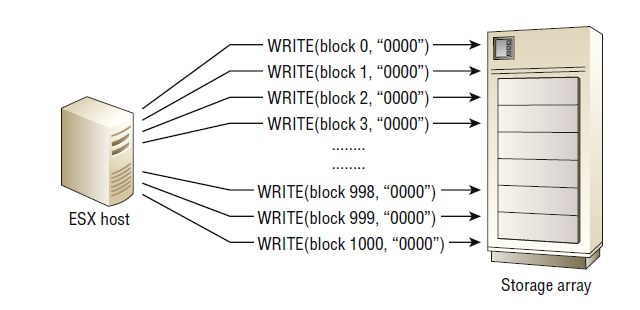

С внедрением аппаратно-ускоренного обнуления точно такой же результат может быть достигнут с помощью одной команды, как показано на рисунке

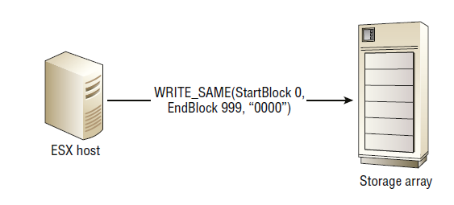

Это не только разгружает операцию с хоста ESX, освобождая циклы ЦП, но и значительно снижает сетевую болтовню, поскольку хост ESX может выдать одну команду, а массив может дать один ответ. Кроме того, хранилище, вероятно, может выполнять работу быстрее. Чистый результат заключается в том, что операция завершается быстрее и использует меньше ЦП ESX и меньше сетевых ресурсов.
Аппаратное ускорение обнуления работает с помощью стандартной команды ***SCSI T10 WRITE_SAME (код операции 0x93)***

#### 12.20.1.3 Аппаратно-ускоренное копирование
Популярные операции, связанные с VMware, такие как Storage vMotion и создание новых виртуальных машин из шаблона, используют большие операции копирования данных. Аппаратно-ускоренное копирование использует команду ***SCSI EXTENDED_COPY (код операции 0x83)*** для разгрузки тяжелой работы по копированию данных в массив хранения. На рисунке показана большая операция копирования без использования и с использованием EXTENDED_COPY.

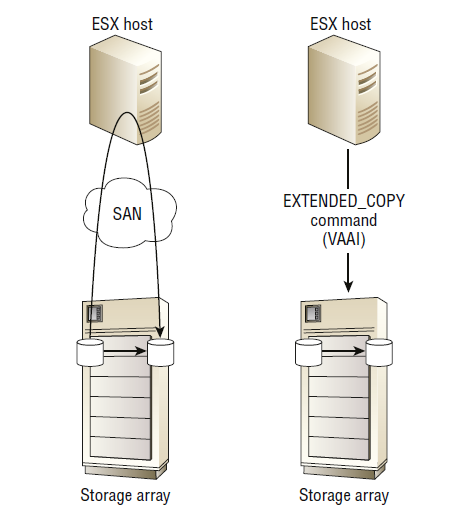

На рисунке операция слева, которая не использует разгрузку EXTENDED_COPY , требует, чтобы все данные, копируемые из исходного тома в целевой том, прошли вверх из массива, через SAN, через HBA в хосте ESX, через механизм перемещения данных ядра, обратно через HBA, обратно вниз через SAN и обратно в массив хранения. Напротив, операция справа показывает одну команду EXTENDED_COPY, выданную хостом ESX массиву. Затем массив копирует данные внутренне, без необходимости проходить весь путь вверх по стеку, через хост и обратно.

Благодаря использованию аппаратной поддержки EXTENDED_COPY можно значительно снизить использование полосы пропускания сети, а также использование ресурсов хоста.

#### 12.20.1.4 Остановка тонкой подготовки (TP Stun)
Остановка тонкой подготовки (TP Stun) — это попытка изящно справиться с условиями нехватки места на массивах хранения с избыточным объемом. Остановка TP — это механизм, с помощью которого виртуальные машины, запрашивающие дополнительное пространство из массива хранения, в котором закончилось место, могут быть ***приостановлены, а не аварийно завершены***. Это достижимо, поскольку массив хранения теперь может информировать хост о том, что его диск заполнен, а не просто выдавать хосту ошибку записи, что позволяет хосту более изящно справиться со сценарием. Как только в массиве появляется больше места, условие снимается, и виртуальная машина может быть возобновлена.

Хотя это может показаться не идеальным, это попытка максимально использовать кошмарный сценарий. Конечно, это актуально только для массивов хранения с тонким резервированием, которые избыточно резервируются, и виртуальных машин, которые находятся в хранилищах данных, которые тонко резервируются из массива хранения.

#### 12.20.1.5 VAAI и рекультивация нулевого пространства
Последние версии VMware теперь полностью поддерживают тонкое выделение ресурсов на основе массивов и оптимизированы для поддержки тонких томов.
VAAI теперь использует команду ***UNMAP СТАНДАРТА T10 SCSI*** для информирования массива хранения о том, что определенные блоки больше не используются. Примерами служат удаленные виртуальные машины или виртуальные машины, которые были перенесены в другие хранилища данных.

#### 12.20.1.6 Быстрое клонирование файлов для NAS
***Fast file clone for NAS*** обеспечивает поддержку разгрузки создания и управления моментальными снимками виртуальных машин в собственных возможностях моментальных снимков массива NAS. Это позволяет создавать моментальные снимки -гораздо быстрее и с меньшим сетевым трафиком.

#### 12.20.1.7 Для NAS ATS не требуется
Интересно, что в мире NAS нет необходимости в эквиваленте примитива ATS, поскольку мир NAS никогда не страдал от рудиментарных систем блокировки, таких как механизм РЕЗЕРВИРОВАНИЯ SCSI . Это потому, что массивы NAS понимают и владеют базовой экспортированной файловой системой и, следовательно, имеют собственные расширенные возможности блокировки на уровне файлов.

#### 12.20.1.8 Microsoft ODX
С Windows 8 и Server 2012 Microsoft представила миру технологию ***Offloaded Data Transfer (ODX)*** . ODX — это технология разгрузки копирования данных, разработанная для разгрузки функций копирования данных на интеллектуальные массивы хранения данных примерно так же, как VMware делает с VAAI. Можно сказать, что ODX для Windows — это то же самое, что VAAI для VMware. Разница в том, что VMware занимается этим дольше, а потому имеет больше возможностей и большую зрелость, хотя со временем это, несомненно, выровняется.

Поскольку ODX похож на некоторые примитивы VAAI, он существует для ускорения определенных операций с хранилищем, таких как операции копирования больших объемов данных и массового обнуления, при этом экономя ресурсы центрального процессора, использование сетевой карты и пропускную способность сети.

#### 12.20.1.9 ODX для больших копий файлов
На рисунке показано, как работает ODX для масштабной операции копирования.

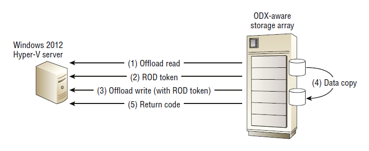

В большой операции копирования, представленной на рисунке, хост под управлением Windows Server 2012 или более поздней версии выдает команду чтения разгрузки массиву с поддержкой ODX. Массив отвечает 512-байтовым токеном, который является логическим представлением даты, которая должна быть скопирована, специфичным для массива. Этот токен известен как ***токен представления данных representation of data (ROD)*** . Затем хост выдает запрос записи разгрузки с соответствующим токеном ROD массиву. Затем массив выполняет копирование, не покидая массива.
ODX также может работать между двумя массивами, оба из которых поддерживают данную конкретную конфигурацию ODX.

ODX работает со следующими технологиями:
- Виртуальные жесткие диски Hyper-V (VHD)
- Акции SMB (иногда называемые CIFS)
- Физические диски
- FC, iSCSI, FCoE, SAS
ODX будет вызываться для выполнения копирования данных каждый раз, когда команда копирования выдается из CLI, PowerShell prompt, Windows Explorer или задания миграции Hyper-V, пока сервер работает под управлением Windows Server 2012 или более поздней версии, а базовый массив хранения поддерживает ODX. 

Однако такие вещи, как дедупликация и зашифрованные диски Windows BitLocker, не работают с первоначальной версией ODX. Будущие версии этих драйверов фильтров потенциально будут поддерживать ODX.
ODX использует примитивы T10 XCOPY LITE , что делает его стандартизированным.
Как и все развивающиеся технологии, она расправляет крылья. Уточните у поставщиков и Microsoft поддерживаемые конфигурации. Следует остерегаться Resilient File System (ReFS), динамических дисков и подобных разработок.

#### 12.20.1.10 ODX и массовое обнуление
ODX также можно использовать для выполнения массового обнуления с использованием токена ROD Well Known Zero Token .
